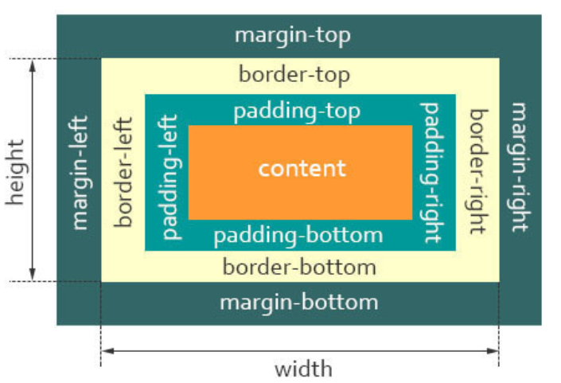
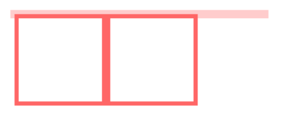
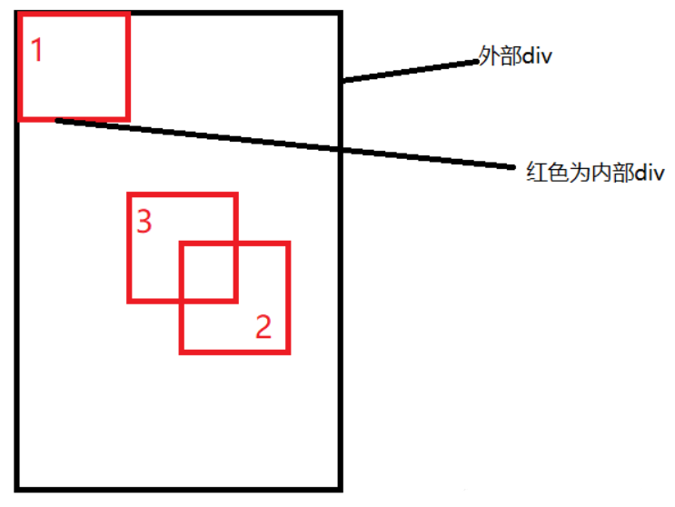

[toc]

CSS Cascading Style Sheets 层叠式样式表单。三大特性：层叠性、继承性以及优先级。

# 盒模型

是什么？文档布局时，浏览器渲染引擎根据标准之一的CSS基础盒模型将元素表示为一个个矩形盒子，一个盒子由四个部分组成：`content`、`padding`、`border`、`margin`

`content`，即实际内容，显示文本和图像

`boreder`，即边框，围绕元素内容的内边距的一条或多条线，由粗细、样式、颜色三部分组成

`padding`，即内边距，清除内容周围的区域，内边距是透明的，取值不能为负，受盒子的`background`属性影响

`margin`，即外边距，在元素外创建额外的空白，空白通常指不能放其他元素的区域

- W3C 标准盒子模型
- IE 怪异盒子模型

默认情况下，盒子模型为`W3C` 标准盒子模型

box-sizing进行设置`box-sizing: content-box|border-box|inherit;`

## 标准盒模型


## 怪异盒模型



包括了padding和border


# 选择器

`css`属性选择器常用的有：

- id选择器（#box），选择id为box的元素
- 类选择器（.one），选择类名为one的所有元素
- 标签选择器（div），选择标签为div的所有元素
- 后代选择器（#box div），选择id为box元素内部所有的div元素
- 子选择器（.one>one_1），选择父元素为.one的所有.one_1的元素
- 相邻同胞选择器（.one+.two），选择紧接在.one之后的所有.two元素
- 群组选择器（div,p），选择div、p的所有元素

- 伪类选择器，用于**指定所选元素的特殊状态**，修改特殊状态下的样式。顺序LVHA，love hate。

```css
:link ：选择未被访问的链接
:visited：选取已被访问的链接
:hover ：鼠标指针浮动在上面的元素
:active：选择活动链接
:focus ：选择具有焦点的
:first-child：父元素的首个子元素
```

- 伪元素选择器，允许你**对被选择元素的特定部分**修改样式。**在css3规范中为了清晰的加以区分，推荐使用双冒号标识伪元素**

```css
:first-letter ：用于选取指定选择器的首字母
:first-line ：选取指定选择器的首行
:before : 选择器在被选元素的内容前面插入内容
:after : 选择器在被选元素的内容后面插入内容
```

- 属性选择器

## 伪类和伪元素

**1. 伪类表示被选择元素的某种状态，例如`:hover`**

**2. 伪元素表示的是被选择元素的某个部分，这个部分看起来像一个独立的元素，但是是"假元素"，只存在于css中，所以叫"伪"的元素，例如`:before`和`:after`**

核心区别在于，是否创造了“新的元素”


## 优先级

内联 > ID选择器 > 类选择器 > 标签选择器

比较时从左向右依次比较

优先级是由 `A` 、`B`、`C`、`D` 的值来决定的，其中它们的值计算规则如下：

1. 如果存在内联样式，那么 `A = 1`, 否则 `A = 0`;
2. `B` 的值等于 `ID选择器` 出现的次数;
3. `C` 的值等于 `类选择器` 和 `属性选择器` 和 `伪类` 出现的总次数;
4. `D` 的值等于 `标签选择器` 和 `伪元素` 出现的总次数 。

这样子直接看好像也还是很明白 ，那先上个例子：

```less
#nav-global > ul > li > a.nav-link复制代码
```

套用上面的算法，依次求出 `A` `B` `C` `D` 的值：

1. 因为没有内联样式 ，所以 `A = 0`;
2. ID选择器总共出现了1次， `B = 1`;
3. 类选择器出现了1次， 属性选择器出现了0次，伪类选择器出现0次，所以 `C = (1 + 0 + 0) = 1`；
4. 标签选择器出现了3次， 伪元素出现了0次，所以 `D = (3 + 0) = 3`;

上面算出的`A` 、 `B`、`C`、`D` 可以简记作：`(0, 1, 1, 3)`。

为了熟悉掌握优先级算法 ，我们再来做一些练习：

```stylus
li                                  /* (0, 0, 0, 1) */
ul li                               /* (0, 0, 0, 2) */
ul ol+li                            /* (0, 0, 0, 3) */
ul ol+li                            /* (0, 0, 0, 3) */
h1 + *[REL=up]                      /* (0, 0, 1, 1) */
ul ol li.red                        /* (0, 0, 1, 3) */
li.red.level                        /* (0, 0, 2, 1) */
a1.a2.a3.a4.a5.a6.a7.a8.a9.a10.a11  /* (0, 0, 11,0) */
#x34y                               /* (0, 1, 0, 0) */
li:first-child h2 .title            /* (0, 0, 2, 2) */
#nav .selected > a:hover            /* (0, 1, 2, 1) */
html body #nav .selected > a:hover  /* (0, 1, 2, 3) */复制代码
```

OK， 现在已经弄清楚了优先级是怎么算的了。但是，还有一个问题，怎么比较两个优先级的高低呢？ **比较规则是: 从左往右依次进行比较 ，较大者胜出，如果相等，则继续往右移动一位进行比较 。如果4位全部相等，则后面的会覆盖前面的**


作者：Chess
链接：https://juejin.cn/post/6844903709772611592

## 继承性

继承是指的是给父元素设置一些属性，后代元素会自动拥有这些属性

关于继承属性，可以分成：字体，文本，元素可见性，表格，列表

# em/px/rem/vh/vw

**px**：绝对单位，页面按精确像素展示

**em**：相对单位，基准点为父节点字体的大小，如果自身定义了`font-size`按自身来计算，整个页面内`1em`不是一个固定的值

**rem**：相对单位，可理解为`root em`, 相对根节点`html`的字体大小来计算

**vh、vw**：主要用于页面视口大小布局，在页面布局上更加方便简单

# 面试官：说说设备像素、css像素、设备独立像素、dpr、ppi 之间的区别？

设备像素：设备像素是指显示屏幕上的实际物理像素，通常用px表示。它是硬件决定的，不能通过软件调整。

CSS像素：CSS像素是相对长度单位，通常用pt、px、em等表示。在网页设计中，CSS像素可以根据不同的设备和分辨率进行自适应调整。

设备独立像素：设备独立像素是一种虚拟像素，它和CSS像素有些相似，但不同的是它不会受到硬件分辨率的影响。在移动设备中，Android系统使用dp（density-independent pixel）作为设备独立像素单位，iOS系统则使用pt（points）。

DPR（Device Pixel Ratio）：DPR是指设备像素和设备独立像素之间的比例关系。例如，苹果iPhone XR的DPR为2 . 0，这意味着每个CSS像素将由2个物理像素来呈现。

PPI（Pixels Per Inch）：PPI表示每英寸包含多少个物理像素。它与显示屏幕尺寸和分辨率有关系。一般来说，PPI越高代表显示屏幕画面更加清晰细腻。


- 设备像素（device pixels），又称为物理像素
- ppi （pixel per inch），每英寸像素，表示每英寸所包含的像素点数目，更确切的说法应该是像素密度。数值越高，说明屏幕能以更高密度显示图像
- 设备独立像素（Device Independent Pixel）：与设备无关的逻辑像素，代表可以通过程序控制使用的虚拟像素，是一个总体概念，包括了CSS像素
- dpr（device pixel ratio），设备像素比，代表设备独立像素到设备像素的转换关系。dpr=设备像素/设备独立像素。当设备像素比为2:1时，使用4（2×2）个设备像素显示1个CSS像素


无缩放情况下，1个CSS像素等于1个设备独立像素

设备像素由屏幕生产之后就不发生改变，而设备独立像素是一个虚拟单位会发生改变

PC端中，1个设备独立像素 = 1个设备像素 （在100%，未缩放的情况下）

在移动端中，标准屏幕（160ppi）下 1个设备独立像素 = 1个设备像素

设备像素比（dpr） = 设备像素 / 设备独立像素

每英寸像素（ppi），值越大，图像越清晰

# 二倍图

物理像素：也就是分辨率，2k，1080p啥的；一个个像素点

物理像素比：一个px能显示的物理像素点的个数成为物理像素比或屏幕像素比；比如说iphone8物理像素水平750，但是对应只有375css px，1px等于两个物理像素，也就是开发尺寸

pc端 1px=1物理像素

早期 1px=1物理像素，视网膜屏幕显示技术，把更多的物理像素压缩到一块屏幕中


二倍图

图片的一个像素需要两个物理像素来展示，需要两倍清晰的图片才能发挥出全部物理像素


## 背景缩放（background-size）

img图片可以缩放，同时background-size也可以缩放

```arduino
background-size： 背景图片宽度 背景图片高度； 
复制代码
```

- 只写一个参数，肯定是宽度，高度被省略，会等比缩放
- 里面的单位可以跟百分比，相对与父盒子
- 单位： 长度|百分比|cover|contain
- cover把背景图像扩展至足够大，使背景图像完全覆盖背景区域
- contain把图像扩展至最大尺寸，使宽度和高度完全适应内容区域
- contain 等比例拉伸，可能会有空白区域


#  隐藏页面元素

- display:none。消失了，引起重排和重绘。元素不可见，不占据空间，无法响应点击事件
- visibility:hidden。隐藏了。只重绘。元素不可见，占据页面空间，无法响应点击事件
- opacity:0。不会引发重排，一般情况下也会引发重绘。如果利用 animation 动画，对 opacity 做变化（animation会默认触发GPU加速），则只会触发 GPU 层面的 composite，不会触发重绘
- 设置height、width模型属性为0
- position:absolute
- clip-path

# BFC理解

（Block Formatting Context），即块级格式化上下文。`BFC`目的是形成一个相对于外界完全独立的空间，让内部的子元素不会影响到外部的元素

## 触发

触发`BFC`的条件包含不限于：

- 根元素，即HTML元素
- 浮动元素：float值为left、right
- overflow值不为 visible，为 auto、scroll、hidden
- display的值为inline-block、inltable-cell、table-caption、table、inline-table、flex、inline-flex、grid、inline-grid
- position的值为absolute或fixed

## 应用

### 防止margin重叠（塌陷）

同一个`BFC`的俩个相邻的盒子的`margin`会发生重叠，可以把这两个盒子分到不同的BFC中

### 清除内部浮动

```html
<style>
    .par {
        border: 5px solid #fcc;
        width: 300px;
    }
 
    .child {
        border: 5px solid #f66;
        width:100px;
        height: 100px;
        float: left;
    }
</style>
<body>
    <div class="par">
        <div class="child"></div>
        <div class="child"></div>
    </div>
</body>
```

页面显示如下：



而`BFC`在计算高度时，浮动元素也会参与，所以我们可以触发`.par`元素生成`BFC`，则内部浮动元素计算高度时候也会计算

```css
.par {
    overflow: hidden;
}
```

实现效果如下：


# 元素水平垂直居中

### 内联元素居中布局

水平居中

- 行内元素可设置：text-align: center
- flex布局设置父元素：display: flex; justify-content: center

垂直居中

- 单行文本父元素确认高度：height === line-height
- 多行文本父元素确认高度：display: table-cell; vertical-align: middle

### 块级元素居中布局

常见思路：

- 水平居中，定宽: margin: 0 auto

- 定位：子绝父相，且子元素四个方向定位均为0，且margin:auto。那么这时候如果子级没有设置宽高，则会被拉开到和父级一样宽高。若子元素设置了宽高，则宽高会按照我们的设置来显示，但是实际上子级的虚拟占位已经撑满了整个父级，这时候再给它一个`margin：auto`它就可以上下左右都居中了

- 定位：子绝父相，子元素left:50%;top:50;定位到中间偏下，然后margin-left:自己一半;margin-top:自己高一半，调到中心

  

- 定位+transform。思路和上面一样，但是不用手动算了，transform: translate(-50%,-50%);

- flex布局。父元素

  ```css
  .father {
          display: flex;
          justify-content: center;
          align-items: center;
      }
  ```

- grid布局。代码同上。

- table布局

  ```css
  .father {
          display: table-cell;
          vertical-align: middle;
          text-align: center;
      }
      .son {
          display: inline-block;
      }
  ```

  

# flex布局

## 属性

容器属性有：


- flex-direction: row | row-reverse | column | column-reverse;

  决定主轴的方向(即项目的排列方向)

- flex-wrap: nowrap | wrap | wrap-reverse;

  不换行；换行，第一行在下方；换行，第一行在上方

- flex-flow。是`flex-direction`属性和`flex-wrap`属性的简写形式，默认值为`row nowrap`

- justify-content: flex-start | flex-end | center | space-between | space-around;

  定义了项目在主轴上的对齐方式。

  - flex-start（默认值）：左对齐
  - flex-end：右对齐
  - center：居中
  - space-between：两端对齐，项目之间的间隔都相等
  - space-around：两个项目两侧间隔相等

  效果图如下：

  

- align-items: flex-start | flex-end | center | baseline | stretch;

  定义项目在交叉轴上如何对齐

  - flex-start：交叉轴的起点对齐
  - flex-end：交叉轴的终点对齐
  - center：交叉轴的中点对齐
  - baseline: 项目的第一行文字的基线对齐
  - stretch（默认值）：如果项目未设置高度或设为auto，将占满整个容器的高度

- align-content

  定义了多根轴线的对齐方式。如果项目只有一根轴线，该属性不起作用


容器成员属性如下：

- `order` 定义项目的排列顺序。数值越小，排列越靠前，默认为0

- `flex-grow`

- `flex-shrink`

- `flex-basis`

- `flex`

- `align-self`允许单个项目有与其他项目不一样的对齐方式，可覆盖`align-items`属性

  默认值为`auto`，表示继承父元素的`align-items`属性，如果没有父元素，则等同于`stretch`

常用

-  flex:number定义子项目分配**剩余空间**，用flex表示占多少**份数**
- align-self控制子项自己在侧轴的排列方式；比如说其余盒子在下面，某一个盒子在顶部
- order定义项目的排列顺序，小的靠前。默认是0

练习https://blog.csdn.net/luo1831251387/article/details/117873932

## flex:1作用

在flex布局中，子元素的flex属性为数字表示该子元素在可用空间内所占比例。例如，若一个父容器有3个子元素，其中一个子元素的flex属性为1，其他两个子元素的flex属性均为2，则第一个子元素将占据1/5（20%）的可用空间，而其他两个子元素将各自占据2/5（40%）的可用空间。同时，子元素的flex属性也可以设置为none、auto或initial等值。


# 动画

CSS3中的transition和animation都是用于实现页面元素动画效果的方法，区别在于实现的方式和使用场景。

transition是一种过渡效果，它可以在元素属性发生变化时平滑地过渡到新值，如透明度、位置、大小等。通过设置transition属性实现。通常情况下，transition被用来制作简单的交互效果，如鼠标悬停或点击时改变颜色、大小等。

animation是一种复杂的动画效果，可以实现更多更复杂的动画效果，并且支持关键帧控制。可以通过设置animation属性、@keyframes关键帧规则和其他相关属性来实现。通常情况下，animation被用于制作更为复杂的动画效果，如旋转、弹跳等。

使用场景方面，transition适用于简单的过渡效果或交互效果，而animation适用于复杂的动画效果和需要更多控制的情况。同时，在性能方面，transition比animation更加轻量级，但对于较为复杂的动画效果，animation提供了更好的控制和细节处理能力。


- transition 实现渐变动画

  `transition`的属性如下：

  - property:填写需要变化的css属性
  - duration:完成过渡效果需要的时间单位(s或者ms)
  - timing-function:完成效果的速度曲线
  - delay: 动画效果的延迟触发时间

  transition: all 2s linear 500ms;

- transform 转换，变形

  可以配合`transition`过渡使用

  - translate(x,y)：位移，定义2D转换中的移动，沿着x和y移动，不会影响其他元素位置
  - scale(x,y) scale(n)：里面是放大倍数
  - rotate(45deg)：旋转，正是顺时针，旋转中心是元素中心点
  - skew：倾斜

- animation 实现自定义动画

  定义关键帧

  1. 开始from结束to

     ```css
     @keyframes rotate{
         from{
             transform: rotate(0deg);
         }
         to{
             transform: rotate(360deg);
         }
     }
     ```

  2. 百分比

     ```css
     @keyframes rotate{
         0%{
             transform: rotate(0deg);
         }
         50%{
             transform: rotate(180deg);
         }
         100%{
             transform: rotate(360deg);
         }
     }
     ```

  使用，animation: rotate 2s;共包含6个属性

transition需要触发一个事件才会随着时间改变其CSS属性；animation在不需要触发任何事件的情况下，也可以显式的随时间变化来改变元素CSS属性，达到一种动画的效果。


# 回流（重排）和重绘

## 概念

在`HTML`中，每个元素都可以理解成一个盒子，在浏览器解析过程中，会涉及到回流与重绘：

- 回流（重**排**）：布局引擎会根据各种样式计算每个盒子在页面上的大小与位置
- 重**绘**：当计算好盒模型的位置、大小及其他属性后，浏览器根据每个盒子特性进行绘制

在页面初始渲染阶段，回流不可避免的触发，可以理解成页面一开始是空白的元素，后面添加了新的元素使页面布局发生改变

当我们对 `DOM` 的修改引发了 `DOM`几何尺寸的变化（比如修改元素的宽、高或隐藏元素等）时，浏览器需要重新计算元素的几何属性，然后再将计算的结果绘制出来

当我们对 `DOM`的修改导致了样式的变化（`color`或`background-color`），却并未影响其几何属性时，浏览器不需重新计算元素的几何属性、直接为该元素绘制新的样式，这里就仅仅触发了重绘

## 触发

### 回流触发时机

回流这一阶段主要是计算节点的位置和几何信息，那么当页面布局和几何信息发生变化的时候，就需要回流，如下面情况：

- 添加或删除可见的DOM元素
- 元素的位置发生变化
- 元素的尺寸发生变化（包括外边距、内边框、边框大小、高度和宽度等）
- 内容发生变化，比如文本变化或图片被另一个不同尺寸的图片所替代
- 页面一开始渲染的时候（这避免不了）
- 浏览器的窗口尺寸变化（因为回流是根据视口的大小来计算元素的位置和大小的）

还有一些容易被忽略的操作：获取一些特定属性的值

> offsetTop、offsetLeft、 offsetWidth、offsetHeight、scrollTop、scrollLeft、scrollWidth、scrollHeight、clientTop、clientLeft、clientWidth、clientHeight

这些属性有一个共性，就是需要通过即时计算得到。因此浏览器为了获取这些值，也会进行回流

除此还包括`getComputedStyle`方法，原理是一样的

### 重绘触发时机

触发回流一定会触发重绘

可以把页面理解为一个黑板，黑板上有一朵画好的小花。现在我们要把这朵从左边移到了右边，那我们要先确定好右边的具体位置，画好形状（回流），再画上它原有的颜色（重绘）

除此之外还有一些其他引起重绘行为：

- 颜色的修改
- 文本方向的修改
- 阴影的修改

### 浏览器优化机制

由于每次重排都会造成额外的计算消耗，因此大多数浏览器都会通过队列化修改并批量执行来优化重排过程。浏览器会将修改操作放入到队列里，直到过了一段时间或者操作达到了一个阈值，才清空队列

当你获取布局信息的操作的时候，会强制队列刷新，包括前面讲到的`offsetTop`等方法都会返回最新的数据

因此浏览器不得不清空队列，触发回流重绘来返回正确的值

## 减少

避免回流的经验：

- 如果想设定元素的样式，通过改变元素的 `class` 类名 (尽可能在 DOM 树的最里层)
- 避免设置多项内联样式
- 应用元素的动画，使用 `position` 属性的 `fixed` 值或 `absolute` 值(如前文示例所提)
- 避免使用 `table` 布局，`table` 中每个元素的大小以及内容的改动，都会导致整个 `table` 的重新计算
- 对于那些复杂的动画，对其设置 `position: fixed/absolute`，尽可能地使元素脱离文档流，从而减少对其他元素的影响
- 使用css3硬件加速，可以让`transform`、`opacity`、`filters`这些动画不会引起回流重绘
- 避免使用 CSS 的 `JavaScript` 表达式

在使用 `JavaScript` 动态插入多个节点时, 可以使用`DocumentFragment`. 创建后一次插入. 就能避免多次的渲染性能

用类名合并样式，计算完再重新应用。不然你动一下就会触发一次渲染树更改，导致回流与重绘。合并后相当于一次性发出。

还可以通过通过设置元素属性`display: none`，将其从页面上去掉，然后再进行后续操作，这些后续操作也不会触发回流与重绘，这个过程称为离线操作


# 设备兼容问题

要解决设备兼容问题，可以考虑以下几个方面：

1 .  采用响应式设计：使用响应式设计可以让网站根据不同设备的屏幕尺寸自适应显示，从而提高兼容性。需要注意的是，在进行响应式设计时需要考虑不同设备之间的差异，并对不同分辨率和屏幕尺寸进行测试。

2 .  使用CSS前缀：在使用CSS3新特性时，不同浏览器可能存在兼容性问题。可以通过添加CSS前缀来解决这些问题，例如-webkit-、-moz-、-o-等。

3 .  使用Polyfill库：Polyfill是一种JavaScript库，可以在旧版本浏览器中模拟新版本浏览器的功能，从而提高兼容性。常见的Polyfill库包括Modernizr、Respond . js、HTML5 Shiv等。

4 .  进行浏览器嗅探：通过检测用户所使用的浏览器信息，可以针对不同浏览器提供相应的代码和样式表，从而提高兼容性。需要注意的是，在进行浏览器嗅探时要遵循标准化和可靠性原则。

需要注意的是，在进行设备兼容处理时应该根据实际情况选择合适的方案，并且进行全面测试和验证。同时，要保持代码简洁和规范化，从而提高代码可维护性和可扩展性。


# 移动端布局

## 技术选型

单独制作

- 流式布局（百分比布局）
- flex弹性布局
- rem布局，包括less+rem+媒体查询、flexble.js+rem
- 混合布局

响应式

- 媒体查询
- bootstarp


## 媒体查询

设置视口

```css
<meta name="viewport" content="width=device-width, initial-scale=1.0, maximum-scale=1.0, user-scalable=no">

viewport：视口

width=device-width:就将布局视口设置成了理想的视口。

initial-scale：[0,10]  初始缩放比例，1表示不缩放

maximum-scale：[0,10]  最小缩放比例

maximum-scale: [0,10]  最大缩放比例

user-scalable: yes／no  是否允许手动缩放页面，默认值为yes
```

媒体类型有all,print,screen

媒体特性有width，max-width，min-width

引入资源，通过对当前媒体的判断来确定引入哪一个资源；一个建议是，媒体查询最好的方式是从小到大，这样根据层叠性，后面把前面的覆盖掉

```css
@media mediatype and|not|only (media feature){
    css-code
}

如
/* 大屏幕 */
@media only screen and (min-width:1200px) {
	对应的样式
}

/* 中等屏幕 */
@media only screen and (min-width: 992px)and (max-width: 1199px) {
	对应的样式
}

/* 小屏幕 */

页面大于 768px， 小于 991px 时显示的样式效果

@media only screen and (min-width: 768px)and (max-width: 991px) {
	对应的样式
}

/* 手机端显示 */

屏幕小于 767px 时的样式

@media only screen and (max-width: 767px) {
	对应的样式
}
```


响应式布局优点可以看到：

- 面对不同分辨率设备灵活性强
- 能够快捷解决多设备显示适应问题

缺点：

- 仅适用布局、信息、框架并不复杂的部门类型网站
- 兼容各种设备工作量大，效率低下
- 代码累赘，会出现隐藏无用的元素，加载时间加长
- 其实这是一种折中性质的设计解决方案，多方面因素影响而达不到最佳效果
- 一定程度上改变了网站原有的布局结构，会出现用户混淆的情况

# CSS性能优化

- 内联首屏关键CSS

- 异步加载CSS
- 资源压缩
- 合理使用选择器
- 减少使用昂贵的属性
- 不要使用@import

### 内联首屏关键CSS

在打开一个页面，页面首要内容出现在屏幕的时间影响着用户的体验，而通过内联`css`关键代码能够使浏览器在下载完`html`后就能立刻渲染

而如果外部引用`css`代码，在解析`html`结构过程中遇到外部`css`文件，才会开始下载`css`代码，再渲染

所以，`CSS`内联使用使渲染时间提前

注意：但是较大的`css`代码并不合适内联（初始拥塞窗口、没有缓存），而其余代码则采取外部引用方式

### 异步加载CSS

在`CSS`文件请求、下载、解析完成之前，`CSS`会阻塞渲染，浏览器将不会渲染任何已处理的内容

前面加载内联代码后，后面的外部引用`css`则没必要阻塞浏览器渲染。这时候就可以采取异步加载的方案，主要有如下：

- 使用javascript将link标签插到head标签最后

```js
// 创建link标签
const myCSS = document.createElement( "link" );
myCSS.rel = "stylesheet";
myCSS.href = "mystyles.css";
// 插入到header的最后位置
document.head.insertBefore( myCSS, document.head.childNodes[ document.head.childNodes.length - 1 ].nextSibling );
```

- 设置link标签media属性为noexis，浏览器会认为当前样式表不适用当前类型，会在不阻塞页面渲染的情况下再进行下载。加载完成后，将`media`的值设为`screen`或`all`，从而让浏览器开始解析CSS

```html
<link rel="stylesheet" href="mystyles.css" media="noexist" onload="this.media='all'">
```

- 通过rel属性将link元素标记为alternate可选样式表，也能实现浏览器异步加载。同样别忘了加载完成之后，将rel设回stylesheet

```html
<link rel="alternate stylesheet" href="mystyles.css" onload="this.rel='stylesheet'">
```

### 资源压缩

利用`webpack`、`gulp/grunt`、`rollup`等模块化工具，将`css`代码进行压缩，使文件变小，大大降低了浏览器的加载时间

### 合理使用选择器

- 不要嵌套使用过多复杂选择器，最好不要三层以上
- 使用id选择器就没必要再进行嵌套
- 通配符和属性选择器效率最低，避免使用

### 减少使用昂贵的属性

在页面发生重绘的时候，昂贵属性如`box-shadow`/`border-radius`/`filter`/透明度/`:nth-child`等，会降低浏览器的渲染性能

### 不要使用@import

css样式文件有两种引入方式，一种是`link`元素，另一种是`@import`

`@import`会影响浏览器的并行下载，使得页面在加载时增加额外的延迟，增添了额外的往返耗时

而且多个`@import`可能会导致下载顺序紊乱

比如一个css文件`index.css`包含了以下内容：`@import url("reset.css")`

那么浏览器就必须先把`index.css`下载、解析和执行后，才下载、解析和执行第二个文件`reset.css`

### [#](https://vue3js.cn/interview/css/css_performance.html#其他)其他

- 减少重排操作，以及减少不必要的重绘
- 了解哪些属性可以继承而来，避免对这些属性重复编写
- cssSprite，合成所有icon图片，用宽高加上backgroud-position的背景图方式显现出我们要的icon图，减少了http请求
- 把小的icon图片转成base64编码
- CSS3动画或者过渡尽量使用transform和opacity来实现动画，不要使用left和top属性

# TODO图片相关

1. img的图像的显示、加载、空白图问题（快手二面）


# 画图形

https://juejin.cn/post/6844904062593269768

首先明确border-width顺序,border-color顺序同理，margin padding也一样，记住上 先开始

```css

/* 上下 左右 */
border-width: 2px 1.5em;
/* 上 左右 下*/
border-width: 1px 2em 1.5cm;
/* 上 右 下 左（即按顺时针依次作用） */
border-width: 1px 2em 0 4rem;

```

border 顺序

常用

```css
/* width | style */
border: 2px solid;
```


画一个直角三角形

宽高为0，让边框撑起来

```html
		<style>
			.border {
				width: 0;
				height: 0;
				border: 20px solid;
				border-color: #96ceb4 #ffeead #d9534f #ffad60;
			}
		</style>
		<div class="border"></div>
```


利用伪类画空心三角形

```css
<style>
			.border {
				width: 0;
				height: 0;
				border-style: solid;
				border-width: 0 50px 50px;
				border-color: transparent transparent #d9534f;
				position: relative;
			}
			.border:after {
				content: '';
				border-style: solid;
				border-width: 0 40px 40px;
				border-color: transparent transparent #96ceb4;
				position: absolute;
				top: 6px;
				left: -40px;
			}
		</style>
		<div class="border"></div>
```


# CSS样式隔离

作者：jjjona0215
链接：https://juejin.cn/post/7064246166396862477

- BEM命名
- css Module，webpack
- css in js，react
- vue scoped
- shadow dom


## BEM

BEM是`一种css命名方法论`，意思是块（Block）、元素（Element）、修饰符（Modifier）的简写

这种命名方法让[CSS](https://link.juejin.cn/?target=https%3A%2F%2Fbaike.baidu.com%2Fitem%2FCSS%2F5457)便于统一团队开发规范和方便维护

## CSS module

顾名思义，`css-modules 将 css 代码模块化`，可以避免`本模块样式被污染`，并且可以很方便的复用 css 代码

**在构建步骤（例如使用Webpack，记住css-loader）中对CSS类名和选择器`限定作用域`的一种方式**（类似于命名空间）

`:local` 与 `:global` 的区别是 CSS Modules 只会对 `:local` 块的 class 样式做 `localIdentName` 规则处理，`:global` 的样式编译后不变

## CSS in JS

一种**设计模式**，它的核心思想是`把CSS直接写到各自组件中`，也就是说`用JS去写CSS`，而不是单独的样式文件里

这跟传统的前端开发思维不一样，传统的原则是`关注点分离`，如常说的`不写行内样式`、`不写行内脚本`，如下代码

代码在一个文件里面，封装了**结构、样式和逻辑**，完全`违背了"关注点分离"的原则`

但是，这`有利于组件的隔离`。每个组件包含了所有需要用到的代码，不依赖外部，组件之间没有耦合，很方便复用。所以，随着 React 的走红和组件模式深入人心，这种"`关注点混合`"的新写法逐渐成为主流

- `唯一CSS选择器`，代表库：[styled-components](https://link.juejin.cn/?target=https%3A%2F%2Fgithub.com%2Fstyled-components%2Fstyled-components)
- `内联样式`（Unique Selector VS Inline Styles）

### CSS in JS 与"CSS 预处理器"（比如 Less 和 [Sass](https://link.juejin.cn?target=https%3A%2F%2Fwww.ruanyifeng.com%2Fblog%2F2012%2F06%2Fsass.html)，包括 PostCSS）有什么区别

`CSS in JS` 使用 `JavaScript` 的语法，**是 JavaScript 脚本的一部分**，不用从头学习一套专用的 API，也不会多一道编译步骤，但是通常会在运行时动态生成CSS，造成一定运行时开销

## 预处理器

## Shadow dom

## Vue Scoped

原理：编译后增加hash属性值来唯一确定对应的选择器


# 预处理语言

- 变量（variables）
- 作用域（scope）
- 代码混合（ mixins）
- 嵌套（nested rules）
- 代码模块化（Modules）

less

@key: value


# 两栏布局

两栏布局实现效果就是将页面分割成左右宽度不等的两列，宽度较小的列设置为固定宽度，剩余宽度由另一列撑满，


两栏布局非常常见，往往是以一个定宽栏和一个自适应的栏并排展示存在

实现思路也非常的简单：

- 使用 float 左浮左边栏
- 右边模块使用 margin-left 撑出内容块做内容展示
- 为父级元素添加BFC，防止下方元素飞到上方内容

代码如下：

```html
<style>
    .box{
        overflow: hidden; 添加BFC
    }
    .left {
        float: left;
        width: 200px;
        background-color: gray;
        height: 400px;
    }
    .right {
        margin-left: 210px;
        background-color: lightgray;
        height: 200px;
    }
</style>
<div class="box">
    <div class="left">左边</div>
    <div class="right">右边</div>
</div>
```

还有一种更为简单的使用则是采取：flex弹性布局

### flex弹性布局

```html
<style>
    .box{
        display: flex;
    }
    .left {
        width: 100px;
    }
    .right {
        flex: 1;
    }
</style>
<div class="box">
    <div class="left">左边</div>
    <div class="right">右边</div>
</div>
```

`flex`可以说是最好的方案了，代码少，使用简单

注意的是，`flex`容器的一个默认属性值:`align-items: stretch;`

这个属性导致了列等高的效果。 为了让两个盒子高度自动，需要设置: `align-items: flex-start`


# 三栏布局

实现三栏布局中间自适应的布局方式有：

- 两边使用 float，中间使用 margin
- 两边使用 absolute，中间使用 margin
- 两边使用 float 和负 margin
- display: table 实现
- flex实现
- grid网格布局

### 两边使用 float，中间使用 margin

需要将中间的内容放在`html`结构最后，否则右侧会臣在中间内容的下方

实现代码如下：

```html
<style>
    .wrap {
        background: #eee;
        overflow: hidden; <!-- 生成BFC，计算高度时考虑浮动的元素 -->
        padding: 20px;
        height: 200px;
    }
    .left {
        width: 200px;
        height: 200px;
        float: left;
        background: coral;
    }
    .right {
        width: 120px;
        height: 200px;
        float: right;
        background: lightblue;
    }
    .middle {
        margin-left: 220px;
        height: 200px;
        background: lightpink;
        margin-right: 140px;
    }
</style>
<div class="wrap">
    <div class="left">左侧</div>
    <div class="right">右侧</div>
    <div class="middle">中间</div>
</div>
```


原理如下：

- 两边固定宽度，中间宽度自适应。
- 利用中间元素的margin值控制两边的间距
- 宽度小于左右部分宽度之和时，右侧部分会被挤下去

这种实现方式存在缺陷：

- 主体内容是最后加载的。
- 右边在主体内容之前，如果是响应式设计，不能简单的换行展示

flex布局

```html
<style type="text/css">
			.wrap {
				display: flex;
				justify-content: space-between;
			}

			.left,
			.right,
			.middle {
				height: 100px;
			}

			.left {
				order: 1;
				width: 200px;
				background: coral;
			}

			.right {
				order: 3;
				width: 120px;
				background: lightblue;
			}

			.middle {
				order: 2;
				background: #555;
				width: 100%;
				margin: 0 20px;
			}
		</style>
		<div class="wrap">
			<div class="middle">中间</div>
			<div class="left">左侧</div>
			<div class="right">右侧</div>
		</div>
```


# 圣杯布局&双飞翼布局

都是三栏布局，实现方式不一样

https://juejin.cn/post/6973562604581027853


# 让浏览器支持小于12px字号

### Zoom

`zoom` 的字面意思是“变焦”，可以改变页面上元素的尺寸，属于真实尺寸

其支持的值类型有：

- zoom:50%，表示缩小到原来的一半
- zoom:0.5，表示缩小到原来的一半

使用 `zoom` 来”支持“ 12px 以下的字体


### -webkit-transform:scale()

针对`chrome`浏览器,加`webkit`前缀，用`transform:scale()`这个属性进行放缩

注意的是，使用`scale`属性只对可以定义宽高的元素生效，所以，下面代码中将`span`元素转为行内块元素

实现代码如下：

```html
<style type="text/css">
    .span1{
        font-size: 12px;
        display: inline-block;
        -webkit-transform:scale(0.8);
    }
    .span2{
        display: inline-block;
        font-size: 12px;
    }
</style>
<body>
    <span class="span1">测试10px</span>
    <span class="span2">测试12px</span>
</body>
```

