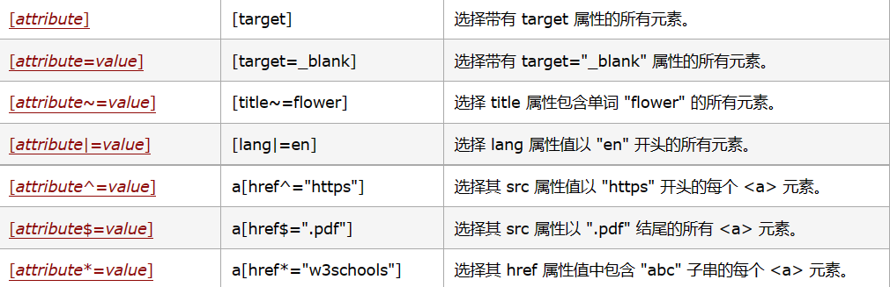
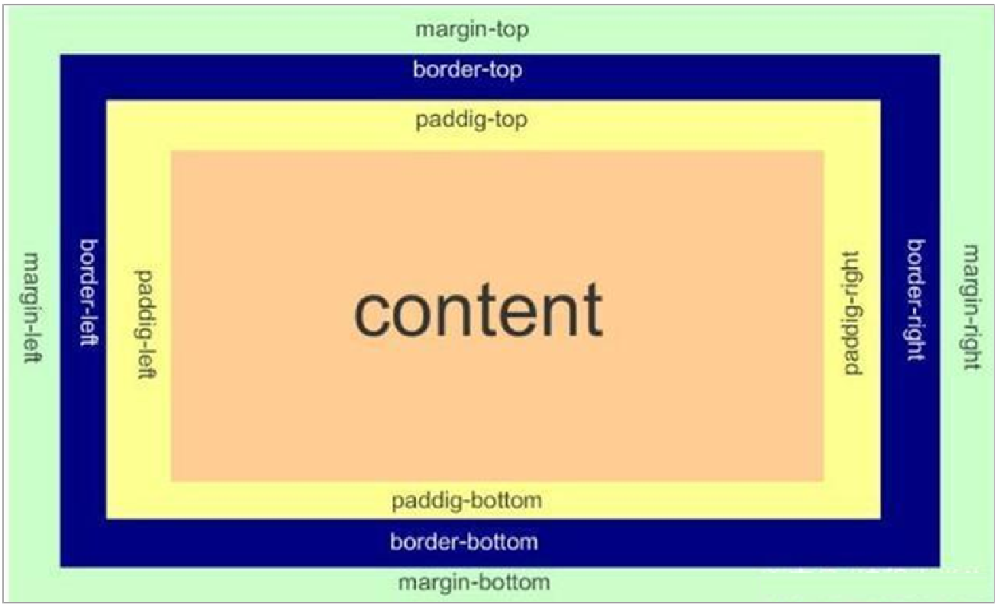

# CSS笔记

# 目录

[toc]


# 选择器

| 选择器                                                       | 示例                | 学习 CSS 的教程                                              |
| :----------------------------------------------------------- | :------------------ | :----------------------------------------------------------- |
| [类型选择器](https://developer.mozilla.org/zh-CN/docs/Web/CSS/Type_selectors) | `h1 { }`            | [类型选择器](https://developer.mozilla.org/zh-CN/docs/user:chrisdavidmills/CSS_Learn/CSS_Selectors/Type_Class_and_ID_Selectors#Type_selectors) |
| [通配选择器](https://developer.mozilla.org/zh-CN/docs/Web/CSS/Universal_selectors) | `* { }`             | [通配选择器](https://developer.mozilla.org/zh-CN/docs/user:chrisdavidmills/CSS_Learn/CSS_Selectors/Type_Class_and_ID_Selectors#The_universal_selector) |
| [类选择器](https://developer.mozilla.org/zh-CN/docs/Web/CSS/Class_selectors) | `.box { }`          | [类选择器](https://developer.mozilla.org/zh-CN/docs/user:chrisdavidmills/CSS_Learn/CSS_Selectors/Type_Class_and_ID_Selectors#Class_selectors) |
| [ID 选择器](https://developer.mozilla.org/zh-CN/docs/Web/CSS/ID_selectors) | `#unique { }`       | [ID 选择器](https://developer.mozilla.org/zh-CN/docs/user:chrisdavidmills/CSS_Learn/CSS_Selectors/Type_Class_and_ID_Selectors#ID_Selectors) |
| [标签属性选择器](https://developer.mozilla.org/zh-CN/docs/Web/CSS/Attribute_selectors) | `a[title] { }`      | [标签属性选择器](https://developer.mozilla.org/zh-CN/docs/User:chrisdavidmills/CSS_Learn/CSS_Selectors/Attribute_selectors) |
| [伪类选择器](https://developer.mozilla.org/zh-CN/docs/Web/CSS/Pseudo-classes) | `p:first-child { }` | [伪类](https://developer.mozilla.org/zh-CN/docs/User:chrisdavidmills/CSS_Learn/CSS_Selectors/Pseuso-classes_and_Pseudo-elements#What_is_a_pseudo-class) |
| [伪元素选择器](https://developer.mozilla.org/zh-CN/docs/Web/CSS/Pseudo-elements) | `p::first-line { }` | [伪元素](https://developer.mozilla.org/zh-CN/docs/User:chrisdavidmills/CSS_Learn/CSS_Selectors/Pseuso-classes_and_Pseudo-elements#What_is_a_pseudo-element) |
| [后代选择器](https://developer.mozilla.org/zh-CN/docs/Web/CSS/Descendant_combinator) | `article p`         | [后代运算符](https://developer.mozilla.org/zh-CN/docs/User:chrisdavidmills/CSS_Learn/CSS_Selectors/Combinators#Descendant_Selector) |
| [子代选择器](https://developer.mozilla.org/zh-CN/docs/Web/CSS/Child_combinator) | `article > p`       | [子代选择器](https://developer.mozilla.org/zh-CN/docs/User:chrisdavidmills/CSS_Learn/CSS_Selectors/Combinators#Child_combinator) |
| [相邻兄弟选择器](https://developer.mozilla.org/zh-CN/docs/Web/CSS/Adjacent_sibling_combinator) | `h1 + p`            | [相邻兄弟](https://developer.mozilla.org/zh-CN/docs/User:chrisdavidmills/CSS_Learn/CSS_Selectors/Combinators#Adjacent_sibling) |
| [通用兄弟选择器](https://developer.mozilla.org/zh-CN/docs/Web/CSS/General_sibling_combinator) | `h1 ~ p`            | [通用兄弟](https://developer.mozilla.org/zh-CN/docs/User:chrisdavidmills/CSS_Learn/CSS_Selectors/Combinators#General_sibling) |

- 基础选择器

  - 标签选择器
  - 类选择器
  - 多类名选择器
  - id选择器
  - 通配符选择器

- 复合选择器

  - 后代选择器

    - 父亲元素 孩子元素 { 样式声明}

  - 子选择器

    - 父亲元素>亲儿子元素{声明}
    - 选择最近一级元素,亲儿子!再向下的孩子节点就不管了

  - 并集选择器,多个选择器用逗号隔开,定义相同的样式

  - 伪类选择器

    - 伪类选择器用于向某些选择器添加特殊的效果，比如给链接添加特殊效果，或选择第1个，第n个元素。
    - 伪类选择器书写最大的特点是用冒号（:）表示，比如 :hover 、 :first-child
    - a:link 没有点击过的(访问过的)链接 a:visited 点击过的(访问过的)链接 a:hover 鼠标经过的那个链接 a:active 鼠标正在按下还没有弹起鼠标的那个链接
    - 为了确保生效，请按照 LVHA 的循顺序声明 :link－:visited－:hover－:active。记忆法：love hate 或者 lv 包包 hao 。

  - :focus伪类选择器,用于选取获得焦点的表单元素。焦点就是光标，一般情况 类表单元素才能获取,如input:focus{color:pink}

  - 中括号一类选择器

    <!--  -->

# 字体

- 大小,font-size
- 粗细,font-weight
  - normal
  - bold
  - 100-900,400等同于normal,700等同于bold,不加单位
- 样式,font-style
  - normal
  - italic斜体
- 综合写法
  - body { font: font-style font-weight font-size/line-height font-family;}
  - 使用 font 属性时，必须按上面语法格式中的顺序书写，不能更换顺序，并且各个属性间以空格隔开 不需要设置的属性可以省略（取默认值），但必须保留 font-size 和 font-family 属性，否则 font 属性将不起作用

# 文本

- 文本颜色,color
  - 预定义颜色值
  - 十六进制#ffffff
  - RGB,rgb(255,0,0)
- 文本对齐,text-align,可选center/left/right
- 修饰文本,text-decoration,可选none,underline,overline,line-through,重点前两个
- 文本缩进,text-indent,单位可以是em(em 是一个相对单位，就是当前元素（font-size) 1 个文字的大小, 如果当前元素没有设置大小，则会按照父元素的 1 个文字大小。)
- 行间距,line-height 属性用于设置行间的距离（行高）。可以控制文字行与行之间的距离 语法： p { line-height: 26px; }上间距+文本高度+下间距 = 行间距
- 文字垂直居中,行高等于盒子高度; 理解,行高的上空隙和下空隙把文字挤到中间了，如果行高小于盒子高度,文字会偏上，如果行高大于盒子高度,则文字偏下。

# 样式表

- 行内样式：使用 HTML 标签的 style 属性定义 CSS 样式；

- 内嵌样式：使用 < style> 标签在 HTML 文档头部（< head> 和 < head> 之间）定义 CSS 样式；

- 链接式：使用 < link> 标签引入外部 CSS 样式表文件。

  <link href="index.css" type="text/css" rel="stylesheet" />

- 导入式：使用 @import 命令导入外部 CSS 样式表文件。

# emmet语法

- 生成标签
  - 标签名,tab键
  - 多个相同标签,div*3
  - 父子关系ul>li
  - 兄弟关系,div+p
  - 类名.demo
  - id名,#app
  - 自增符号
- 生成css样式

# 元素显示模式

- 块元素

  - ```
    <h1>~<h6>、<p>、<div>、<ul>、<ol>、<li>标签是最典型的块元素
    ```

  - 比较霸道，自己独占一行。

  - 高度，宽度、外边距以及内边距都可以控制。

  - 宽度默认是容器（父级宽度）的100%。

  - 是一个容器及盒子，里面可以放行内或者块级元素。

  - 文字类的元素内不能放块级元素,如p,h1标签内不能放div,只有文字才成段落，因此p标签里**不能放块级元素**，同理 `<h1>`~`<h6><dt>`内都不能放其他块级元素。

- 行内元素

  - ```
    <a>、<strong>、<b>、<em>、<i>、<del>、<s>、<ins>、<u>、<span>标签是最典型的块元素
    ```

  - 相邻行内元素在一行上，一行可以显示多个。

  - 高、宽直接设置是无效的。

  - 默认宽度就是它本身内容的宽度。

  - 行内元素只能容纳文本或其他行内元素。
    **注意：** 链接里面不能再放链接 特殊情况链接 里面可以放块级元素，但是给 转换一下块级模式最安全

  - 链接 `<a>`里边不能再放链接。

- 行内块元素

  - ```
    、<input />、<td>
    ```

  - 和相邻行内元素（行内块）在一行上，但是他们之间会有空白缝隙。

  - 一行可以显示多个（行内元素特点）。

  - 默认宽度就是它本身内容的宽度（行内元素特点）。

  - 高度，行高、外边距以及内边距都可以控制（块级元素特点）。

- 显示模式转换

  - 转换为块元素：display:block;
  - 转换为行内元素：display:inline;
  - 转换为行内块：display: inline-block;

# 背景

- 颜色,background-color,元素背景颜色默认值是 transparent（透明）
- 背景颜色半透明,rgba(0,0,0,0.3)最后一个参数是 alpha 透明度，取值范围在 0~1之间- 前面三个参数为颜色，(0,0,0)为黑色- 我们习惯把 0.3 的 0 省略掉，写为 background: rgba(0, 0, 0, .3);
- 图片,background-image 定义元素的背景图片,
  - back-ground-image:none | url(url)
  - 路径不要加引号
- 平铺,background-repeat 设置元素背景图像的平铺
  - repeat,no-repeat,repeat-x,repeat-y
- 位置,background-position 属性可以改变图片在背景中的位置
  - background-position:x y;
  - 坐标系
<!-- - 背景颜色渐变linear-gradient -->
- 固定,background-attachment 属性设置背景图像是否固定或者随着页面的其余部分滚动。
- 合起来,background: 背景颜色 背景图片地址 背景平铺 背景图像滚动 背景图片位置;

# 三大特性

- 层叠性,最后一个为准
- 继承性,子标签会继承父标签的某些样式（text-，font-，line-这些元素开头的可以继承，以及color属性）行高可以跟单位也可以不跟单位- 如果子元素没有设置行高，则会继承父元素的行高为 1.5- 此时子元素的行高是：当前子元素的文字大小font-side * 1.5- body 行高 1.5 这样写法最大的优势就是里面子元素可以根据自己文字大小自动调整行高
- 优先级
  - 当同一个元素指定多个选择器，就会有优先级的产生。
  - 
  - 不会有进位,从左向右比较
  - 符合选择器权重叠加

# 网页布局

- 先准备好相关的网页元素，网页元素基本都是盒子 Box 。
- 利用 CSS 设置好盒子样式，然后摆放到相应位置。
- 往盒子里面装内容
- 三大核心
  - 盒模型,浮动,定位

# 盒模型

- 

- content

  - 

- padding

  - 不允许为负

- border

  -  border: 1px solid red;  

- margin

  ```css
  /* 应用于所有边 */
  margin: 1em;
  margin: -3px;
  
  /* 上边下边 | 左边右边 */
  margin: 5% auto;
  
  /* 上边 | 左边右边 | 下边 */
  margin: 1em auto 2em;
  
  /* 上边 | 右边 | 下边 | 左边 */
  margin: 2px 1em 0 auto;
  
  /* 全局值 */
  margin: inherit;
  margin: initial;
  margin: unset;
  
  ```

  

# 浮动

# 定位

- 固定定位的盒子必须有宽度

# 动画

# css命名规范

```css
常用的CSS命名规则
头：header　　内容：content/container　　尾：footer　　导航：nav　　侧栏：sidebar
栏目：column　　页面外围控制整体布局宽度：wrapper　　左右中：left right center
登录条：loginbar　　标志：logo　　广告：banner　　页面主体：main　　热点：hot
新闻：news　　下载：download　　子导航：subnav　　菜单：menu
子菜单：submenu　　搜索：search　　友情链接：friendlink　　页脚：footer
版权：copyright　　滚动：scroll　　内容：content　　标签页：tab
文章列表：list　　提示信息：msg　　小技巧：tips　　栏目标题：title
加入：joinus　　指南：guild　　服务：service　　注册：regsiter
状态：status　　投票：vote　　合作伙伴：partner
(1)页面结构
容器: container　　页头：header　　内容：content/container
页面主体：main　　页尾：footer　　导航：nav
侧栏：sidebar　　栏目：column　　页面外围控制整体布局宽度：wrapper
左右中：left right center
(2)导航
导航：nav　　主导航：mainbav　　子导航：subnav
顶导航：topnav　　边导航：sidebar　　左导航：leftsidebar
右导航：rightsidebar　　菜单：menu　　子菜单：submenu
标题: title　　摘要: summary
(3)功能
标志：logo　　广告：banner　　登陆：login　　登录条：loginbar
注册：regsiter　　搜索：search　　功能区：shop
标题：title　　加入：joinus 　状态：status　　按钮：btn
滚动：scroll　　标签页：tab　　文章列表：list　　提示信息：msg
当前的: current　　小技巧：tips　　图标: icon　　注释：note
指南：guild　服务：service　　热点：hot　　新闻：news
下载：download　　投票：vote　　合作伙伴：partner
友情链接：link　　版权：copyright
```

# 注意事项

- 语义，不要div一把梭，seo优化
- 居中对齐
  - 块级元素水平居中，给定宽度，水平margin为auto
  - 文字水平居中，text-align: center;
  - 文字垂直居中，行高等于块高；
  - 图片元素默认和文字基线对齐，需要对图片元素设置vertical-align: middle;（去除图片到顶端的缝隙）
- margin塌陷，父盒子overflow：hidden
- 开始时，可以给个背景颜色帮助识别
- 链接给个< a >标签，里面放东西，更好的语义；div增加一个click也ok

## 单列布局

### 效果


### 原理

盒子水平居中显示,指定宽度后,margin:0 auto即可

### 实现

### 细节

width与max-width

通常有公共版心,单独抽一个类出来

## 两列自适应布局

**两列自适应布局是指一列由内容撑开，另一列撑满剩余宽度的布局方式**


固定侧边栏怎么实现

父盒子确定位置

## 三栏布局

## 粘连布局

## 等高布局

## 圣杯布局

定义：两侧固定宽度，中间自适应

flex做法，中间盒子flex:1占据全部份数

## 组件做法

焦点图，直接和父盒子一样宽

如何写一个固定定位置顶的搜索栏


固定定位如何居中对齐，首先找到50%，然后transform，兼容性写法