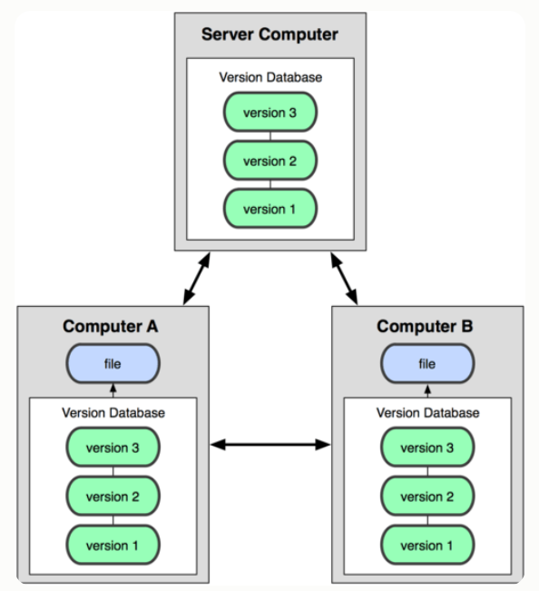
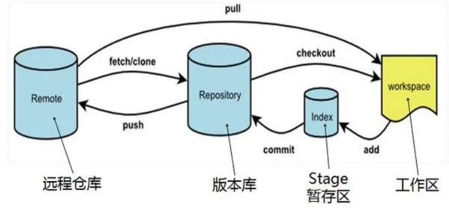
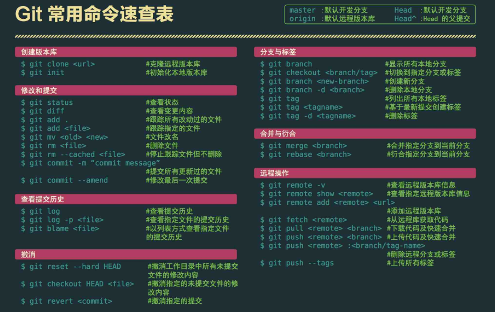
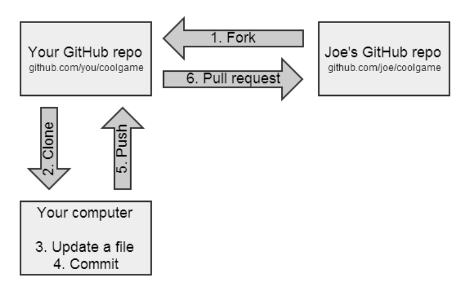
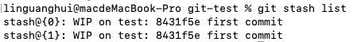
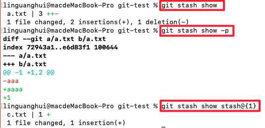
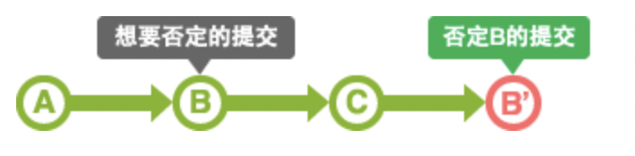

[toc]

# 理解

## 一、是什么

git，是一个分布式版本控制软件，最初目的是为更好地管理`Linux`内核开发而设计

分布式版本控制系统的客户端并不只提取最新版本的文件快照，而是把代码仓库完整地镜像下来。这么一来，任何一处协同工作用的服务器发生故障，事后都可以用任何一个镜像出来的本地仓库恢复

<!--  -->

项目开始，只有一个原始版仓库，别的机器可以`clone`这个原始版本库，那么所有`clone`的机器，它们的版本库其实都是一样的，并没有主次之分

所以在实现团队协作的时候，只要有一台电脑充当服务器的角色，其他每个人都从这个“服务器”仓库`clone`一份到自己的电脑上，并且各自把各自的提交推送到服务器仓库里，也从服务器仓库中拉取别人的提交

`github`实际就可以充当这个服务器角色，其是一个开源协作社区，提供`Git`仓库托管服务，既可以让别人参与你的开源项目，也可以参与别人的开源项目

## 二、工作原理

当我们通过`git init`创建或者`git clone`一个项目的时候，项目目录会隐藏一个`.git`子目录，其作用是用来跟踪管理版本库的

`Git` 中所有数据在存储前都计算校验和，然后以校验和来引用，所以在我们修改或者删除文件的时候，`git`能够知道

`Git`用以计算校验和的机制叫做 SHA-1 散列（hash，哈希）， 这是一个由 40 个十六进制字符（0-9 和 a-f）组成字符串，基于 Git 中文件的内容或目录结构计算出来，如下：

```text
24b9da6552252987aa493b52f8696cd6d3b00373
```

当我们修改文件的时候，`git`就会修改文件的状态，可以通过`git status`进行查询，状态情况如下：

- 已修改（modified）：表示修改了文件，但还没保存到数据库中。
- 已暂存（staged）：表示对一个已修改文件的当前版本做了标记，使之包含在下次提交的快照中。
- 已提交（committed）：表示数据已经安全的保存在本地数据库中。

文件状态对应的，不同状态的文件在`Git`中处于不同的工作区域，主要分成了四部分：

- 工作区：相当于本地写代码的区域，如 git clone 一个项目到本地，相当于本地克隆了远程仓库项目的一个副本
- 暂存区：暂存区是一个文件，保存了下次将提交的文件列表信息，一般在 Git 仓库目录中
- 本地仓库：提交更新，找到暂存区域的文件，将快照永久性存储到 Git 本地仓库
- 远程仓库：远程的仓库，如 github



## 三、命令

从上图可以看到，`git`日常简单的使用就只有上图6个命令：

- add
- commit
- push
- pull
- clone
- checkout

但实际上还有很多命令，如果想要熟练使用，还有60个多命令，通过这些命令的配合使用，能够提高个人工作效率和团队协助能力



# fork,clone,branch区别

### fork

叉子,是分叉克隆出一个新拷贝,包含了原来的仓库（即upstream repository，上游仓库）所有内容，如分支、Tag、提交

如果想将你的修改合并到原项目中时，可以通过的 Pull Request 把你的提交贡献回 原仓库



### clone

`clone`，译为克隆，它的作用是将文件从远程代码仓下载到本地，从而形成一个本地代码仓

执行`clone`命令后，会在当前目录下创建一个名为`xxx`的目录，并在这个目录下初始化一个 `.git` 文件夹，然后从中读取最新版本的文件的拷贝

默认配置下远程 `Git` 仓库中的每一个文件的每一个版本都将被拉取下来

### branch

`branch`，译为分支，其作用简单而言就是开启另一个分支， 使用分支意味着你可以把你的工作从开发主线上分离开来，以免影响开发主线

# head 工作树 索引之间的区别

- 在`git`中，可以存在很多分支，其本质上是一个指向`commit`对象的可变指针，而`Head`是一个特别的指针，是一个指向你正在工作中的本地分支的指针
- HEAD 指针通常指向我们所在的分支，当我们在某个分支上创建新的提交时，分支指针总是会指向当前分支的最新提交
- 工作树是查看和编辑的（源）文件的实际内容
- 索引是为了向数据库提交作准备的区域，也被称为暂存区域，如工作树的代码通过 git add 则添加到 git 索引中，通过git commit 则将索引区域的文件提交到 git 仓库中


# fetch merge区别

- git fetch 命令用于从另一个存储库下载对象和引用
- git pull 命令用于从另一个存储库或本地分支获取并集成(整合)

相同点：

- 在作用上他们的功能是大致相同的，都是起到了更新代码的作用

不同点：

- git pull是相当于从远程仓库获取最新版本，然后再与本地分支merge，即git pull = git fetch + git merge
- 相比起来，git fetch 更安全也更符合实际要求，在 merge 前，我们可以查看更新情况，根据实际情况再决定是否合并


# git stash

## 一、是什么

stash，译为存放，在 git 中，可以理解为保存当前工作进度，会把暂存区和工作区的改动进行保存，这些修改会保存在一个栈上

后续你可以在任何时候任何分支重新将某次的修改推出来，重新应用这些更改的代码

默认情况下，`git stash`会缓存下列状态的文件：

- 添加到暂存区的修改（staged changes）
- Git跟踪的但并未添加到暂存区的修改（unstaged changes）

但以下状态的文件不会缓存：

- 在工作目录中新的文件（untracked files）
- 被忽略的文件（ignored files）

如果想要上述的文件都被缓存，可以使用`-u`或者`--include-untracked`可以工作目录新的文件，使用`-a`或者`--all`命令可以当前目录下的所有修改

## 二、如何使用

关于`git stash`常见的命令如下：

- git stash
- git stash save
- git stash list
- git stash pop
- git stash apply
- git stash show
- git stash drop
- git stash clear

### [#](https://vue3js.cn/interview/git/git stash.html#git-stash)git stash

保存当前工作进度，会把暂存区和工作区的改动保存起来

### [#](https://vue3js.cn/interview/git/git stash.html#git-stash-save)git stash save

`git stash save`可以用于存储修改.并且将`git`的工作状态切回到`HEAD`也就是上一次合法提交上

如果给定具体的文件路径,`git stash`只会处理路径下的文件.其他的文件不会被存储，其存在一些参数：

- --keep-index 或者 -k 只会存储为加入 git 管理的文件
- --include-untracked 为追踪的文件也会被缓存,当前的工作空间会被恢复为完全清空的状态
- -a 或者 --all 命令可以当前目录下的所有修改，包括被 git 忽略的文件

### [#](https://vue3js.cn/interview/git/git stash.html#git-stash-list)git stash list

显示保存进度的列表。也就意味着，`git stash`命令可以多次执行，当多次使用`git stash`命令后，栈里会充满未提交的代码，如下：



其中，`stash@{0}`、`stash@{1}`就是当前`stash`的名称

### [#](https://vue3js.cn/interview/git/git stash.html#git-stash-pop)git stash pop

`git stash pop` 从栈中读取最近一次保存的内容，也就是栈顶的`stash`会恢复到工作区

也可以通过 `git stash pop` + `stash`名字执行恢复哪个`stash`恢复到当前目录

如果从`stash`中恢复的内容和当前目录中的内容发生了冲突，则需要手动修复冲突或者创建新的分支来解决冲突

### [#](https://vue3js.cn/interview/git/git stash.html#git-stash-apply)git stash apply

将堆栈中的内容应用到当前目录，不同于`git stash pop`，该命令不会将内容从堆栈中删除

也就说该命令能够将堆栈的内容多次应用到工作目录中，适应于多个分支的情况

同样，可以通过`git stash apply` + `stash`名字执行恢复哪个`stash`恢复到当前目录

### [#](https://vue3js.cn/interview/git/git stash.html#git-stash-show)git stash show

查看堆栈中最新保存的`stash`和当前目录的差异

通过使用`git stash show -p`查看详细的不同

通过使用`git stash show stash@{1}`查看指定的`stash`和当前目录差异



### [#](https://vue3js.cn/interview/git/git stash.html#git-stash-drop)git stash drop

`git stash drop` + `stash`名称表示从堆栈中移除某个指定的stash

### [#](https://vue3js.cn/interview/git/git stash.html#git-stash-clear)git stash clear

删除所有存储的进度

## 三、应用场景

当你在项目的一部分上已经工作一段时间后，所有东西都进入了混乱的状态， 而这时你想要切换到另一个分支或者拉下远端的代码去做一点别的事情

但是你创建一次未完成的代码的`commit`提交，这时候就可以使用`git stash`

例如以下场景：

当你的开发进行到一半,但是代码还不想进行提交 ,然后需要同步去关联远端代码时.如果你本地的代码和远端代码没有冲突时,可以直接通过`git pull`解决

但是如果可能发生冲突怎么办.直接`git pull`会拒绝覆盖当前的修改，这时候就可以依次使用下述的命令：

- git stash
- git pull
- git stash pop

或者当你开发到一半，现在要修改别的分支问题的时候，你也可以使用`git stash`缓存当前区域的代码

- git stash：保存开发到一半的代码
- git commit -m '修改问题'
- git stash pop：将代码追加到最新的提交之后


# git rebase 和git merge的理解与区别

从上面可以看到，`merge`和`rebasea`都是合并历史记录，但是各自特性不同：

### [#](https://vue3js.cn/interview/git/git rebase_ git merge.html#merge)merge

通过`merge`合并分支会新增一个`merge commit`，然后将两个分支的历史联系起来

其实是一种非破坏性的操作，对现有分支不会以任何方式被更改，但是会导致历史记录相对复杂

### [#](https://vue3js.cn/interview/git/git rebase_ git merge.html#rebase)rebase

`rebase`会将整个分支移动到另一个分支上，有效地整合了所有分支上的提交

主要的好处是历史记录更加清晰，是在原有提交的基础上将差异内容反映进去，消除了 `git merge`所需的不必要的合并提交

# reset revert

## git reset

`reset`用于回退版本，可以遗弃不再使用的提交

执行遗弃时，需要根据影响的范围而指定不同的参数，可以指定是否复原索引或工作树内容


## git revert

在当前提交后面，新增一次提交，抵消掉上一次提交导致的所有变化，不会改变过去的历史，主要是用于安全地取消过去发布的提交



撤销（revert）被设计为撤销公开的提交（比如已经push）的安全方式，`git reset`被设计为重设本地更改

因为两个命令的目的不同，它们的实现也不一样：重设完全地移除了一堆更改，而撤销保留了原来的更改，用一个新的提交来实现撤销

两者主要区别如下：

- git revert是用一次新的commit来回滚之前的commit，git reset是直接删除指定的commit
- git reset 是把HEAD向后移动了一下，而git revert是HEAD继续前进，只是新的commit的内容和要revert的内容正好相反，能够抵消要被revert的内容
- 在回滚这一操作上看，效果差不多。但是在日后继续 merge 以前的老版本时有区别

> git revert是用一次逆向的commit“中和”之前的提交，因此日后合并老的branch时，之前提交合并的代码仍然存在，导致不能够重新合并
>
> 但是git reset是之间把某些commit在某个branch上删除，因而和老的branch再次merge时，这些被回滚的commit应该还会被引入

- 如果回退分支的代码以后还需要的情况则使用`git revert`， 如果分支是提错了没用的并且不想让别人发现这些错误代码，则使用`git reset`