[toc]

# 资料来源

https://vue3js.cn/interview

# JS执行流程

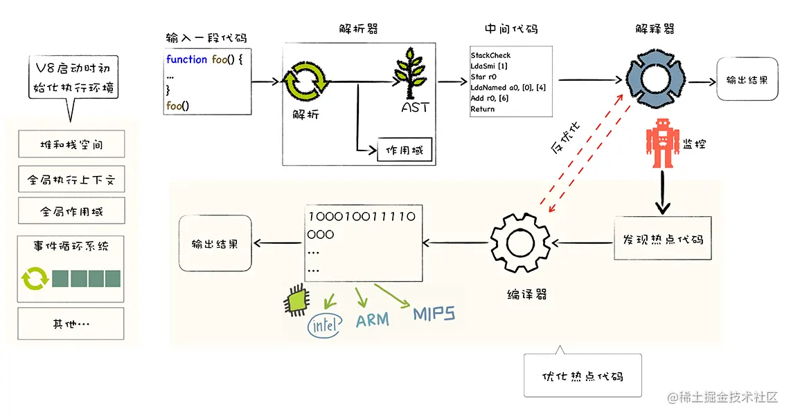

准备基础环境

- 初始化堆栈
- JS全局执行上下文，包括全局变量和内置函数
- 全局作用域
- 消息循环系统。消息驱动器，消息队列

执行流程

- V8结构化JS源代码，生成抽象语法树AST，产生相关作用域
- 生成字节码（介于AST和机器代码的中间代码），与特定类型的机器代码无关
- 解释器按照顺序解释执行字节码，输出结果


JavaScript的执行分为：解释和执行两个阶段,这两个阶段所做的事并不一样：

### 解释阶段：

- 词法分析
- 语法分析
- 作用域规则确定

### 执行阶段：

- 创建执行上下文
- 执行函数代码
- 垃圾回收

JavaScript解释阶段便会确定作用域规则，因此作用域在函数定义时就已经确定了，而不是在函数调用时确定，但是执行上下文是函数执行之前创建的。执行上下文最明显的就是this的指向是执行时确定的。而作用域访问的变量是编写代码的结构确定的。

作用域和执行上下文之间最大的区别是： **执行上下文在运行时确定，随时可能改变；作用域在定义时就确定，并且不会改变**。

一个作用域下可能包含若干个上下文环境。有可能从来没有过上下文环境（函数从来就没有被调用过）；有可能有过，现在函数被调用完毕后，上下文环境被销毁了；有可能同时存在一个或多个（闭包）。**同一个作用域下，不同的调用会产生不同的执行上下文环境，继而产生不同的变量的值**。


作者：浪里行舟
链接：https://juejin.cn/post/6844903797135769614

​	JIT技术，在 `JavaScript` 引擎中增加一个**监视器**（也叫分析器）。监视器监控着代码的运行情况，**记录代码一共运行了多少次、如何运行的等信息**。执行多次的标记warm hot

​	如果标记成了warm，就送到编译器去编译，并把结果保存。代码段的每一行都会被编译成一个“桩”（`stub`），同时给这个桩分配一个以`行号 + 变量类型`的索引。如果监视器监视到了执行同样的代码和同样的变量类型，那么就直接把这个已编译的版本 `push` 出来给浏览器。

​	如果一个代码段变得 `very hot`，`监视器`会把它发送到**优化编译器**中。**生成一个更快速和高效的代码版本出来，并且存储之**。`优化编译器`最成功一个特点叫做**类型特`JavaScript` 所使用的**动态类型体系**在运行时需要进行额外的解释工作。`JIT` 处理这个问题的方法是编译多基线桩。

- 如果一个代码段是单一形态的（即总是以同一类型被调用），则只生成一个桩。
- 如果是**多形态**的（即调用的过程中，类型不断变化），则会为操作所调用的每一个类型组合生成一个桩。


# 数据类型

## 分类

基本

undefined，null，Boolean,String,Number,Symbol,BigInt

引用

Object

## 存储

栈内存，堆内存

## 判断

typeof 操作符返回一个字符串，表示未经计算的操作数的类型

- 判断**基本数据类型**
- `typeof null` 特例，返回的是`"object"`
- typeof function => 'function'

a instanceof b

- a是否在b的原型对象上
- 检测构造函数的 `prototype` 属性是否出现在某个实例对象的原型链上

`typeof`与`instanceof`都是判断数据类型的方法，区别如下：

- `typeof`会返回一个变量的基本类型，`instanceof`返回的是一个布尔值
- `instanceof` 可以准确地判断复杂引用数据类型，但是不能正确判断基础数据类型
- 而`typeof` 也存在弊端，它虽然可以判断基础数据类型（`null` 除外），但是引用数据类型中，除了`function` 类型以外，其他的也无法判断

如果需要通用检测数据类型，可以采用`Object.prototype.toString`，调用该方法，统一返回格式`“[object Xxx]”`的字符串


Object.prototype.toString.call(xx)

- 判断**基本数据类型**
- 实现原理：
  - 若参数(xx)不为 `null` 或 `undefined`，则**将参数转为对象**，再作判断
  - 转为对象后，取得该对象的 `[Symbol.toStringTag]` 属性值（可能会遍历原型链）作为 `tag`，然后返回 `"[object " + tag + "]"` 形式的字符串。


# 数据类型转换

## 显示转换

- Number()
  - undefined转为NaN；
  - String如果可以解析，解析成对应的数值；否则NaN；空串为0
  - Symbol不可转换
  - Object 先调用toPrimitive，再调用toNumber
- parseInt()。左到右逐个解析字符，遇到不能转换的字符就停下来
- String()
  - [object object]
- Boolean()
  - 转换为true的情况，非空字符串，非零数值，任意对象


## 隐式转换

需要布尔值的地方，会自动调用Boolean函数。如条件表达式

需要字符串的地方，先将复合类型的值转为原始类型的值，再将原始类型的值转为字符串。如+字符串拼接

除了`+`有可能把运算子转为字符串，其他运算符都会把运算子自动转成数值


# == 和 ===区别

等于操作符（==）在比较中会先进行类型转换，再确定操作数是否相等

- 两个都为简单类型，字符串和布尔值都会转换成数值，再比较

- 简单类型与引用类型比较，对象转化成其原始类型的值，再比较。

  > 如果一个操作数是对象，另一个操作数不是，则调用对象的 `valueOf()`方法取得其原始值，再根据前面的规则进行比较
  >
  > ```js
  > let obj = {
  > 	valueOf: function () {
  > 		return 1;
  > 	},
  > };
  > console.log(obj == 1); // true
  > 
  > ```

- 两个都为引用类型，则比较它们是否指向同一个对象

- null 和 undefined 相等

- 存在 NaN 则返回 false


===值和类型都相等才true

最好使用===

# let const var

围绕

- 暂时性死区
- 重复声明
- 变量提升
- const不能修改
- 块级作用域


# Symbol

https://blog.csdn.net/canoe777/article/details/107759464

## 是什么

表示独一无二的值，Symbol最大的用途是用来定义对象的唯一属性名
比如我们要给一个已有属性的对象添加一个新的属性，新的属性可能和旧的属性名称冲突，这个时候采用Symbol是最好的。


# BigInt

**`BigInt`** 是一种内置对象，它提供了一种方法来表示大于 `2^53 - 1` 的整数。这原本是 Javascript 中可以用 [`Number`](https://developer.mozilla.org/zh-CN/docs/Web/JavaScript/Reference/Global_Objects/Number) 表示的最大数字。**`BigInt`** 可以表示任意大的整数。

可以用在一个整数字面量后面加 `n` 的方式定义一个 `BigInt` ，如：`10n`，或者调用函数 `BigInt()`（但不包含 `new` 运算符）并传递一个整数值或字符串值。

不能用于 [`Math`](https://developer.mozilla.org/zh-CN/docs/Web/JavaScript/Reference/Global_Objects/Math) 对象中的方法；不能和任何 [`Number`](https://developer.mozilla.org/zh-CN/docs/Web/JavaScript/Reference/Global_Objects/Number) 实例混合运算，两者必须转换成同一种类型。在两种类型来回转换时要小心，因为 `BigInt` 变量在转换成 [`Number`](https://developer.mozilla.org/zh-CN/docs/Web/JavaScript/Reference/Global_Objects/Number) 变量时可能会丢失精度。


# foreach,for in和for of

`for in`遍历的是数组的索引（`index`），而`for of`遍历的是数组元素值（`value`）

## foreach

https://juejin.cn/post/6976419561067249672

foreach使用return不能中断循环

如何中断？try catch，或使用every或some


## for in

迭代对象原型链上一切可以枚举的属性，所以性能差

主要用于对象，键是字符型索引

缺点

- `for in` 循环主要遍历数字优先，由小到大遍历

- `for in` 无法遍历 `Symbol`属性（不可枚举）。

- `for in` 会将公有(prototype) 中可枚举的属性也遍历了。可以使用 `hasOwnProperty`来阻止遍历公有属性。

```js
let f = {
	fn() {},
};
let son = {
	0: 0,
	[Symbol(1)]: 1,
};
son.__proto__ = f;
for (let key in son) {
	console.log(key); //0 fn
}
for (let key in son) {
	if (son.hasOwnProperty(key)) {
		console.log(key); //0
	}
}

```

### 怎么获取Symbol属性呢？

使用 `Object.getOwnPropertySymbols()`，获取所有 Symbol 属性。

想获取全部属性，`Object.keys(obj).concat(Object.getOwnPropertySymbols(obj))`

## for of

for of 循环的原理是`按照是否有迭代器规范来循环的`，所有带有 `Symbol.iterator` 的都是实现了迭代器规范，比如数组一部分类数组，`Set,Map...`。`对象没有实现 Symbol.iterator 规范`，所以不能使用`for of`循环。

- 使用 `for of` 循环，首先会先执行 `Symbol.iterator` 属性对应的函数且返回一个对象

- 对象内包含一个函数 `next()` 循环一次执行一次 `next()`，`next()` 中又返回一个对象

- 这个对象内包含两个值分别是 `done：代表循环是否结束，true 代表结束；value：代表每次返回的值`。

### 如何让普通的类数组可以for of循环

> 类数组被需具备和数组类试的结果属性名从`0, 1, 2...`开始，且必须具备`length` 属性。
>
> 给类数组对象添加`Symbol.iterator`接口规范就可以了。

```js
let obj = {
	0: 12,
	1: '林一一',
	hello: 123,
	[Symbol('a')]: 'a',
	2: 'age18',
	length: 3,
};
//
obj[Symbol.iterator] = Array.prototype[Symbol.iterator];
for (const value of obj) {
	console.log(value);
}
/* 属性
 *   12
 *   林一一
 *   age18
 */

```

# 类数组对象转为数组

- 使用 call()和slice
- 扩展运算符
- Array.from()

## querySectorAll

querySelectorAll 是 [Dom](https://link.zhihu.com/?target=https%3A//dom.spec.whatwg.org/) 规范中的内容，Dom 规范是平台中立的，querySelectorAll 返回的结果是 NodeList

使用Array.prototype.[slice](https://so.csdn.net/so/search?q=slice&spm=1001.2101.3001.7020).call()方法或者[].slice.call()方法

## 怎么把argument实参集合变成真正的数组？

为什么不是？

`arguments` 是类数组(其实是一个对象)属性从0开始排，依次为0，1，2... 最后还有 `callee和length` 属性，`arguments` 的 `__proto__` 直接指向基类的 `object`，不具备数组的方法。

怎么做？

- 使用 call()和slice
- 扩展运算符
- Array.from()

```js
let array = [12, 23, 45, 65, 32];
function fn() {
	// [[12, 23, 45, 65, 32],1]
	console.log([].slice.call(arguments), Array.prototype.slice.call(arguments));
	console.log(Array.from(arguments));
	console.log([...arguments]);
}
fn(array, 1);

```


# TODOObject相关方法

## 属性

在JavaScript中，对象是通过属性描述（property descriptor）进行描述的，我们可以配置以下关键字。

1.configurable——如果设置为true，则可以修改或者删除属性。如果设置为false，则不允许修改。

2.enumerable——如果设置为true，则可在for-in循环对象属性使出现。

3.value——指定属性的值，默认为undefined。

4.writable——如果设置为true，则可通过赋值语句修改属性值。

5.get——定义getter函数，当访问属性时发生调用，不能与value与writable同时使用。

6.set——定义setter函数，当对属性赋值时调用，也不能与value与writable同时使用。

通过简单语句创建对象属性，例如：

ninjaTestInherit.name = "Yoshi"

该赋值语句创建的属性可以被修改或删除、可遍历、可写， NinjaTestInherit的name属性值被设置为Yoshi，get和set函数均为undefined。

如果想调整属性的配置信息，我们可以使用内置的Object.defineProprty方法，传入3个参数：属性所在的对象、属性名和属性描述对象。

原文链接：https://blog.csdn.net/zhangying1994/article/details/84892743

对象的方法如何声明呢?

```js
let obj = {
	1: 1,
	2: '2',
	hello: function () {
		return 1;
	},
};
let obj2 = {
	1: 1,
	2: '2',
	hello() {
		return 1;
	},
};
```

## 方法

toString()

**`Object.create()`** 方法用于创建一个新对象，使用现有的对象来作为新创建对象的原型（prototype）。


# ES6特性

## 类

我们将讲解的内容主要归为四大类：

1、解决原有语法上的一些不足

let 和 const 的块级作用域

2、对原有语法进行增强

解构、展开、参数默认值、模板字符串

3、全新的对象、全新的方法、全新的功能

promise、proxy、reflect、object的assign、is

4、全新的数据类型和数据结构

symbol、set、map


## const和let

## 解构赋值

## 模板字符串

## 函数扩展

参数默认值，函数的形参是默认声明的，不能使用`let`或`const`再次声明

length属性，返回没有指定默认值的参数个数

name属性，返回函数名

严格模式

箭头函数

## 数组扩展

Array.from()把两类对象转为数组，类似数组的对象和可遍历`（iterable）`的对象（包括 `ES6` 新增的数据结构 `Set` 和 `Map`）还可以接受第二个参数，用来对每个元素进行处理，将处理后的值放入返回的数组

### Array.of()

用于将一组值，转换为数组

```js
Array.of(3, 11, 8) // [3,11,8]
```

没有参数的时候，返回一个空数组

当参数只有一个的时候，实际上是指定数组的长度

参数个数不少于 2 个时，`Array()`才会返回由参数组成的新数组

关于数组实例对象新增的方法有如下：

- copyWithin()
- find()、findIndex()
- fill()
- entries()，keys()，values()
- includes()
- flat()，flatMap()


## 对象扩展

### 简写

ES6中，当对象键名与对应值名相等的时候，可以进行简写

```js
const baz = {foo:foo}

// 等同于
const baz = {foo}
```


方法也能够进行简写

```js
const o = {
  method() {
    return "Hello!";
  }
};

// 等同于

const o = {
  method: function() {
    return "Hello!";
  }
}
```


在函数内作为返回值，也会变得方便很多

```js
function getPoint() {
  const x = 1;
  const y = 10;
  return {x, y};
}

getPoint()
// {x:1, y:10}
```


注意：简写的对象方法不能用作构造函数，否则会报错

```js
const obj = {
  f() {
    this.foo = 'bar';
  }
};

new obj.f() // 报错
```

### 属性名表达式

ES6 允许字面量定义对象时，将表达式放在括号内；表达式还可以用于定义方法名；表达式还可以用于定义方法名；属性名表达式如果是一个对象，默认情况下会自动将对象转为字符串

### super关键词

`this`关键字总是指向函数所在的当前对象，ES6 又新增了另一个类似的关键字`super`，指向当前对象的原型对象

### 属性遍历

- for...in：循环遍历对象自身的和继承的可枚举属性（不含 Symbol 属性）
- Object.keys(obj)：返回一个数组，包括对象自身的（不含继承的）所有可枚举属性（不含 Symbol 属性）的键名
- Object.getOwnPropertyNames(obj)：回一个数组，包含对象自身的所有属性（不含 Symbol 属性，但是包括不可枚举属性）的键名
- Object.getOwnPropertySymbols(obj)：返回一个数组，包含对象自身的所有 Symbol 属性的键名
- Reflect.ownKeys(obj)：返回一个数组，包含对象自身的（不含继承的）所有键名，不管键名是 Symbol 或字符串，也不管是否可枚举

上述遍历，都遵守同样的属性遍历的次序规则：

- 首先遍历所有数值键，按照数值升序排列
- 其次遍历所有字符串键，按照加入时间升序排列
- 最后遍历所有 Symbol 键，按照加入时间升序排

### 对象新增的方法

关于对象新增的方法，分别有以下：

- Object.is()
- Object.assign()
- Object.getOwnPropertyDescriptors()
- Object.setPrototypeOf()，Object.getPrototypeOf()
- Object.keys()，Object.values()，Object.entries()
- Object.fromEntries()

## Symbol

## Set，Map

## Promise

## Iterator 和for ...of

## Generator和async/await


# 代理与反射

https://juejin.cn/post/7152899071651840030


Proxy和Reflect是ES6新增的两个重要特性之一。

Proxy是一个代理对象，可以在目标对象之前进行拦截和定制各种操作，例如对属性的读写、方法调用等。通过使用Proxy，我们可以实现诸如数据绑定、日志记录、权限管理、缓存等高级特性。

Reflect是一个内置的对象，提供了一组可操作性强、易于理解的API，用于反射（reflect）处理对象。它与Proxy密切相关，可以配合使用进行代理编程。Reflect提供了诸如Object . defineProperty()、Object . getPrototypeOf()、Object . setPrototypeOf()等常用API，使得JavaScript语言更加灵活和方便。

通常情况下，我们可以使用Proxy来创建一个虚拟代理对象，并在其上添加各种拦截器（handler），然后通过Reflect来实现真正的操作。例如，在处理一个类中非法的方法访问时，我们可以使用Proxy设置get方法来检测是否存在该方法，并在需要时抛出异常；同时使用Reflect进行真正的方法调用。

总之，Proxy和Reflect是JavaScript语言中非常重要、强大和灵活的特性，可以让我们更好地开发高级应用程序和增强代码质量和可维护性。

```js
const handler = {
	//target：目标对象
	//key：引用的目标对象上的字符串键属性
	//value：要赋给属性的值。
	//receiver：代理对象或继承代理对象的对象
	get(target, key, receiver) {
		console.log('get');
		return Reflect.get(target, key, receiver);
	},
	set(target, key, value, receiver) {
		console.log('set');
		Reflect.set(target, key, value, receiver);
	},
};
let obj = {
	a: 1,
};
let proxyO = new Proxy(obj, handler);
proxyO.a = 2;
console.log(proxyO.a);
//输出 set get 2
```


# TODO迭代器

作用

给不同的数据结构提供统一的遍历访问机制(这种机制可以使得数据结构里的成员按照顺序依次被遍历访问，最常见的就是数组、map的遍历了。)

实质

遍历器对象本质上，就是一个指针`对象`。这个对象里面有一个`next`方法，然后调用该next方法，移动指针使得指针指向数据结构中的第一个元素。每调用一次next方法，指针就指向数据结构里的下一个元素，这样不断的调用next方法就可以实现遍历元素的效果了

另外每一次调用next方法，都会返回数据结构的当前成员的信息。具体来说，就是返回一个包含`value`和`done`两个属性的对象。其中，`value`属性是当前成员的值，`done`属性是一个布尔值，表示遍历是否结束，没有结束返回false，结束为true。


#### 手写一个迭代器

```javascript
function myIteration(arr){
    var index=0;
    return {
        next:function(){
            return index<arr.length ? 
            {value:arr[index++],done:false}:
            {value:undefined,done:true}
        }
    }
}
var test=myIteration([1,2])
console.log(test.next()) //{ "value": 1, "done": false }
console.log(test.next()) //{ "value": 2, "done": false }
console.log(test.next()) //{ "value": undefined, "done": true }
```


# 模块化Module

## 为什么需要？

- 代码抽象
- 代码封装
- 代码复用
- 依赖管理

如果没有模块化，我们代码会怎样？

- 变量和方法不容易维护，容易污染全局作用域
- 加载资源的方式通过script标签从上到下。
- 依赖的环境主观逻辑偏重，代码较多就会比较复杂。
- 大型项目资源难以维护，特别是多人合作的情况下，资源的引入会让人奔溃

因此，需要一种将`JavaScript`程序模块化的机制，如

- 对象
- 基于闭包的模块化IIFE，jQuery

- AMD (典型代表：require.js）
- CMD
- CommonJs (典型代表：node.js早期)
- ESM


### CommonJs

`CommonJS` 是一套 `Javascript` 模块规范，用于服务端

```js
// a.js
module.exports={ foo , bar}

// b.js
const { foo,bar } = require('./a.js')
```

其有如下特点：同步，缓存，值拷贝

- 所有代码都运行在模块作用域，不会污染全局作用域
- 模块是同步加载的，即只有加载完成，才能执行后面的操作
- 模块在首次执行后就会缓存，再次加载只返回缓存结果，如果想要再次执行，可清除缓存
- `require`返回的值是被输出的值的拷贝，模块内部的变化也不会影响这个值


## ES6

ES6静态，编译时确定依赖，静态分析成为可能，typeScript`也是依靠静态分析实现功能

export、import

严格模式

# IIFE

IIFE（立即调用函数表达式）

IIFE是一个定义时就会调用的函数，定义一个IIFE很简单，只需要写两个小括号，第一个括号里声明一个匿名函数，第二个括号里传入实参。

```js
// IIFE有两种写法风格，两种都可以正常使用
(function (arg) {
    console.log(arg)
})(1); // IIFE后面必须要加分号，表示结束
// 1

(function (arg) {
    console.log(arg)
}(2)); // IIFE后面必须要加分号，表示结束
// 2

```

立即调用函数表达式（IIFE）具有以下优点：

- 函数内的变量不会造成全局污染。
- 函数执行完后就会立即销毁，不会造成资源浪费。


作者：余烬的小舟
链接：https://juejin.cn/post/6984728699421589534

# Object/Map/WeakMap的区别

> 也就是说，
>
> - `Object` 结构提供了字符串—值的对应，
> - `Map` 结构提供了值—值的对应，是一种更完善的 `Hash` 结构实现。

`WeakMap`结构与`Map`结构类似，也是用于生成键值对的集合。

`WeakMap`与`Map`的区别有两点。

- 首先，`WeakMap`只接受对象作为键名（null除外），不接受其他类型的值作为键名。
- 其次，`WeakMap`的键名所指向的对象，不计入垃圾回收机制。

总之，`WeakMap`的专用场合就是，它的键所对应的对象，可能会在将来消失。`WeakMap`结构有助于**防止内存泄漏**。

> `WeakMap` 弱引用的只是**键名**，而不是键值。**键值依然是正常引用**。


**`Map`** 对象保存键值对，并且能够记住键的原始插入顺序。


# Object . assign

使用Object . assign方法合并两个对象时，会改变原对象。如果不想改变原对象，可以创建一个新的空对象，并将需要合并的对象作为参数传入。

例如：

```
const obj1 = { a: 1, b: 2 };
const obj2 = { c: 3, d: 4 };

// 改变原对象
Object . assign(obj1, obj2);
console . log(obj1); // { a: 1, b: 2, c: 3, d: 4 }

// 不改变原对象
const newObj = Object . assign({}, obj1, obj2);
console . log(newObj); // { a: 1, b: 2, c: 3, d: 4 }
```

# JS 深浅复制

> JS在语言层面**仅支持浅复制**，深复制需要手动实现

## 浅复制(3个)只复制一层

1. 扩展运算符
2. `Object.assign()`
3. `Object.defineProperties({}, Object.getOwnPropertyDescriptors(original));`

### 扩展运算符（...）复制对象和数组

```javascript
const copyOfObject = {...originalObject};
const copyOfArray = [...originalArray];
```

扩展运算符不足和特性。

| 不足&特性                                                    |
| ------------------------------------------------------------ |
| 不能复制普通对象的`prototype`属性                            |
| 不能复制*内置对象*的**特殊属性**（internal slots）           |
| 只复制对象的本身的属性(非继承)                               |
| 只复制对象的可枚举属性(enumerable)                           |
| 复制的数据属性都是**可写的**(writable)和**可配置的**(configurable) |

### `Object.assign()`

**`Object.assign(target,source)`** 方法将所有[可枚举](https://developer.mozilla.org/zh-CN/docs/Web/JavaScript/Reference/Global_Objects/Object/propertyIsEnumerable)（`Object.propertyIsEnumerable()` 返回 true）的[自有](https://developer.mozilla.org/zh-CN/docs/Web/JavaScript/Reference/Global_Objects/Object/hasOwnProperty)（`Object.hasOwnProperty()` 返回 true）属性从一个或多个源对象`复制`到目标对象，返回修改后的对象。


`Object.assign()`的工作方式和扩展运算符类似。

```javascript
const copy1 = {...original};
const copy2 = Object.assign({}, original);
```

`Object.assign()`并非完全和扩展运算符等同，他们之间存在一些细微的差别。

- 扩展运算符在副本中**直接定义新的属性**
- `Object.assign()`通过**赋值的方式**来处理副本中对应属性

### `Object.getOwnPropertyDescriptors()`和`Object.defineProperties()`

- getOwnPropertyDescriptors(obj)所指定对象的所有自身属性的描述符，如果没有任何自身属性，则返回空对象
- **`Object.defineProperties(obj, props)`** 方法直接在一个对象上定义新的属性或修改现有属性，并返回该对象。

`JavaScript`允许我们通过**属性描述符**来创建属性。

```javascript
function copyAllOwnProperties(original) {
  return Object.defineProperties(
    {}, Object.getOwnPropertyDescriptors(original));
}
```

1. 能够复制所有自有属性
2. 能够复制非枚举属性

------

## 深复制

### 通过嵌套扩展运算符实现深复制

```javascript
const original = {name: '789', work: {address: 'BeiJing'}};
const copy = {name: original.name, work: {...original.work}};

original.work !== copy.work // 指向不同的引用地址
```

### 使用JSON实现数据的深复制

先将普通对象，

1. 先转换为`JSON`串(`stringify`)
2. 然后再解析(`parse`)该串

```javascript
function jsonDeepCopy(original) {
  return JSON.parse(JSON.stringify(original));
}
```

而通过这种方式有一个很明显的缺点就是：

> 只能处理`JSON`所能识别的`key`和`value`。对于不支持的类型，会被直接忽略掉。

## 手动实现

### 递归函数实现深复制

实现逻辑就是（`FHT`）

1. 利用 `for-in`对对象的属性进行遍历(**自身属性+继承属性**)
2. `source.hasOwnProperty(i)`判断是否是**非继承**的**可枚举**属性
3. `typeof source[i] === 'object'`判断值的类型，如果是对象，递归处理

```javascript
function clone(source) {
    let target = {};
    for(let i in source) {
        if (source.hasOwnProperty(i)) {
            if (typeof source[i] === 'object') {
                target[i] = clone(source[i]); // 递归处理
            } else {
                target[i] = source[i];
            }
        }
    }

    return target;
}


```

类似，手写stringfy

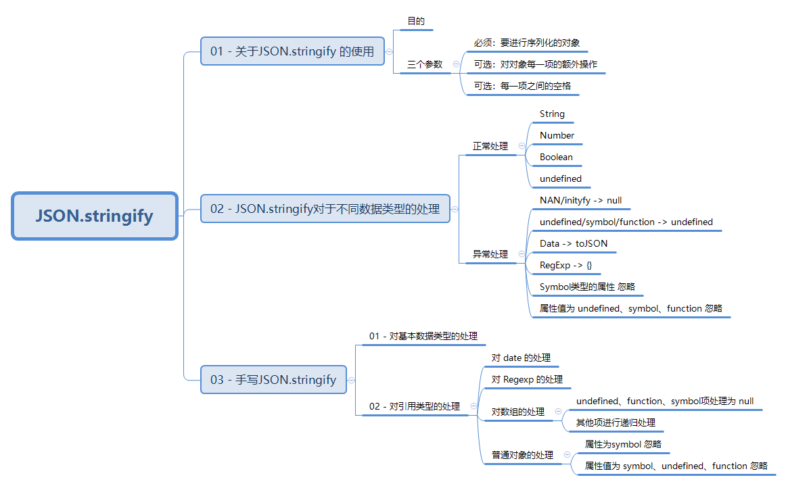

```js
function jsonStringify(data) {
  let type = typeof data;
  if(type !== 'object') {
    let result = data;
    if (Number.isNaN(data) || data === Infinity) {
       //NaN 和 Infinity 序列化返回 "null"
       result = "null";
    } else if (type === 'function' || type === 'undefined' || type === 'symbol') {
      // 由于 function 序列化返回 undefined，因此和 undefined、symbol 一起处理
       return undefined;
    } else if (type === 'string') {
       result = '"' + data + '"';
    }
    return String(result);
  } else if (type === 'object') {
     if (data === null) {
        return "null"  
     } else if (data.toJSON && typeof data.toJSON === 'function') {
         // 对象可能内置toJSON方法来自定义序列化对象
        return jsonStringify(data.toJSON());
     } else if (data instanceof Array) {
        let result = [];
        data.forEach((item, index) => {
        if (typeof item === 'undefined' || typeof item === 'function' || typeof item === 'symbol') {
               result[index] = "null";
           } else {
               result[index] = jsonStringify(item);
           }
         });
         result = "[" + result + "]";
         return result.replace(/'/g, '"');
      } else {
         // 处理普通对象
         let result = [];
         Object.keys(data).forEach((item, index) => {
            if (typeof item !== 'symbol') {
              //key 如果是 symbol 对象，忽略
              if (data[item] !== undefined && typeof data[item] !== 'function' && typeof data[item] !== 'symbol') {
                //键值如果是 undefined、function、symbol 为属性值，忽略
                result.push('"' + item + '"' + ":" + jsonStringify(data[item]));
              }
            }
         });
         return ("{" + result + "}").replace(/'/g, '"');
        }
    }
}
```


# 闭包

https://juejin.cn/post/6957913856488243237

## 是什么

一个函数和对其周围状态（lexical environment，词法环境）的引用捆绑在一起（或者说函数被引用包围），这样的组合就是闭包（closure）

也就是说，闭包让你可以在一个内层函数中访问到其外层函数的作用域

## 使用场景

任何闭包的使用场景都离不开这两点：

- 创建私有变量
- 延长变量的生命周期


## 缺陷

消耗内存，浪费性能

## 题目

```js
for (var i = 0; i < 5; i++) {
	setTimeout(function () {
		console.log(i++);
	}, 1000);
}
console.log(i);
//5 5 6 7 8 9
```

解释

- 执行代码前先创建全局执行环境
- 在全局执行环境里先执行for循环，for循环会执行5次，每次都会执行setTimeout函数，执行一次setTimeout就需要等待1秒。由于JavaScript是单线程的，只有一个执行栈，如果每次都要等的话是很不好的，所以会先把setTimeout函数先放进一个任务队列中，等到执行栈中执行完了之后再完成任务队列中的任务。
- for循环执行完了之后i=5，然后就是执行栈中的console.log(i)，输出的结果是9，最后执行栈中执行完了之后再执行5个setTimeout函数则最终得到的结果是5，5，6，7，8，9


类似绑定到button上


问题
3.1 console.log(i)处于全局执行环境，为什么可以得到for中的i？
for循环并不是一个函数，所以没有函数作用域。
var声明的变量不存在块级作用域，之前碰到的看起来好像存在是由于函数作用域的效果。let声明的变量就有块级作用域了。
因此for循环中声明的i也是属于全局执行环境中的。
原文链接：https://blog.csdn.net/hahalalalalalala/article/details/107386666


改成立即执行函数

```js
for (var i = 0; i < 5; i++) {
	(function (x) {
		setTimeout(function () {
			console.log(x++);
		}, 1000);
	})(i);
}
console.log(i);//5 0 1 2 3 4

```


## 函数即对象

**在JS中，一切皆对象**。那从语言的设计层面来讲，**函数是一种特殊的对象**。

函数和对象一样可以拥有*属性和值*。

```javascript
function foo(){
    var test = 1
    return test;
}
foo.myName = 1
foo.obj = { x: 1 }
foo.fun = function(){
  return 0;
}

```

根据对象的数据特性：`foo` 函数拥有`myName`/`obj`/`fun` 的属性

> 但是函数和普通对象不同的是，**函数可以被调用**。

### 从**V8内部**来看看函数是如何实现可调用特性

在 V8 内部，会为函数对象添加了两个**隐藏属性**

- `name` 属性:属性的值就是**函数名称**
- `code` 属性:表示**函数代码**，以字符串的形式存储在**内存**中

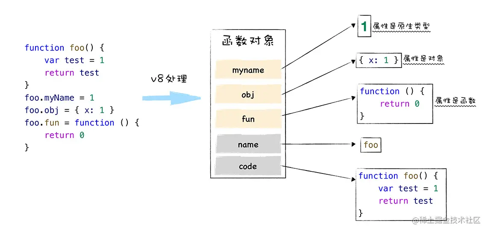

### code 属性

当执行到，一个**函数调用**语句时，`V8` 便会从*函数对象*中取出 `code` 属性值(也就是函数代码),然后再**解释执行**这段函数代码。

> 在解释执行函数代码的时候，又会生成该函数对应的**执行上下文，并被推入到调用栈里**。


## 闭包

> 在 JS 中，根据词法作用域的规则,内部函数总是可以访问其外部函数中声明的变量。
>  当通过**调用**一个外部函数**返回**一个内部函数后，即使该外部函数已经执行结束了。但是内部函数引用外部函数的变量依然保存在内存中，就把这些变量的集合称为闭包。

```javascript
function test() {
    var myName = "fn_outer"
    let age = 78;
    var innerObj = {
        getName:function(){
            console.log(age);
            return myName
        },
        setName:function(newName){
            myName = newName
        }
    }
    return innerObj
}
var t = test();
console.log(t.getName());//fn_outer 
t.setName("global")
console.log(t.getName())//global

```

- 根据

  词法作用域的规则，内部函数 getName 和 setName 总是可以访问它们的外部函数 test中的变量

  - 在执行`test`时，调用栈的情况 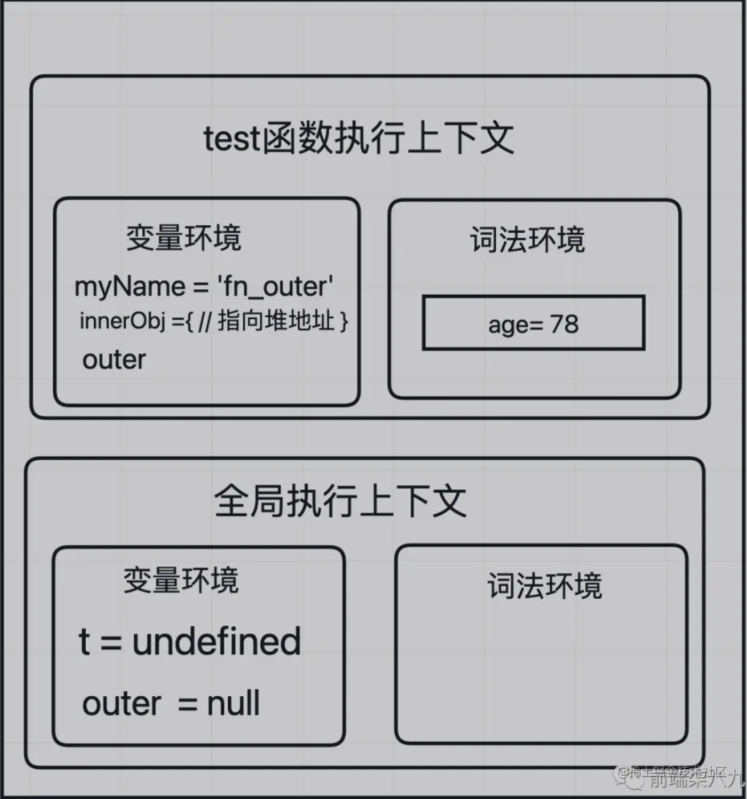

- test 函数执行完成之后，其执行上下文从栈顶弹出了
  
  - 但是由于返回`innerObj`对象中的 `setName` 和 `getName` 方法中使用了 `test` 函数内部的变量 `myName` 和 `age` 所以这两个变量依然保存在内存中（`Closure (test)`）
  - 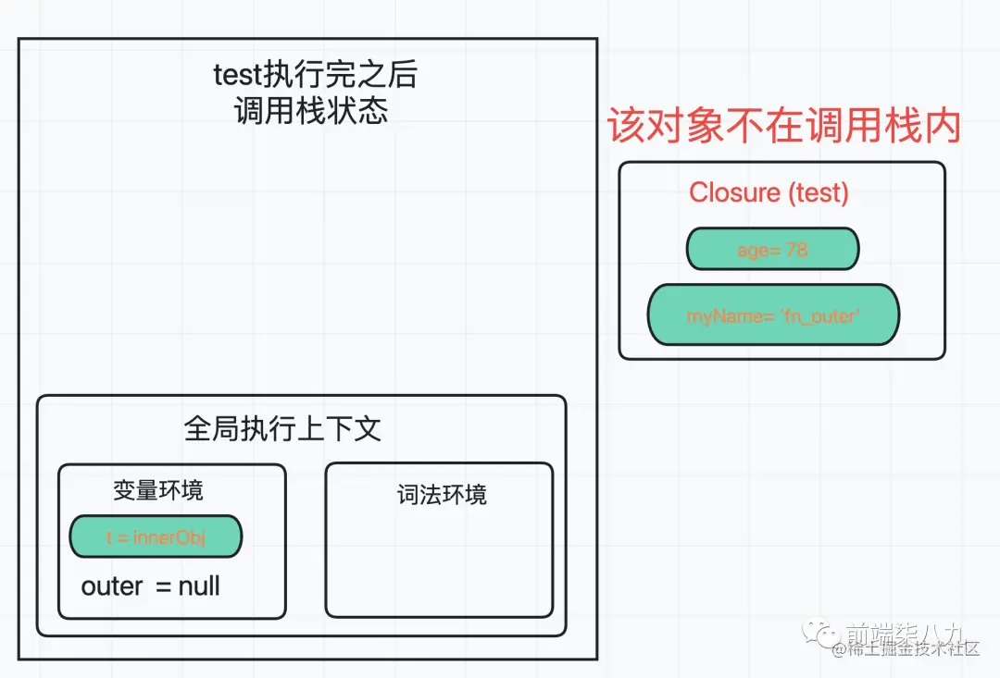
  
- 当执行到t.setName方法的时，调用栈如下：

  - 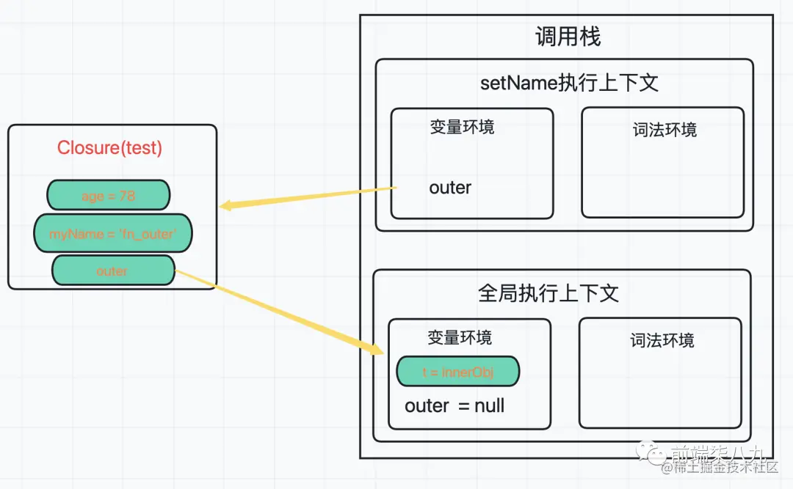
  
- 利用debugger来查看对应的作用链和调用栈信息

  - 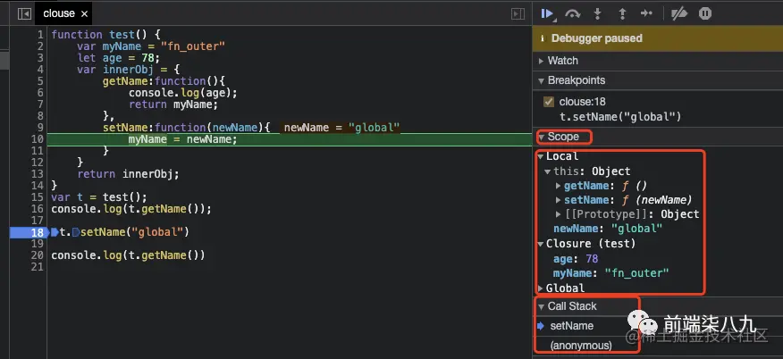

通过上面分析，然后参考作用域的概念和使用方式，我们可以做一个简单的结论

> 闭包和词法环境的**强相关**

而JS的作用域由词法环境决定，并且作用域是**静态**的。

所以，我们可以得出一个结论：

> 闭包在每次创建函数时创建（闭包在JS编译阶段被创建）


## 闭包是如何产生的？

> 产生闭包的核心两步:
>
> 1. **预扫描**内部函数
> 2. 把`内部函数`引用的外部变量**保存到堆中**

```javascript
function test() {
    var myName = "fn_outer"
    let age = 78;
    var innerObj = {
        getName:function(){
            console.log(age);
            return myName
        },
        setName:function(newName){
            myName = newName
        }
    }
    return innerObj
}
var t = test();

```

当 `V8` **执行**到 `test` 函数时

- 首先会编译，并创建一个空执行上下文。
  - 在`编译过程`中，遇到**内部函数** `setName`， `V8`还要对内部函数做一次快速的词法扫描(预扫描) 发现该内部函数引用了 **外部函数**(`test`)中的 `myName` 变量
  - 由于是内部函数引用了外部函数的变量，所以 **V8 判断这是一个闭包**
  - 于是在堆空间创建换一个`closure(test)`的对象 （这是一个内部对象，`JavaScript` 是无法访问的），用来保存 `myName` 变量
- 当 `test` 函数**执行结束之后**,返回的 `getName` 和 `setName` 方法都引用`clourse(test)`对象。
  - 即使 `test` 函数退出了,`clourse(test)`依然被其内部的 `getName` 和 `setName` 方法引用。
- 所以在下次调用`t.setName`或者`t.getName`时,在进行**变量查找**时候，根据作用域链来查找。


# 垃圾回收机制

https://juejin.cn/post/7038593947995734030

## 内存管理

## 垃圾回收算法

**就是垃圾收集器按照固定的时间间隔，周期性地寻找那些不再使用的变量，然后将其清楚或释放内存。**

### 标记清除算法

### 标记整理算法

### 引用计数算法

### V8的优化

分代式垃圾回收

新生代内存的回收，通常是通过Scavenge 的算法进行垃圾回收，就是将新生代内存进行一分为二，正在被使用的内存空间称为使用区，而限制状态的内存空间称为空闲区。

回收的原理是：

- 新加入的对象都会存放在使用区，当使用区快写满时就进行一次垃圾清理操作。
- 在开始进行垃圾回收时，新生代回收器会对使用区内的对象进行标记
- 标记完成后，需要对使用区内的活动对象拷贝到空闲区进行排序
- 而后进入垃圾清理阶段，将非活动对象占用的内存空间进行清理
- 最后对使用区和空闲区进行交换，使用区->空闲区，空闲区->使用区

新生代中的变量如果经过回收之后依然一直存在，那么会放入到老生代内存中，只要是已经经历过一次Scavenge算法回收的，就可以晋升为老生代内存的对象。


此时应该使用Mark-Sweep（标记清除）和Mark-Compact（标记整理）的策略进行老生代内存中的垃圾回收。

首先是标记阶段，从一组根元素开始，递归遍历这组根元素，遍历过程中能到达的元素称为活动对象，没有到达的元素就可以判断为非活动对象。清除阶段老生代垃圾回收器会直接将非活动对象，也就是数据清理掉。

同样的标记清除策略会产生内存碎片，因此还需要进行标记整理策略进行优化。

## 内存泄漏与优化

- **过多的缓存**。及时清理过多的缓存。

- **滥用闭包**。尽量避免使用大量的闭包。

- **定时器或回调太多**。与节点或数据相关联的计时器不再需要时，DOM节点对象可以清除，整个回调函数也不再需要。可是，计时器回调函数仍然没有被回收（计时器停止才会被回收）。当不需要setTimeout或setInterval时，**定时器没有被清除**，定时器的糊掉函数以及其内部依赖的变量都不能被回收，**会造成内存泄漏**。解决方法：在定时器完成工作时，需要手动清除定时器。

- **太多无效的DOM引用**。DOM删除了，但是节点的引用还在，导致GC无法实现对其所占内存的回收。解决方法：给删除的DOM节点引用设置为null。

- **滥用全局变量。**全局变量是根据定义无法被垃圾回收机制进行收集的，因此需要特别注意临时存储和处理大量信息的全局变量。如果必须使用全局变量来存储数据，请确保将其指定为null或在完成后重新分配它。解决方法：使用严格模式。

- **从外到内执行appendChild。**此时即使调用removeChild也无法进行释放内存。解决方法：从内到外appendChild。

**反复重写同一个数据会造成内存大量占用**，但是IE浏览器关闭后会被释放。

- **注意程序逻辑**，避免编写『死循环』之类的代码。

- **DOM对象和JS对象相互引用**。


# 原型链

https://vue3js.cn/interview/JavaScript/prototype.html#%E4%B8%89%E3%80%81%E6%80%BB%E7%BB%93

神图

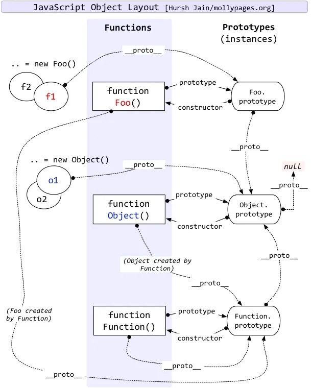

```js
function Obj() {
	this.a = 1;
}
let obj = new Obj();
console.log(obj.__proto__ === Obj.prototype); //true 实例对象的__proto__ 和构造函数的prototype指向原型对象
console.log(obj.constructor === Obj); //true 实例对象和原型对象的constructor属性指向构造函数
console.log(Obj.prototype.constructor === Obj); //true

```


- 一切对象都是继承自`Object`对象，`Object` 对象直接继承根源对象`null`
- 一切的函数对象（包括 `Object` 对象），都是继承自 `Function` 对象
- `Object` 对象直接继承自 `Function` 对象
- `Function`对象的`__proto__`会指向自己的原型对象，最终还是继承自`Object`对象


# 继承实现

https://vue3js.cn/interview/JavaScript/inherit.html

https://juejin.cn/post/6914216540468576263#heading-3


使用Object.create可以减少组合继承中多进行一次构造的过程，是因为它可以创建一个新的对象，并让这个对象的原型指向传入的参数对象，从而实现了对原型的继承。相较于组合继承，它避免了在子类构造函数中调用父类构造函数时多次执行父类构造函数的问题。同时，它还可以方便地实现原型链继承和属性继承，使得代码更加简洁易懂。


# 在JavaScript中，类的静态声明

在JavaScript中，类的静态声明允许您将属性和方法直接添加到类本身，而不是其实例。这意味着您可以通过类来访问这些属性和方法，而不需要先创建类的实例。

静态声明使用关键字static来定义，并且仅存在于类的主体中。它们可以用于创建工具函数，共享状态等等。

静态声明是通过在类本身上定义属性和方法来实现的，而不是在其原型链上。因此，在外部无法更改或覆盖它们。

例如：

class MyClass {
  static myStaticMethod() {
    console . log('Hello World!');
  }
}

MyClass . myStaticMethod(); //输出 "Hello World!"

尝试更改静态声明将会导致错误。


# 作用域

https://vue3js.cn/interview/JavaScript/scope.html#%E4%B8%89%E3%80%81%E4%BD%9C%E7%94%A8%E5%9F%9F%E9%93%BE

作用域，即变量（变量作用域又称上下文）和函数生效（能被访问）的区域或集合

换句话说，作用域决定了代码区块中变量和其他资源的可见性

作用域就是一个**独立的区域**，讲得具体点就是在我们的程序中定义变量的一个独立区域，它决定了当前执行代码对变量的访问权限。

## 分类

- 全局作用域：函数外，大括号{}外
- 函数作用域
- ES6块级作用域

作用域就是一个**让变量不会向外暴露出去的独立区域**。作用域最大的用处就是**隔离变量**，不同作用域下同名变量不会有冲突。

**作用域是分层的，内层作用域可以访问外层作用域的变量，反之则不行**。我们看个例子，用泡泡来比喻作用域可能好理解一点：


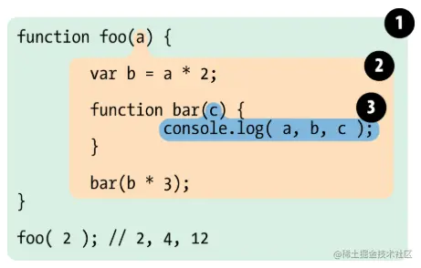


全局作用域会污染全局命名空间，容易引起命名冲突


## 立即执行函数

块级作用域的出现，实际上使得获得广泛应用的匿名立即执行函数表达式（匿名 IIFE）不再必要了。


## 变量提升

JS将变量的声明提升，**函数声明 function f(){}的优先级优于变量声明**，且函数声明会连带定义一起被提升

```js
console.log(foo); //[Function: foo]
var foo = 'abc';
console.log(foo); //abc
function foo() {}
console.log(foo); //abc
```

```js
console.log(foo); //undifined
var foo = 'abc';
console.log(foo); //abc
var foo = function () {};
console.log(foo); //[Function: foo]

```

## 作用域链

```js
var x = 10
function fn() {
  console.log(x)
}
function show(f) {
  var x = 20
  (function() {
    f() //10，而不是20
  })()
}
show(fn)
```

**要到创建这个函数的那个作用域中取值,这里强调的是“创建”，而不是“调用”**，切记切记——其实这就是所谓的"静态作用域"

```js
var fn = function () {
	console.log(fn);
};
fn();//[Function: fn]
var obj = {
	fn2: function () {
		console.log(fn2);
	},
};
obj.fn2(); //ReferenceError: fn2 is not defined

```

```js
var fn = function () {
	console.log(fn);
};
fn(); //[Function: fn]
var obj = {
	fn2: function () {
		console.log(obj.fn2);
	},
};
obj.fn2(); //[Function: fn2]

```


```js
function fn(a) {
	console.log(a); // function a() {alert(1)}  [Function: a]
	var a = 2;
	function a() {
		alert(1);
	}
	console.log(a); //2
}
fn(1);

```

执行函数前，会对函数中的关键字var和function进行预解析
就是对变量和函数的声明提前，此时不会给变量赋值，当函数与变量同名时，函数会覆盖掉变量；待变量执行了之后，那个名字才会代表变量。


# 执行上下文

简单的来说，执行上下文是一种对`Javascript`代码执行环境的抽象概念，也就是说只要有`Javascript`代码运行，那么它就一定是运行在执行上下文中

```js
const obj = {
    fn() {
        console.log(this)
        const f = () => {
            console.log(this)
        }
        f()
    }
}

obj.fn();//obj obj
const fn = obj.fn
fn()//nodejs端global global
```


 {执行上下文 |Execution context} 中包含了

1. {变量环境 |Viriable Environment}
2. {词法环境 |Lexical Environment}
3. {外部环境 |outer}
4. `this`

> ```
> this` 是和执行上下文绑定的,也就是说每个执行上下文中都有一个 `this
> ```

## 分为三种

- 全局执行上下文：只有一个，浏览器中的全局对象就是 `window`对象，`this` 指向这个全局对象
- 函数执行上下文：存在无数个，只有在函数被调用的时候才会被创建，每次调用函数都会创建一个新的执行上下文
- Eval 函数执行上下文： 指的是运行在 `eval` 函数中的代码，很少用而且不建议使用

## 生命周期

创建阶段 → 执行阶段 → 回收阶段

### 创建阶段

创建阶段即当函数被调用，但未执行任何其内部代码之前

创建阶段做了三件事：

- 确定 this 的值，也被称为 `This Binding`
- LexicalEnvironment（词法环境） 组件被创建
- VariableEnvironment（变量环境） 组件被创建

### 执行阶段

在这阶段，执行变量赋值、代码执行

如果 `Javascript` 引擎在源代码中声明的实际位置找不到变量的值，那么将为其分配 `undefined` 值

### [#](https://vue3js.cn/interview/JavaScript/context_stack.html#回收阶段)回收阶段

执行上下文出栈等待虚拟机回收执行上下文

## 执行栈

执行栈，也叫调用栈，具有 LIFO（后进先出）结构，用于存储在代码执行期间创建的所有执行上下文

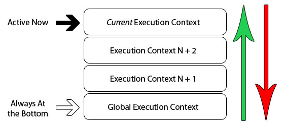

当`Javascript`引擎开始执行你第一行脚本代码的时候，它就会创建一个全局执行上下文然后将它压到执行栈中

每当引擎碰到一个函数的时候，它就会创建一个函数执行上下文，然后将这个执行上下文压到执行栈中

引擎会执行位于执行栈栈顶的执行上下文(一般是函数执行上下文)，当该函数执行结束后，对应的执行上下文就会被弹

出，然后控制流程到达执行栈的下一个执行上下文

------

# this 

## 定义

`this` 关键字是函数运行时自动生成的一个内部对象，只能在函数内部使用，总指向调用它的对象

同时，`this`在函数执行过程中，`this`一旦被确定了，就不可以再更改，更改报错

## 绑定规则

### 默认绑定

全局环境，绑定全局对象；严格模式下，不能将全局对象用于默认绑定，this会绑定到`undefined`，只有函数运行在非严格模式下，默认绑定才能绑定到全局对象

### new绑定

构造函数中的new指向实例对象

`new`过程遇到`return`一个对象，此时`this`指向为返回的对象

```js
function fn()  
{  
    this.user = 'xxx';  
    return {};  
}
var a = new fn();  
console.log(a.user); //undefined
```


如果返回一个简单类型的时候，则`this`指向实例对象

```js
function P() {
	return 1;
}
let t = new P();
console.log(t); //{}
console.log(P()); //1

```


注意的是`null`虽然也是对象，但是此时`new`仍然指向实例对象

```js
function fn()  
{  
    this.user = 'xxx';  
    return null;
}
var a = new fn;  
console.log(a.user); //xxx
```


### 隐式绑定

`this`永远指向的是最后调用它的对象

函数还可以作为某个对象的方法调用，这时`this`就指这个上级对象

```js
function test() {
  console.log(this.x);
}

var obj = {};
obj.x = 1;
obj.m = test;

obj.m(); // 1
```


这个函数中包含多个对象，尽管这个函数是被最外层的对象所调用，`this`指向的也只是它上一级的对象

```js
var o = {
    a:10,
    b:{
        fn:function(){
            console.log(this.a); //undefined
        }
    }
}
o.b.fn();
```

上述代码中，`this`的上一级对象为`b`，`b`内部并没有`a`变量的定义，所以输出`undefined`

这里再举一种特殊情况

```js
var o = {
    a:10,
    b:{
        a:12,
        fn:function(){
            console.log(this.a); //undefined
            console.log(this); //window
        }
    }
}
var j = o.b.fn;
j();
```


此时`this`指向的是`window`，这里的大家需要记住，**`this`永远指向的是最后调用它的对象**，虽然`fn`是对象`b`的方法，但是`fn`赋值给`j`时候并没有执行，所以最终指向`window`

### 显示绑定call，apply，bind

## 箭头函数

## 绑定优先级

## 设计缺陷以及应对方案

### 嵌套函数中的 内部函数`this` 不会从外层函数中继承

```javascript
var myObj = {
  name : " 北宸南蓁 ", 
  showThis: function(){
    console.log(this)
    function inner(){console.log(this)}
    inner()
  }
}
myObj.showThis()

```

- 函数 `inner` 中的 `this` 指向的是全局 `window` 对象
- 函数 `showThis` 中的 `this` 指向的是 `myObj` 对象

### 解决方案

> 把 this 体系转换为了作用域的体系

```javascript
var myObj = {
  name : " 北宸 ", 
  showThis: function(){
    console.log(this)
    var self = this
    function inner(){
      self.name = " 南蓁 "
    }
    inner()
  }
}
myObj.showThis()
console.log(myObj.name)
console.log(window.name)

```

在 `showThis` 函数中声明一个变量 `self` 用来保存 `this`，然后在 `inner` 函数中使用 `self`

#### 使用 ES6 中的箭头函数

```javascript
var myObj = {
  name : " 北宸 ", 
  showThis: function(){
    console.log(this)
    var inner = ()=>{
      this.name = " 南蓁 "
      console.log(this)
    }
    inner()
  }
}
myObj.showThis()
console.log(myObj.name)
console.log(window.name)

```

`ES6` 中的箭头函数并不会创建其自身的执行上下文,所以箭头函数中的 `this` 取决于它的外部函数

### 普通函数中的 `this` 默认指向全局对象 window

通过设置 `JavaScript` 的“严格模式”来解决

在严格模式下，默认执行一个函数，其函数的执行上下文中的 `this` 值是 `undefined`


# 箭头函数和普通函数的区别

1. 语法更加简洁、清晰

2. 箭头函数**没有 `prototype` (原型)，所以箭头函数本身没有`this`**

3. **箭头函数不会创建自己的`this`**

- 箭头函数没有自己的`this`，箭头函数的`this`指向在定义的时候继承自**外层第一个普通函数的this**

4. **`call` | `apply` | `bind` 无法改变箭头函数中`this`的指向**

5. 箭头函数**不能作为构造函数使用**

6. 箭头函数**不绑定`arguments`，取而代之用`rest`参数`...`代替`arguments`对象，来访问箭头函数的参数列表**

7. 箭头函数不能用作`Generator`函数，不能使用`yield`关键字

```js
const f = () => {
	console.log(this.name);
};
let obj = {
	name: 123,
};
f.apply(obj);//undifined

```


凝练

- 简洁清晰
- this
  - 没有prototype，没有自己的this
  - this继承自上层普通函数
  - **`call` | `apply` | `bind` 无法改变箭头函数中`this`的指向**
  - 不能用来构造函数
- 箭头函数**不绑定`arguments`，取而代之用`rest`参数`...`代替`arguments`对象，来访问箭头函数的参数列表**
- 箭头函数不能用作`Generator`函数，不能使用`yield`关键字


# call,apply,bind

https://juejin.cn/post/7128233572380442660

更好的复用，解决this问题

`call`、`apply`、`bind`作用是改变函数执行时的上下文，简而言之就是改变函数运行时的`this`指向

```js
var name = "lucy";
var obj = {
    name: "martin",
    say: function () {
        console.log(this.name);
    }
};
obj.say(); // martin，this 指向 obj 对象
setTimeout(obj.say,0); // lucy，this 指向 window 对象
```

正常情况`say`方法输出`martin`

但是我们把`say`放在`setTimeout`方法中，在定时器中是作为回调函数来执行的，因此回到主栈执行时是在全局执行上下文的环境中执行的，这时候`this`指向`window`，所以输出`lucy`

我们实际需要的是`this`指向`obj`对象，这时候就需要该改变`this`指向了

```js
setTimeout(obj.say.bind(obj),0); //martin，this指向obj对象
```

使用

### apply

`apply`接受两个参数，第一个参数是`this`的指向，第二个参数是函数接受的参数，以数组的形式传入

改变`this`指向后原函数会立即执行，且此方法只是临时改变`this`指向一次

```js
function fn(...args){
    console.log(this,args);
}
let obj = {
    myname:"张三"
}

fn.apply(obj,[1,2]); // this会变成传入的obj，传入的参数必须是一个数组；
fn(1,2) // this指向window
```

当第一个参数为`null`、`undefined`的时候，默认指向`window`(在浏览器中)

```js
fn.apply(null,[1,2]); // this指向window
fn.apply(undefined,[1,2]); // this指向window
```


### call

`call`方法的第一个参数也是`this`的指向，后面传入的是一个参数列表

跟`apply`一样，改变`this`指向后原函数会立即执行，且此方法只是临时改变`this`指向一次

```js
function fn(...args){
    console.log(this,args);
}
let obj = {
    myname:"张三"
}

fn.call(obj,1,2); // this会变成传入的obj，传入的参数必须是一个数组；
fn(1,2) // this指向window
```

同样的，当第一个参数为`null`、`undefined`的时候，默认指向`window`(在浏览器中)

```js
fn.call(null,[1,2]); // this指向window
fn.call(undefined,[1,2]); // this指向window
```


### bind

bind方法和call很相似，第一参数也是`this`的指向，后面传入的也是一个参数列表(但是这个参数列表可以分多次传入)

改变`this`指向后不会立即执行，而是返回一个永久改变`this`指向的函数

```js
function fn(...args){
    console.log(this,args);
}
let obj = {
    myname:"张三"
}

const bindFn = fn.bind(obj); // this 也会变成传入的obj ，bind不是立即执行需要执行一次
bindFn(1,2) // this指向obj
fn(1,2) // this指向window
```

### 小结

从上面可以看到，`apply`、`call`、`bind`三者的区别在于：

- 三者都可以改变函数的`this`对象指向
- 三者第一个参数都是`this`要指向的对象，如果如果没有这个参数或参数为`undefined`或`null`，则默认指向全局`window`
- 三者都可以传参，但是`apply`是数组，而`call`是参数列表，且`apply`和`call`是一次性传入参数，而`bind`可以分为多次传入
- `bind`是返回绑定this之后的函数，`apply`、`call` 则是立即执行


## 实现

this默认是绑定到调用它的对象身上，那我们就拿到绑定的对象，给它增加这个函数属性，然后调用这个函数

注意

- 可能会覆盖掉绑定的对象的值呀，那就使用symbol
- bind需要绑定但不执行，利用闭包去做

```js
Function.prototype.mycall = function (obj, ...args) {
	obj = obj || window;

	// Symbol是唯一的，防止重名key，不然你把原来属性覆盖了
	const fn = Symbol();
	obj[fn] = this; //this指的是调的函数对象

	// 执行，返回执行值
	return obj[fn](...args);
};
Function.prototype.myapply = function (obj, args) {
	obj = obj || window;

	// Symbol是唯一的，防止重名key
	const fn = Symbol();
	obj[fn] = this;

	// 执行，返回执行值
	return obj[fn](...args);
};
Function.prototype.myBind = function (target,...outArgs) {
  target = target || {} // 处理边界条件
  const symbolKey = Symbol()
  target[symbolKey] = this
  return function (...innerArgs) { // 返回一个函数
    const res = target[symbolKey](...outArgs, ...innerArgs) // outArgs和innerArgs都是一个数组，解构后传入函数
    // delete target[symbolKey] 这里千万不能销毁绑定的函数，否则第二次调用的时候，就会出现问题。
    return res
  } 
}
function say() {
	console.log(this.name);
}
let obj = { name: 12 };
say.myapply(obj, []);
say.mycall(obj);
//mybind 测试
function say(a, b) {
	console.log(this.name, a, b);
}
let obj = { name: 12 };
let fn = say.myBind(obj, 1);
fn(2);


```


# new运算符

## 流程

- 创建一个新的对象`obj`
- 将对象与构建函数通过原型链连接起来
- 将构建函数中的`this`绑定到新建的对象`obj`上
- 根据构建函数返回类型作判断，如果是原始值则被忽略，如果是返回对象，需要正常处理


```js
function mynew(func, ...args) {
    const obj = {}
    obj.__proto__ = func.prototype
    let result = func.apply(obj, args)
    return result instanceof Object ? result : obj
}
function Person(name, age) {
    this.name = name;
    this.age = age;
}
Person.prototype.say = function () {
    console.log(this.name)
}

let p = mynew(Person, "huihui", 123)
console.log(p) // Person {name: "huihui", age: 123}
p.say() // huihui
```

关于最后为什么要判断，这和new的特征有关


# 函数式编程，柯里化,redux 中间件

柯里化

参数数量不够就先别调用,等着够了再调用

```javascript
const curry = (fn, ...args) => {
	return fn.length <= args.length ? fn(...args) : curry.bind(null, fn, ...args);
};
const add = (a, b, c) => a + b + c;
const sub = (a, b, c) => a - b - c;
console.log(curry(add)(1, 2, 3), curry(add)(1)(2)(3)); // 结果为6
console.log(curry(sub)(1)(2)(3), curry(sub)(1, 2, 3)); // 结果为-4

```


## applyMiddleware

```javascript
function applyMiddleware(...middlewares){
  return function(createStore){
    return function(reducer,initialState){
      var store = createStore(reducer,initialState);
      var dispatch = store.dispatch;
      var chain = [];

      var middlewareAPI = {
        getState: store.getState,
        dispatch: (action) => dispatch(action)
      };

      chain = middlewares.map(
          middleware => middleware(middlewareAPI)
          );

      dispatch = compose(...chain)(store.dispatch);
      return { ...store, dispatch };
    }
  }
}

```

`applyMiddleware` 函数是一个三级柯里化函数

# 位置计算-下拉刷新，上划加载

上划加载

首先明确api

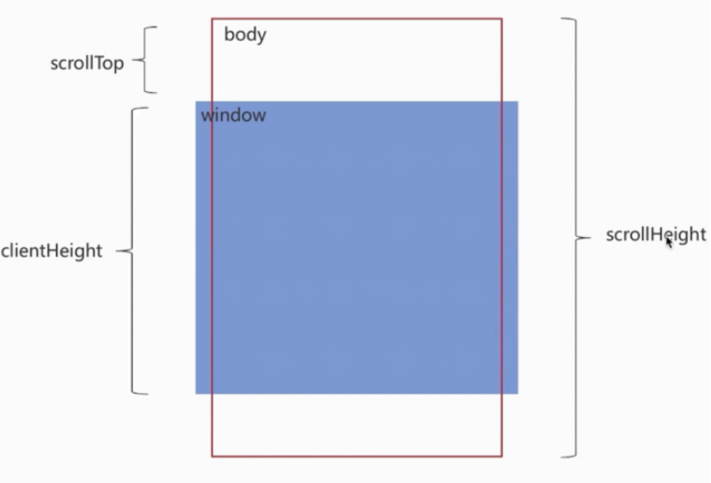

- `scrollTop`：滚动视窗的高度距离`window`顶部的距离，它会随着往上滚动而不断增加，初始值是0，它是一个变化的值
- `clientHeight`:它是一个定值，表示屏幕可视区域的高度；
- `scrollHeight`：页面不能滚动时也是存在的,此时scrollHeight等于clientHeight。scrollHeight表示`body`所有元素的总长度(包括body元素自身的padding)

触底公式`scrollTop + clientHeight >= scrollHeight`


## 下拉刷新

关于下拉刷新的原生实现，主要分成三步：

- 监听原生`touchstart`事件，记录其初始位置的值，`e.touches[0].pageY`；
- 监听原生`touchmove`事件，记录并计算当前滑动的位置值与初始位置值的差值，大于`0`表示向下拉动，并借助CSS3的`translateY`属性使元素跟随手势向下滑动对应的差值，同时也应设置一个允许滑动的最大值；
- 监听原生`touchend`事件，若此时元素滑动达到最大值，则触发`callback`，同时将`translateY`重设为`0`，元素回到初始位置


# 位置计算-如何判断元素是否在可视区域ViewPort

判断一个元素是否在可视区域，我们常用的有三种办法：

- offsetTop、scrollTop
- getBoundingClientRect
- Intersection Observer

### offsetTop

`offsetTop`，元素的上外边框至包含元素的上内边框之间的像素距离

在可视区域内要求

`el.offsetTop-scrollTop<=clientHeight`


### getBoundingClientRect

返回一个 [`DOMRect`](https://developer.mozilla.org/zh-CN/docs/Web/API/DOMRect) 对象，其提供了元素的大小及其相对于[视口](https://developer.mozilla.org/zh-CN/docs/Glossary/Viewport)的位置。

如果一个元素在视窗之内的话，那么它一定满足下面四个条件：

- top 大于等于 0
- left 大于等于 0
- bottom 小于等于视窗高度
- right 小于等于视窗宽度


### Intersection Observer

http://ruanyifeng.com/blog/2016/11/intersectionobserver_api.html

ntersection Observer API 提供给 web 开发者，**一种异步查询元素相对于其他元素或窗口位置的能力**。它常用于追踪一个元素在窗口的可视问题.

**传统位置计算的方式，依赖于对 DOM 状态的轮询计算，然而这种方式会在主线程里密集执行从而造成页面性能问题**

> ```javascript
> var io = new IntersectionObserver(callback, option);
> ```

上面代码中，`IntersectionObserver`是浏览器原生提供的构造函数，接受两个参数：`callback`是可见性变化时的回调函数，`option`是配置对象（该参数可选）。

构造函数的返回值是一个观察器实例。实例的`observe`方法可以指定观察哪个 DOM 节点。

> ```javascript
> // 开始观察
> io.observe(document.getElementById('example'));
> 
> // 停止观察
> io.unobserve(element);
> 
> // 关闭观察器
> io.disconnect();
> ```

上面代码中，`observe`的参数是一个 DOM 节点对象。如果要观察多个节点，就要多次调用这个方法。

> ```javascript
> io.observe(elementA);
> io.observe(elementB);
> ```

`Intersection Observer` 即重叠观察者，从这个命名就可以看出它用于判断两个元素是否重叠，因为不用进行事件的监听，性能方面相比`getBoundingClientRect`会好很多

使用步骤主要分为两步：创建观察者和传入被观察者


# 图片懒加载

利用`JavaScript`实现懒加载的3种方式,原理都是判断图片是否出现在可视区后给图片赋值src属性。

懒加载就是延时加载(*也称为按需加载*)。

**具体表现为：**当我们访问页面时，先将img图片的路径替换成一张占位图的路径，这样就只需请求一次，而当图片进入可视区域时才把其图片的路径替换为真正的路径，从而显示图片，达到懒加载的效果。(*即：懒加载就是使用同一张占位图进行占位，然后按需获取图片真正的路径，从而实现懒加载*)

**技术原理是：**先将img的src属性隐藏，而将其真正的地址存放在img标签自定义的属性中(*eg：data-src*)，当图片进入可视区域时，将真正的路径从*data-src*中取出替换回来，从而显示图片。

## 利用HTML提供的 `data-` 属性来嵌入自定义数据

**自定义数据**存放这个标签原本的图片地址。

### 利用offsetTop计算位置

用`JavaScript`实现当**滚动滚动条**时，如果图片出现在可视区，那么加载图片。**加载图片其实就是给img标签src属性赋值为本来的地址，那么此时图片便会请求加载渲染出来**

```javascript
//获取全部img标签
var images = document.getElementsByTagName("img");
 
 window.addEventListener("scroll", (e) => {
    //当发生滚动事件时调用loadPic事件
    loadPic();
  });
  
function loadPic() {
  // 遍历每一张图
  for (let i of images) {
    //判断当前图片是否在可视区内
    if (i.offsetTop <= window.innerHeight + window.scrollY) {
        //获取自定义data-src属性的值
        let trueSrc = i.getAttribute("data-src");
        //把值赋值给图片的src属性
        i.setAttribute("src", trueSrc);
    }
  }
}
//没发生滚动事件时也要先执行一次
loadPic();

```

- `offsetTop` 为元素距离顶部的距离；
- `window.innerHeight` 为当前窗口的高度；
- `window.scrollY` 为滚动距离

当 `i.offsetTop <= window.innerHeight + window.scrollY`时图片就处于窗口可视区了。

### 利用`getBoundingClientRect().top` 计算位置

```javascript
window.addEventListener("scroll", (e) => {
      loadPic();
    });
    
function loadPic() {
  for (let i of images) {
    //计算方式和第一种方式不同
    if (i.getBoundingClientRect().top < window.innerHeight) {
      let trueSrc = i.getAttribute("data-src");
      i.setAttribute("src", trueSrc);
    }
  }
}

loadPic();

```

- `getBoundingClientRect().top` 为元素相对于窗口的位置；
- `window.innerHeight` 为当前窗口的高度；

当元素对于窗口的位置小于当前窗口的高度时，那自然处于了窗口可视区了。

## Intersection Observer

`Intersection Observer` 构造函数的作用是它能够观察**可视窗口与目标元素产生的交叉区域**。简单来说就是当用它观察我们的图片时，当图片出现或者消失在可视窗口，它都能知道并且会执行一个特殊的回调函数，我们就利用这个回调函数实现我们的操作

```javascript
var images = document.getElementsByTagName("img");
function callback(entries) {
   for (let i of entries) {
     if (i.isIntersecting) {
         let img = i.target;
         let trueSrc = img.getAttribute("data-src");
         img.setAttribute("src", trueSrc);
         observer.unobserve(img);
     }
   } 
}
 
const observer = new IntersectionObserver(callback);

for (let i of images) {
 observer.observe(i);
}


```

------


# 数组常用方法

## 增删改查

增加元素后返回长度，删除元素后返回元素，好像也蛮符合认知？

- **`push()`** 方法将一个或多个元素添加到数组的末尾，并返回该数组的新长度。
- **`pop()`** 方法从数组中删除最后一个元素，并返回该元素的值。
- `unshift()`在数组开头添加任意多个值，然后返回新的数组长度
- **`shift()`** 方法从数组中删除**第一个**元素，并返回该元素的值。


- `splice()`传入三个参数，分别是开始位置、要删除的元素数量、插入的元素，返回空数组。删除数量为0，相当于增加；删除数量为1，同时插入，相当于修改
- `slice(begin,end)`左开右闭，子数组


- `indexOf(val)`没找到-1
- `includes(val)`找到true，没找到false
- `find((val,index,arr)=>{return ...})`根据传入函数，返回匹配的第一个元素

## 迭代

都不改变原数组

- some
- every
- forEach
- filter
- map

## 转换

- `join(string)`返回包含所有项，有分隔符的字符串
- sort(function(a,b){})接收比较函数
- reverse()反转

## 改变原数组（7）

1. `push` **`push()`** 方法将一个或多个元素添加到数组的末尾，并返回该数组的新长度。
2. `pop `**`pop()`** 方法从数组中删除最后一个元素，并返回该元素的值。
3. `shift` 
4. `unshift`
5. `reverse`
6. `sort`
7. `splice`

## 不会改变(7)

1. `concat`
2. `join`
3. `slice` 
4. `filter`
5. `reduce`
6. `find`
7. `findIndex`

## 实现

就是遍历，注意几点：

- 通过this拿到传入的数组
- 检查入参
- reduce的时候，让起始值等于第一个元素

如

```js
Array.prototype.myForeach = function (fn) {
	//校验
	if (this == null) {
		throw new TypeError('this is null or not defined');
	}
	if (typeof fn !== 'function') {
		throw new TypeError(fn + ' is not a function');
	}

	const self = this; //拿到数组
	for (let i = 0; i < self.length; ++i) {
		fn(self[i], i, self);
	}
};
Array.prototype.myMap = function (fn) {
	//校验
	if (this == null) {
		throw new TypeError('this is null or not defined');
	}
	if (typeof fn !== 'function') {
		throw new TypeError(fn + ' is not a function');
	}

	const self = this; //拿到数组
	const res = [];
	for (let i = 0; i < self.length; ++i) {
		res.push(fn(self[i], i, self));
	}
	return res;
};
Array.prototype.myReduce = function (fn) {
	//校验
	if (this == null) {
		throw new TypeError('this is null or not defined');
	}
	if (typeof fn !== 'function') {
		throw new TypeError(fn + ' is not a function');
	}

	const self = this; //拿到数组
	const len = self.length >>> 0;
	if (len === 0) {
		return;
	}
	let res = self[0];
	for (let i = 1; i < self.length; ++i) {
		res = fn(res, self[i], i, self);
	}
	return res;
};
let tmp = [1, 2, 3];
tmp.myForeach((el, index, cur) => {
	// console.log(el);
});
let res1 = tmp.myMap((el, index, cur) => {
	// console.log(cur);
	return el + '1';
});

```

# ajax,fetch,axios

ajax是js异步技术的术语，Asynchronous JavaScript And XML，翻译过来就是“异步的 Javascript 和 XML”。早起相关的api是xhr，它是一个术语。
fetch是es6新增的用于网络请求标准api，它是一个api。
axios是用于网络请求的第三方库，它是一个库。
以上就是他们的区别。

axios本身就是独立的请求库，跟用什么框架没关系；而且最初Vue官方推荐的请求库是vue-resouce，后来才推荐的axios；
axios不是xhr的子集，axios利用xhr进行了二次封装的请求库，xhr只是axios中的其中一个请求适配器，axios在nodejs端还有个http的请求适配器；axios = xhr + http；

Ajax是异步JavaScript和XML（Asynchronous JavaScript and XML）的缩写，用于通过后台服务器请求和接收数据，而无需在页面重新加载的情况下更新部分网页内容。

要判断Ajax的状态，可以使用XMLHttpRequest对象的readyState属性。readyState具有五个可能的值：

0：未初始化。尚未调用open()方法。

1：正在加载。已调用open()方法，但尚未发送请求。

2：已发送。已经发送请求，但尚未收到响应。

3：正在接收。已经收到部分响应数据。

4：已完成。已接收到全部响应数据，并且可以使用此数据。

还可以检查XMLHttpRequest对象的status属性以确定HTTP请求的成功状态。如果status为200，则表示请求成功。


# 尾调用优化

https://blog.csdn.net/hanzheng6602/article/details/79859643?spm=1001.2101.3001.6650.4&utm_medium=distribute.pc_relevant.none-task-blog-2%7Edefault%7ECTRLIST%7ERate-4-79859643-blog-86408252.pc_relevant_3mothn_strategy_recovery&depth_1-utm_source=distribute.pc_relevant.none-task-blog-2%7Edefault%7ECTRLIST%7ERate-4-79859643-blog-86408252.pc_relevant_3mothn_strategy_recovery&utm_relevant_index=5

https://www.bookstack.cn/read/es6-3rd/spilt.6.docs-function.md

## 是什么？

尾调用（Tail Call）是函数式编程的一个重要概念，就是指某个函数的最后一步是调用另一个函数。

尾递归：递归+尾调用

## 为什么？

函数不断调用子函数，形成调用栈。多了就栈溢出

尾调用由于是函数的最后一步操作，所以不需要保留外层函数的调用帧，因为调用位置、内部变量等信息都不会再用到了，只要直接用内层函数的调用帧，取代外层函数的调用帧就可以了

## 怎么做？

把内边变量改写成函数的参数。如果为了更好的语义，可以提供一个正常的函数来包装一下，或者使用es6参数默认值。

如斐波那契数列,初始

```js
function Fibonacci (n) {
  if ( n <= 1 ) {return 1};
  return Fibonacci(n - 1) + Fibonacci(n - 2);
}
Fibonacci(10) // 89
Fibonacci(100) // 超时
Fibonacci(500) // 超时
```

优化过

```js
function fib(n, prev = 0, curr = 1) {
  if (n === 0) {
    return prev; // 终止条件，返回前一项
  }
  
  return fib(n - 1, curr, prev + curr); // 尾调用，传入当前项和下一项的和
}

// 示例：求斐波那契数列第10项
console . log(fib(10)); // 输出结果为: 55

注释说明：
1 .  函数名为fib，传入参数n表示求斐波那契数列的第n项
2 .  prev和curr分别表示斐波那契数列中的前一项和当前项，初始值分别为0和1，可以在调用函数时不传入，默认使用0和1
3 .  如果n等于0，则递归到末尾，返回prev作为结果
4 .  如果n不等于0，则进行尾递归调用，将当前项curr作为下一次递归的prev，将prev+curr作为下一次递归的curr，并将n-1作为下一次递归的参数
5 .  尾递归优化可以避免栈溢出问题，因为每次递归调用时不需要再存储之前的状态了，只需要更新传入参数即可
6 .  最后输出fib(10)即可得到斐波那契数列第10项的结果
```


# 防抖与节流

https://juejin.cn/post/7207365636694671417

JS 防抖与节流

|               | 共同点                 | 区别           | 应用场景    |
| ------------- | ---------------------- | -------------- | ----------- |
| 防抖 debounce | 在事件频繁被触发的时候 | 只执行最后一次 | input输入   |
| 节流 throttle | 减少事件执行的次数     | 有规律的执行   | 拖拽,Scroll |

## 是什么?

优化高频率执行代码的一种手段.浏览器的 `resize`、`scroll`、`keypress`、`mousemove` 等事件在触发时，会不断地调用绑定在事件上的回调函数，极大地浪费资源，降低前端性能

- 节流: n 秒内只运行一次，若在 n 秒内重复触发，只有**一次生效**
- 防抖: n 秒后在执行该事件，若在 n 秒内被重复触发，则**重新计时**

防抖函数的作用是在用户停止触发事件后，延迟一段时间再执行函数。这样可以避免频繁地执行一些计算量大或者请求量大的函数，比如自动保存、搜索建议等。

节流函数的作用是在一定时间间隔内，只执行一次函数。这样可以保证函数的执行速度不超过设定的频率，比如滚动事件、窗口大小调整等。

防抖和节流函数的好处是可以提高性能，减少资源消耗，优化用户体验。


## 怎么做?

思路: 定时器,时间戳去包装一下,返回一个新的函数

### 防抖

```js
//防抖
function debounce(fn) {
	let timer = null;

	return function () {
		if (timer) clearTimeout(timer);

		timer = setTimeout(() => {
			fn.apply(this, arguments);
			timer = null;
		}, 1000);
	};
}
let g3 = debounce(f, 1000);
g3();
g3();
g3();
g3();

```

防抖函数`返回一个新函数`，该函数会在一定时间内（这里是 1000 毫秒）不执行，在该时间内如果再次触发了该事件，会`清除之前的计时器`并重新设置计时器。当计时器结束后，才会执行传入的函数并向后台服务器请求数据，同时将 input 元素的值作为参数进行输出。

这样可以`防止用户输入过快或者频率过高`，导致向后台服务器`发送重复的请求`。

> clearTimeout
>
> 清楚对应的计时器之后，那个计时器不会再次执行

### 节流

```js
function f() {
	console.log('f');
}
//节流
//定时器
function throttled(fn, wait) {
	let time = null; //标志位
	return function (...args) {
		//不要忘记传递参数
		if (time !== null) {
			return;
		}
		time = setTimeout(() => {
			fn.apply(null, args);
			time = null;
		}, wait);
	};
}
// let g = throttled(f, 1000);
// g();
// g();
// g();
//时间戳
function throttled2(fn, wait) {
	let last = Date.now();
	return function () {
		let timeNow = Date.now();
		if (last + wait <= timeNow) {
			fn();
			last = timeNow;
		}
	};
}
// let g2 = throttled(f, 1000);
// g2();
// g2();
// g2();
```


## 应用场景

防抖在连续的事件，只需触发一次回调的场景有：

- 搜索框搜索输入。只需用户最后一次输入完，再发送请求
- 手机号、邮箱验证输入检测
- 窗口大小`resize`。只需窗口调整完成后，计算窗口大小。防止重复渲染。

节流在间隔一段时间执行一次回调的场景有：

- 滚动加载，加载更多或滚到底部监听
- 搜索框，搜索联想功能


## 搜索栏防抖如何处理用户输入不定性造成的无用请求问题（快手二面）

搜索栏，addeventlistener('input',debounce())绑定一个防抖后的请求函数


# 错误检测sentry apm onerror try...catch

apm application performance management 前端性能管理(监控)

sentry 前端监控的一个库

https://juejin.cn/post/7031876097390149645

## 错误类型:

### Js执行错误

日常执行中主要有同步错误、语法错误、普通异步任务错误、Promise任务错误、async任务错误5种常见的异常错误。

### 资源加载错误

主要有图片、script、css、font等资源的加载错误问题。


## 捕获，利用已有

### try catch

捕获同步执行错误

不能捕获语法错误，异步任务错误，promise错误，资源加载错误

### window.onerror=function(){}

### window.addEventListener(‘error’,(error)=>{})

### window.addEventListener(‘unhandledrejection’)

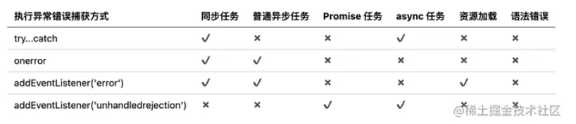


# 严格模式

"use strict"

- 变量必须先声明
- 禁止使用with
- 禁止this指向window
- 函数参数不能重名

vue-cli默认开启严格模式

# 事件模型

https://vue3js.cn/interview/JavaScript/event_Model.html

事件流都会经历三个阶段：

- 事件捕获阶段(capture phase)
- 处于目标阶段(target phase)
- 事件冒泡阶段(bubbling phase)

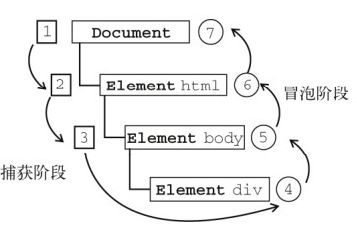

事件冒泡是一种从下往上的传播方式，由最具体的元素（触发节点）然后逐渐向上传播到最不具体的那个节点，也就是`DOM`中最高层的父节点

事件模型可以分为三种：

- 原始事件模型（DOM0级）
- 标准事件模型（DOM2级）
- IE事件模型（基本不用）


### 标准事件模型

在该事件模型中，一次事件共有三个过程:

- 事件捕获阶段：事件从`document`一直向下传播到目标元素, 依次检查经过的节点是否绑定了事件监听函数，如果有则执行
- 事件处理阶段：事件到达目标元素, 触发目标元素的监听函数
- 事件冒泡阶段：事件从目标元素冒泡到`document`, 依次检查经过的节点是否绑定了事件监听函数，如果有则执行

事件绑定监听函数的方式如下:

```text
addEventListener(eventType, handler, useCapture)
```

事件移除监听函数的方式如下:

```text
removeEventListener(eventType, handler, useCapture)
```

参数如下：

- `eventType`指定事件类型(不要加on)
- `handler`是事件处理函数
- `useCapture`是一个`boolean`用于指定是否在捕获阶段进行处理，一般设置为`false`与IE浏览器保持一致


### IE事件模型

IE事件模型共有两个过程:

- 事件处理阶段：事件到达目标元素, 触发目标元素的监听函数。
- 事件冒泡阶段：事件从目标元素冒泡到`document`, 依次检查经过的节点是否绑定了事件监听函数，如果有则执行

事件绑定监听函数的方式如下:

```text
attachEvent(eventType, handler)
```

事件移除监听函数的方式如下:

```text
detachEvent(eventType, handler)
```

举个例子：

```js
var btn = document.getElementById('.btn');
btn.attachEvent(‘onclick’, showMessage);
btn.detachEvent(‘onclick’, showMessage);
```


# 事件代理

事件代理，俗地来讲，就是把一个元素响应事件（`click`、`keydown`......）的函数委托到另一个元素

前面讲到，事件流的都会经过三个阶段： 捕获阶段 -> 目标阶段 -> 冒泡阶段，而事件委托就是在冒泡阶段完成

## 应用场景

如果我们有一个列表，列表之中有大量的列表项，我们需要在点击列表项的时候响应一个事件

```js
<ul id="list">
  <li>item 1</li>
  <li>item 2</li>
  <li>item 3</li>
  ......
  <li>item n</li>
</ul>
```

如果给每个列表项一一都绑定一个函数，那对于内存消耗是非常大的

```js
// 获取目标元素
const lis = document.getElementsByTagName("li")
// 循环遍历绑定事件
for (let i = 0; i < lis.length; i++) {
    lis[i].onclick = function(e){
        console.log(e.target.innerHTML)
    }
}
```

这时候就可以事件委托，把点击事件绑定在父级元素`ul`上面，然后执行事件的时候，利用事件回调参数去匹配目标元素

```js
document.getElementById('list').addEventListener('click', function (e) {
		console.log('the content is: ', e.target.innerHTML);
	});
```

## 优势

- 减少整个页面所需的内存，提升整体性能
- 动态绑定，减少重复工作

## 局限

- `focus`、`blur`这些事件没有事件冒泡机制，所以无法进行委托绑定事件
- `mousemove`、`mouseout`这样的事件，虽然有事件冒泡，但是只能不断通过位置去计算定位，对性能消耗高，因此也是不适合于事件委托的

如果把所有事件都用事件代理，可能会出现事件误判，即本不该被触发的事件被绑定上了事件


# BOM

`BOM` (Browser Object Model)，浏览器对象模型，提供了独立于内容与浏览器窗口进行交互的对象

其作用就是跟浏览器做一些交互效果,比如如何进行页面的后退，前进，刷新，浏览器的窗口发生变化，滚动条的滚动，以及获取客户的一些信息如：浏览器品牌版本，屏幕分辨率

## window

`Bom`的核心对象是`window`，它表示浏览器的一个实例

在浏览器中，`window`对象有双重角色，即是浏览器窗口的一个接口，又是全局对象

因此所有在全局作用域中声明的变量、函数都会变成`window`对象的属性和方法

窗口控制方法

## location

属性。。。

实现路由要关注

- 

## history

## navigator

`navigator` 对象主要用来获取浏览器的属性，区分浏览器类型。属性较多，且兼容性比较复杂

## screen

