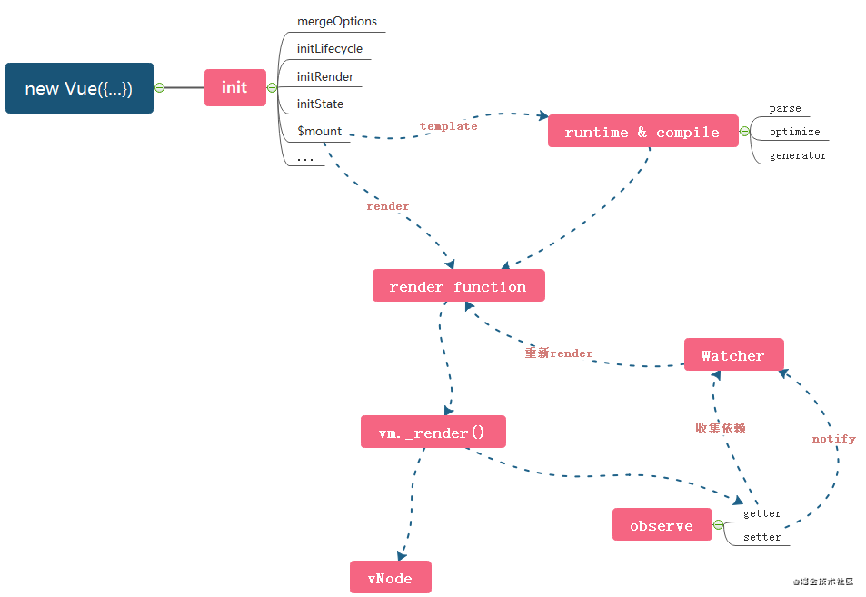
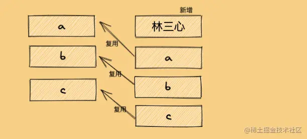

[toc]


# VUE和react技术选型

做技术选型时，需要从以下几个方面进行考虑：

1 .  项目需求：需要了解项目的具体需求，包括功能、性能、可扩展性等方面，来判断哪种框架更适合。

2 .  团队技术水平：团队成员对哪种框架掌握程度更高，是否有培训和学习的计划。

3 .  社区支持和生态环境：框架的社区活跃程度、更新频率、文档质量等方面都需要考虑。

4 .  可维护性和可扩展性：选择哪种框架需要考虑未来项目的可维护性和可扩展性。

5 .  性能和稳定性：选择哪种框架还需要考虑其性能和稳定性，这是项目成功的重要保障。

对于Vue和React两个框架，它们都有自己的优缺点，具体选择可以根据项目需求进行权衡。Vue在模板语法上更加简洁易懂，并且易于上手；React则更为灵活，可以用JSX语法实现复杂组件，并且生态圈非常强大。同时，Vue在国内社区使用较为广泛；React在国际社区整体使用率较高。如果团队已经熟悉了某一个框架，那么就建议继续使用这个框架；如果从零开始，则需要根据项目情况进行选型。


# VUE和react区别

原文链接：https://blog.csdn.net/xgangzai/article/details/115301290

## 相同点

数据驱动视图：隐藏频繁的dom操作，关注数据变化

组件化：注意力放在UI层，将页面分成一些组件

都使用virtual dom：Vue与React都使用了 Virtual DOM + Diff算法， 不管是Vue的Template模板+options api 写法， 还是React的Class或者Function写法,最后都是生成render函数，而render函数执行返回VNode(虚拟DOM的数据结构，本质上是棵树)。

## 不同点

### 核心思想不同

Vue早期开发就尤雨溪大佬，所以定位就是尽可能的降低前端开发的门槛，让更多的人能够更快地上手开发。这就有了vue的主要特点：**灵活易用的渐进式框架，进行数据拦截/代理，它对侦测数据的变化更敏感、更精确。**

React 从一开始的定位就是提出 UI 开发的新思路。背靠大公司Facebook 的React，从开始起就不缺关注和用户，而且React想要做的是用更好的方式去颠覆前端开发方式。所以React**推崇函数式编程（纯组件）**，数据不可变以及单向数据流,当然需要双向的地方也可以手动实现， 比如借助onChange和setState来实现。

### 组件写法差异

vue template

react jsx+inline Style，把 HTML 和 CSS 全都写进 JavaScript 中

diff算法不同

###  响应式原理不同

Vue

Vue依赖收集，自动优化，数据可变。

Vue递归监听data的所有属性,直接修改。

当数据改变时，自动找到引用组件重新渲染。

React

React基于状态机，手动优化，数据不可变，需要setState驱动新的state替换老的state。当数据改变时，以组件为根目录，默认全部重新渲染, 所以 React 中会需要 shouldComponentUpdate 这个生命周期函数方法来进行控制

### 其他不同点

Vue为了更加简单易用，引入了指令、filter等概念以及大量的option API,比如 `watch`、`computed`等都是非常好用的。

而React的API比较少， 如果你的JavaScript基础比较好，上手也是比较容易的




# 异步更新

- 数据是同步更新，视图是异步更新
- 因为如果视图更新是同步的，那会导致多次渲染浪费不必要的性能，没必要，内部做了去重(重新更新的值)和防抖(只更新最后一次)

可以结合nexttick()获得更新后状态

简单回顾一下吧。

1. 修改 Vue 中的 Data 时，就会触发所有和这个 Data 相关的 Watcher 进行更新。
2. 首先，会将所有的 Watcher 加入队列 Queue。
3. 然后，调用 nextTick 方法，执行异步任务。
4. 在异步任务的回调中，对 Queue 中的 Watcher 进行排序，然后执行对应的 DOM 更新。


作者：孟思行
链接：https://juejin.cn/post/6861737267426394125


# 单向数据流

## 是什么

Vue 的单向数据流：指数据一般从父组件传到子组件，子组件没有权利直接修改父组件传来的数据，即子组件从 props 中直接获取的数据，只能请求父组件修改数据再传给子组件。父级属性值的更新会下行流动到子组件中。

## 为什么？

- 你把组件相当于一个函数，props 相当于函数的传参。如果组件内部可以改变 props 就相当于，在函数内部改变参数。那么这个函数就产生了副作用，那么这个函数就不是一个 pure function。这会使函数变的不可测试，不可测试也就不能预测执行结果，从而降低代码可维护性。
- 单向数据流的好处在于所有的状态改变(mutation)可追溯。


# v-if 和v-for

`v-for`优先级比`v-if`高

1. 永远不要把 `v-if` 和 `v-for` 同时用在同一个元素上，带来性能方面的浪费（每次渲染都会先循环再进行条件判断）
2. 如果避免出现这种情况，则在外层嵌套`template`（页面渲染不生成`dom`节点），在这一层进行v-if判断，然后在内部进行v-for循环

```js
<template v-if="isShow">
    <p v-for="item in items">
</template>
```

1. 如果条件出现在循环内部，可通过计算属性`computed`提前过滤掉那些不需要显示的项

```js
computed: {
    items: function() {
      return this.list.filter(function (item) {
        return item.isShow
      })
    }
}
```

# v-if 和v-show

`vue` 中 `v-show` 与 `v-if` 的作用效果是相同的(不含v-else)，都能控制元素在页面是否显示

区别

- 控制手段不同
- 编译过程不同
- 编译条件不同

控制手段：`v-show`隐藏则是为该元素添加`css--display:none`，`dom`元素依旧还在。`v-if`显示隐藏是将`dom`元素整个添加或删除

编译过程：`v-if`切换有一个局部编译/卸载的过程，切换过程中合适地销毁和重建内部的事件监听和子组件；`v-show`只是简单的基于css切换

编译条件：`v-if`是真正的条件渲染，它会确保在切换过程中条件块内的事件监听器和子组件适当地被销毁和重建。只有渲染条件为假时，并不做操作，直到为真才渲染

- `v-show` 由`false`变为`true`的时候不会触发组件的生命周期
- `v-if`由`false`变为`true`的时候，触发组件的`beforeCreate`、`create`、`beforeMount`、`mounted`钩子，由`true`变为`false`的时候触发组件的`beforeDestory`、`destoryed`方法

性能消耗：`v-if`有更高的切换消耗；`v-show`有更高的初始渲染消耗；

如果需要非常频繁地切换，则使用 v-show 较好

如果在运行时条件很少改变，则使用 v-if 较好

# 渲染watcher

vue的渲染watcher在哪里生成？（我说在dep里生成，面试官说不对，我又说在complie函数生成，面试官告诉我在挂载时生成）

Vue的渲染watcher是在组件实例化的时候生成的。具体来说，当我们创建一个组件实例时，Vue会为该实例生成一个渲染watcher，用于监听组件数据的变化并更新视图。这个渲染watcher会在组件第一次渲染时执行，并且在组件数据发生变化时重新执行，从而更新组件视图。


# nextTick()

官方对其的定义

> 在下次 DOM 更新循环结束之后执行延迟回调。在修改数据之后立即使用这个方法，获取更新后的 DOM

什么意思呢？

我们可以理解成，`Vue` 在更新 `DOM` 时是异步执行的。当数据发生变化，`Vue`将开启一个异步更新队列，视图需要等队列中所有数据变化完成之后，再统一进行更新。`nextTick`本质是一种优化策略


等待下一次 DOM 更新刷新的工具方法。

- **详细信息**

  ​	当你在 Vue 中更改响应式状态时，最终的 DOM 更新并不是同步生效的，而是由 Vue 将它们缓存在一个队列中，直到下一个“tick”才一起执行。这样是为了确保每个组件无论发生多少状态改变，都仅执行一次更新。

  ​	`nextTick()` 可以在状态改变后立即使用，以等待 DOM 更新完成。你可以传递一个回调函数作为参数，或者 await 返回的 Promise。
  
- **示例**

  ```vue
  <script setup>
  import { ref, nextTick } from 'vue'
  
  const count = ref(0)
  
  async function increment() {
    count.value++
  
    // DOM 还未更新
    console.log(document.getElementById('counter').textContent) // 0
  
    await nextTick()
    // DOM 此时已经更新
    console.log(document.getElementById('counter').textContent) // 1
  }
  </script>
  
  <template>
    <button id="counter" @click="increment">{{ count }}</button>
  </template>
  ```

# nextTick的实现原理，并且一定能保证nextTick在视图更新之后执行吗？

Vue中的nextTick方法可以在DOM更新完成之后执行回调函数，其实现原理如下：

1 .  将回调函数推入一个队列中。

2 .  使用MutationObserver或setImmediate（IE下使用setTimeout）监听DOM更新完成事件。

3 .  在DOM更新完成后，将队列中的回调函数依次执行。

需要注意的是，虽然nextTick可以保证在DOM更新完成后执行回调函数，但并不能保证在所有情况下都能完全保证执行顺序。因为nextTick的本质是异步任务，在一些特殊情况下可能会存在无法预测的执行顺序问题。因此，在编写代码时还是需要谨慎考虑执行顺序和异步操作等问题。


Vue3中的nextTick方法实现原理是通过Promise和微任务来实现的。首先，当我们调用nextTick时，会将回调函数推入一个队列中并返回一个Promise对象。然后，当主线程的执行栈为空时，会执行所有已经排队的微任务，也就是处理该Promise对象中的then方法。在这个then方法中，我们可以确保当前DOM已经更新完毕，并且可以访问最新的数据。因此，在该方法中调用回调函数可以保证在视图更新完成后再进行操作。


# VUE实例挂载

- `new Vue`的时候调用会调用`_init`方法
  - 定义 `$set`、`$get` 、`$delete`、`$watch` 等方法
  - 定义 `$on`、`$off`、`$emit`、`$off`等事件
  - 定义 `_update`、`$forceUpdate`、`$destroy`生命周期
- 调用`$mount`进行页面的挂载
- 挂载的时候主要是通过`mountComponent`方法
- 定义`updateComponent`更新函数
- 执行`render`生成虚拟`DOM`
- `_update`将虚拟`DOM`生成真实`DOM`结构，并且渲染到页面中

一个组件渲染到页面中的过程包括这几个步骤 

Template ——> AST(抽象语法树) ——> Render ——> VDom(虚拟Dom) ——> 真实的Dom ——> 最终页面


# 生命周期


最常用  [`onMounted`](https://cn.vuejs.org/api/composition-api-lifecycle.html#onmounted)、[`onUpdated`](https://cn.vuejs.org/api/composition-api-lifecycle.html#onupdated) 和 [`onUnmounted`](https://cn.vuejs.org/api/composition-api-lifecycle.html#onunmounted)

## 父子组件生命周期

子组件先挂载

https://juejin.cn/post/7108206884867276831

- 加载父组件中的数据created，
- 然后再去中执行父组件挂载前的onBeforeMount
- 子组件中的数据加载
- 子组件中的挂载dom
- 再去父组件中挂载dom

## setup

新的 `setup` 选项是在组件创建**之前**, `props` 被解析之后执行，是组合式 API 的入口。

创建组件实例，然后初始化 props ，紧接着就调用setup 函数。从生命周期钩子的视角来看，它会在 beforeCreate 钩子之前被调用.

这个 `setup` attribute 是一个标识，告诉 Vue 需要在编译时进行一些处理，让我们可以更简洁地使用组合式 API。比如，`<script setup>` 中的导入和顶层变量/函数都能够在模板中直接使用。


# keep-alive组件

keep-alive`是`vue`中的内置组件，能在组件切换过程中将状态保留在内存中，防止重复渲染`DOM

`keep-alive` 包裹动态组件时，会缓存不活动的组件实例，而不是销毁它们

`keep-alive`可以设置以下`props`属性：

- `include` - 字符串或正则表达式。只有名称匹配的组件会被缓存
- `exclude` - 字符串或正则表达式。任何名称匹配的组件都不会被缓存
- `max` - 数字。最多可以缓存多少组件实例

简述一下keep-alive的作用，如何更新keep-alive包裹下的子组件的状态

Keep-alive是Vue框架提供的一个组件，可以缓存被包裹的子组件，使得这些组件在切换时不会被销毁，而是保留在内存中以便下次使用。 Keep-alive的作用是优化页面性能，减少组件的重新渲染和数据请求。

要更新keep-alive包裹下的子组件的状态，可以使用activated生命周期钩子函数。当keep-alive激活时（即包裹的子组件被缓存），activated函数会被调用。在该函数中可以进行更新子组件状态等操作。例如，在activated函数中可以根据需要重新发起数据请求、更新状态等操作，以保证子组件在激活后处于最新状态。

官网demo

当一个组件实例从 DOM 上移除但因为被 `<KeepAlive>` 缓存而仍作为组件树的一部分时，它将变为**不活跃**状态而不是被卸载。当一个组件实例作为缓存树的一部分插入到 DOM 中时，它将重新**被激活**。

一个持续存在的组件可以通过 [`onActivated()`](https://cn.vuejs.org/api/composition-api-lifecycle.html#onactivated) 和 [`onDeactivated()`](https://cn.vuejs.org/api/composition-api-lifecycle.html#ondeactivated) 注册相应的两个状态的生命周期钩子：

vue

```
<script setup>
import { onActivated, onDeactivated } from 'vue'

onActivated(() => {
  // 调用时机为首次挂载
  // 以及每次从缓存中被重新插入时
})

onDeactivated(() => {
  // 在从 DOM 上移除、进入缓存
  // 以及组件卸载时调用
})
</script>
```

请注意：

- `onActivated` 在组件挂载时也会调用，并且 `onDeactivated` 在组件卸载时也会调用。
- 这两个钩子不仅适用于 `<KeepAlive>` 缓存的根组件，也适用于缓存树中的后代组件。


# VUE3和VUE2的区别

​	`Vue` 内部根据功能可以被分为三个大的模块：**响应性 `reactivite`、运行时 `runtime`、编辑器 `compiler`**，以及一些小的功能点。那么要说 `vue2` 与 `vue3` 的区别，我们需要从这三个方面加小的功能点进行说起。

## 首先先来说 **响应性 `reactivite`**：

`vue2` 的响应性主要依赖 `Object.defineProperty` 进行实现，但是 `Object.defineProperty` 只能监听 **指定对象的指定属性的 `getter` 行为和 `setter` 行为**，那么这样在某些情况下就会出现问题。

什么问题呢？

比如说：我们在 `data` 中声明了一个对象 `person` ，但是在后期为 `person` 增加了新的属性，那么这个新的属性就会失去响应性。想要解决这个问题其实也非常的简单，可以通过 `Vue.$set` 方法来增加 **指定对象指定属性的响应性**。但是这样的一种方式，在 `Vue` 的自动响应性机制中是不合理。

所以在 `Vue3` 中，`Vue` 引入了反射和代理的概念，所谓反射指的是 `Reflect`，所谓代理指的是 `Proxy`。我们可以利用 `Proxy` 直接代理一个普通对象，得到一个 `proxy 实例` 的代理对象。在 `vue3` 中，这个过程通过 `reactive` 这个方法进行实现。

但是 `proxy` 只能实现代理复杂数据类型，所以 `vue` 额外提供了 `ref` 方法，用来处理简单数据类型的响应性。`ref` 本质上并没有进行数据的监听，而是构建了一个 `RefImpl` 的类，通过 `set` 和 `get` 标记了 `value` 函数，以此来进行的实现。所以 `ref` 必须要通过 `.value` 进行触发，之所以要这么做本质是调用 `value 方法`。

## 接下来是**运行时 `runtime`**：

所谓的运行时，大多数时候指的是 `renderer 渲染器`，渲染器本质上是一个对象，内部主要三个方法 `render、hydrate、createApp` ，其中 `render` 主要处理渲染逻辑，`hydrate` 主要处理服务端渲染逻辑，而 `createApp` 就是创建 `vue` 实例的方法。

这里咱们主要来说 `render 渲染函数`，`vue3` 中为了保证宿主环境与渲染逻辑的分离，把所有与宿主环境相关的逻辑进行了抽离，通过接口的形式进行传递。这样做的目的其实是为了解绑宿主环境与渲染逻辑，以保证 `vue` 在非浏览器端的宿主环境下可以正常渲染。

## 再往下是 **编辑器 `compiler`**：

`vue` 中的 `compiler` 其实是一个 `DSL（特定领域下专用语言编辑器）` ，其目的是为了把 `template 模板` 编译成 `render` 函数。 逻辑主要是分成了三大步： `parse、transform 和 generate`。其中 `parse` 的作用是为了把 `template` 转化为 `AST（抽象语法树）`，`transform` 可以把 `AST（抽象语法树）` 转化为 `JavaScript AST`，最后由 `generate` 把 `JavaScript AST` 通过转化为 `render 函数`。转化的过程中会涉及到一些稍微复杂的概念，比如 **有限自动状态机** 这个就不再这里展开说了。


除此之外，还有一些其他的变化。比如 `vue3` 新增的 `composition API`。 `composition API` 在 `vue3.0` 和 `vue3.2` 中会有一些不同的呈现，比如说：最初的 `composition API` 以 `setup` 函数作为入口函数， `setup` 函数必须返回两种类型的值：第一是对象，第二是函数。

当 `setup` 函数返回对象时，对象中的数据或方法可以在 `template` 中被使用。当 `setup` 函数返回函数时，函数会被作为 `render` 函数。

但是这种 `setup` 函数的形式并不好，因为所有的逻辑都集中在 `setup` 函数中，很容易出现一个巨大的 `setup` 函数，我们把它叫做巨石（屎山）函数。所以 `vue 3.2` 的时候，新增了一个 `script setup` 的语法糖，尝试解决这个问题。目前来看 `script setup` 的呈现还是非常不错的。

除此之外还有一些小的变化，比如 `Fragment、Teleport、Suspense` 等等，这些就不去说了


作者：LGD_Sunday
链接：https://juejin.cn/post/7203195123433734203


# 说说vue模板编译的过程，有什么优化方案吗？

Vue模板编译的过程可以分为以下几步：

1 .  将模板字符串解析成AST（抽象语法树）。

2 .  对AST进行静态分析，生成渲染函数。

3 .  将渲染函数编译成可执行的JavaScript代码。

Vue模板编译的过程中，其中第二步静态分析的过程比较耗时，因此可以采取以下优化方案：

1 .  使用预编译：将模板编译成渲染函数并缓存起来，下次使用时直接使用缓存中的渲染函数，避免重复的解析和静态分析过程。

2 .  使用运行时编译：在开发环境中使用运行时编译，在生产环境中使用预编译，以减少页面加载时间和提高性能。

3 .  提高组件复用率：将公共部分抽离出来封装成组件，并在应用中进行复用。这样可以减少相同代码块的渲染和解析过程，并提高代码重用率和可维护性。

总之，在Vue模板编译过程中，我们需要考虑如何尽可能地减少解析、静态分析等耗时操作，并优化组件复用率和代码架构设计。


# 组件通信

- 父子关系的组件数据传递选择 `props` 与 `$emit`进行传递，也可选择`ref`
- 兄弟关系的组件数据传递可选择`$bus`，其次可以选择`$parent`进行传递
- 祖先与后代组件数据传递可选择`attrs`与`listeners`或者 `Provide`与 `Inject`
- 复杂关系的组件数据传递可以通过`pinia`存放共享的变量


父子

props

- 适用场景：父组件传递数据给子组件
- 子组件设置`props`属性，定义接收父组件传递过来的参数
- 父组件在使用子组件标签中通过字面量来传递值


$emit触发自定义事件

- 适用场景：子组件传递数据给父组件
- 子组件通过`$emit触发`自定义事件，`$emit`第二个参数为传递的数值
- 父组件绑定监听器获取到子组件传递过来的参数


###  ref

- 父组件在使用子组件的时候设置`ref`
- 父组件通过设置子组件`ref`来获取数据
- 子组件需要defineProps


非Prop的Attribute 如class style id

provide、inject

总线bus

在 `Vue2` 有总线传值的方法，我们在 `Vue3` 中也可以自己模拟。

这个方式其实有点像 `Vuex` 或者 `Pinia` 那样，弄一个独立的工具出来专门控制数据。

但和 `Vuex` 或 `Pinia` 相比，我们自己写的这个方法并没有很好的数据跟踪之类的特性。

## 技术选型怎么选通信方式

Vue3提供了多种组件通信方式，可以根据不同的场景选择合适的方式，具体如下：

1 .  Props和$emit：用于父子组件之间的通信，父组件通过props将数据传递给子组件，子组件通过$emit事件向父组件发送消息。

2 .  provide和inject：用于祖先和后代组件之间的通信，祖先组件通过provide向下传递数据，后代组件通过inject获取数据。

3 .  EventBus：用于兄弟或非父子之间的通信，在Vue3中可以使用一个空的Vue实例作为事件总线，在其中定义事件监听和触发方法。

4 .  Vuex：用于大型应用程序中全局状态管理，使用Vuex可以将共享状态抽取出来并集中管理。

5 .  Teleport：在两个不同的DOM层次结构之间进行通信。可以被用来创建对话框、提供更好的滚动行为等等。

综上所述，Vue3提供了多种灵活且易用的组件通信方式，开发者可以根据实际需求选择合适的方式。

> `<Teleport>` 是一个内置组件，它可以将一个组件内部的一部分模板“传送”到该组件的 DOM 结构外层的位置去。

# 逻辑复用

mixin不再推荐，推荐使用组合式函数


在 Vue 应用的概念中，“组合式函数”(Composables) 是一个利用 Vue 的组合式 API 来封装和复用**有状态逻辑**的函数。


# 双向绑定与响应式原理

Vue3中的双向绑定和响应式原理有所不同。

双向绑定指的是数据的变化可以同时更新视图，而视图的变化也可以更新数据。

响应式原理则是通过劫持数据的getter和setter方法来实现数据的变化驱动视图的更新。


# 双向绑定

移动端和PC端前端开发的本质区别

后端：

M: model 数据模型层 提供数据
V: view 视图层 显示页面
C: controller 控制层 调用数据渲染视图

MVC设计模式的出现，在一定程度上依赖于另外一项关键技术的成熟，就是模板引擎；就是前端HTML中写关键字符以期承载数据，然后再交由后台将前端HTML代码中的关键字符进行正则匹配，替换为真实数据；它没有从正真意义上实现前后端的分离，而是浅层次的实现了前后端工程上的分离，也就是后台程序员不写页面代码而已；但在MVC的发展道路上，也有人试图突破这种模式实现真正的前后端分离，不使用模板引擎，从服务器获取静态页面后，使用大量的ajax获取数据并更新到页面，这种做法，确实实现了前后端工程及数据的彻底分离，为前端工程化的发展提供了关键性思路设想，而它最大的BUG就是需要前端程序员大量且繁琐的操作DOM已向用户展示数据，痛苦不堪，虽然 jQuery 从一定程度上减缓了这种痛苦，但这并不是MVVM，所以 jQuery 也不是终点，但这种设计是对前端工程化发展具有历史性意义的……


MVVM


- 数据层（Model）：应用的数据及业务逻辑
- 视图层（View）：应用的展示效果，各类UI组件
- 业务逻辑层（ViewModel）：框架封装的核心，它负责将数据与视图关联起来

本质上就是解决了前端程序员大量繁琐的操作DOM的问题，数据的请求获取依然依赖于Ajax技术，但是数据获取后的展示，不再是操作DOM，而是交由中间的VM层来处理，真正意义上实现了前后端分离。

原文链接：https://blog.csdn.net/weixin_42069147/article/details/107993247


好的主人，Vue 3 的双向绑定原理可以概括为以下几个步骤：

1 .  模板编译：Vue 3 的模板编译器将模板代码转换成渲染函数，其中包含了响应式数据的访问路径。

2 .  响应式系统：Vue 3 的响应式系统会根据访问路径监听数据变化，当数据发生改变时会触发相应的更新操作。

3 .  表单元素绑定：在表单元素上使用 v-model 指令时，Vue 3 会自动为其添加一个名为 modelValue 的 prop，并在 input 或 change 事件中更新该 prop 的值。

4 .  更新视图：当 modelValue 发生变化时，Vue 3 会重新渲染组件，并将新的值绑定到表单元素上。

具体实现原理可以参考 Vue 3 的源码。希望这些信息对主人有所帮助喵~


# 响应式原理

TODO 阅读https://juejin.cn/post/6857669921166491662

- Vue2的响应式是基于`Object.defineProperty`实现的
- Vue3的响应式是基于ES6的`Proxy`来实现的

Object.defineProperty

- 检测不到对象属性的添加和删除
- 数组`API`方法无法监听到
- 需要对每个属性进行遍历监听，如果嵌套对象，需要深层监听，造成性能问题

> Reflect
>
> **Reflect** 是一个内置的对象，它提供拦截 JavaScript 操作的方法。这些方法与[proxy handlers (en-US)](https://developer.mozilla.org/en-US/docs/Web/JavaScript/Reference/Global_Objects/Proxy/Proxy)的方法相同。`Reflect`不是一个函数对象，因此它是不可构造的。
>
> 相当于说提供Reflect对象将这些能够实现反射机制的方法都归结于一个地方并且做了简化，保持JS的简单。于是我们再也不需要调用`Object`对象，然后写上很多的代码。

那为什么建议`Proxy和Reflect`一起使用呢？因为`Proxy和Reflect`的方法都是一一对应的，在`Proxy`里使用`Reflect`会提高语义化

- `Proxy的get`对应`Reflect.get`
- `Proxy的set`对应`Reflect.set`
- 还有很多其他方法我就不一一列举，都是一一对应的

还有一个原因就是，尽量把this放在`receiver`上，而不放在`target`上

为什么要尽量把this放在代理对象`receiver`上，而不建议放原对象`target`上呢？因为原对象`target`有可能本来也是是另一个代理的代理对象，所以如果this一直放`target`上的话，出bug的概率会大大提高，所以之前的代码为什么不建议，大家应该知道了吧？


自动收集依赖，以及自动通知更新，Proxy可以解决这个问题


用`track函数`把所有依赖于`money变量`的`effect函数`都收集起来，放在`dep`里，`dep`为什么用`Set`呢？因为`Set`可以自动去重。搜集起来之后，以后只要`money变量`一改变，就执行`trigger函数`通知`dep`里所有依赖`money变量`的`effect函数`执行，实现依赖变量的更新。


那么，到底有没有办法可以实现，自动收集依赖，以及自动通知更新呢？答案是有的，`Proxy`可以为我们解决这个难题。咱们先写一个`reactive函数`，大家先照敲，理解好`Proxy-track-trigger`这三者的关系，后面我会讲为什么这里`Proxy`需要搭配`Reflect`


作者：Sunshine_Lin
链接：https://juejin.cn/post/7001999813344493581
来源：稀土掘金
著作权归作者所有。商业转载请联系作者获得授权，非商业转载请注明出处。


# 虚拟DOM算法

`虚拟DOM`是一个`对象`，一个什么样的对象呢？**一个用来表示真实DOM的对象**，要记住这句话。

>```html
><ul id="list">
>    <li class="item">哈哈</li>
>    <li class="item">呵呵</li>
>    <li class="item">嘿嘿</li>
></ul>
>```
>
>对应虚拟dom
>
>```js
>let oldVDOM = { // 旧虚拟DOM
>        tagName: 'ul', // 标签名
>        props: { // 标签属性
>            id: 'list'
>        },
>        children: [ // 标签子节点
>            {
>                tagName: 'li', props: { class: 'item' }, children: ['哈哈']
>            },
>            {
>                tagName: 'li', props: { class: 'item' }, children: ['呵呵']
>            },
>            {
>                tagName: 'li', props: { class: 'item' }, children: ['嘿嘿']
>            },
>        ]
>    }
>```

这就是咱们平常说的`新旧两个虚拟DOM`，这个时候的`新虚拟DOM`是数据的最新状态，那么我们直接拿`新虚拟DOM`去渲染成`真实DOM`的话，效率真的会比直接操作真实DOM高吗？那肯定是不会的，看下图：


由上图，一看便知，肯定是第2种方式比较快，因为第1种方式中间还夹着一个`虚拟DOM`的步骤，所以**虚拟DOM比真实DOM快**这句话其实是错的，或者说是不严谨的。那正确的说法是什么呢？**虚拟DOM算法操作真实DOM，性能高于直接操作真实DOM**，`虚拟DOM`和`虚拟DOM算法`是两种概念。`虚拟DOM算法 = 虚拟DOM + Diff算法`

diff算法


总结：**Diff算法是一种对比算法**。对比两者是`旧虚拟DOM和新虚拟DOM`，对比出是哪个`虚拟节点`更改了，找出这个`虚拟节点`，并只更新这个虚拟节点所对应的`真实节点`，而不用更新其他数据没发生改变的节点，实现`精准`地更新真实DOM，进而`提高效率`。

`使用虚拟DOM算法的损耗计算`： 总损耗 = 虚拟DOM增删改+（与Diff算法效率有关）真实DOM差异增删改+（较少的节点）排版与重绘

`直接操作真实DOM的损耗计算`： 总损耗 = 真实DOM完全增删改+（可能较多的节点）排版与重绘

## 原理

深度优先，同层比较

### Diff同层对比

新旧虚拟DOM对比的时候，Diff算法比较只会在同层级进行, 不会跨层级比较。比较子节点 所以Diff算法是:`深度优先算法`。 时间复杂度:`O(n)`


### Diff对比流程

当数据改变时，会触发`setter`，并且通过`Dep.notify`去通知所有`订阅者Watcher`，订阅者们就会调用`patch方法`，给真实DOM打补丁，更新相应的视图。对于这一步不太了解的可以看一下我之前写[Vue源码系列](https://juejin.cn/column/6969563635194527758)

`newVnode和oldVnode`：同层的新旧虚拟节点 

### patch方法

这个方法作用就是，对比当前同层的虚拟节点是否为同一种类型的标签`(同一类型的标准，下面会讲)`：

- 是：继续执行`patchVnode方法`进行深层比对
- 否：没必要比对了，直接整个节点替换成`新虚拟节点`

来看看`patch`的核心原理代码

```js
function patch(oldVnode, newVnode) {
  // 比较是否为一个类型的节点
  if (sameVnode(oldVnode, newVnode)) {
    // 是：继续进行深层比较
    patchVnode(oldVnode, newVnode)
  } else {
    // 否
    const oldEl = oldVnode.el // 旧虚拟节点的真实DOM节点
    const parentEle = api.parentNode(oldEl) // 获取父节点
    createEle(newVnode) // 创建新虚拟节点对应的真实DOM节点
    if (parentEle !== null) {
      api.insertBefore(parentEle, vnode.el, api.nextSibling(oEl)) // 将新元素添加进父元素
      api.removeChild(parentEle, oldVnode.el)  // 移除以前的旧元素节点
      // 设置null，释放内存
      oldVnode = null
    }
  }

  return newVnode
}

```

### sameVnode方法

patch关键的一步就是`sameVnode方法判断是否为同一类型节点`，那问题来了，怎么才算是同一类型节点呢？这个`类型`的标准是什么呢？

咱们来看看sameVnode方法的核心原理代码，就一目了然了

```js
function sameVnode(oldVnode, newVnode) {
  return (
    oldVnode.key === newVnode.key && // key值是否一样
    oldVnode.tagName === newVnode.tagName && // 标签名是否一样
    oldVnode.isComment === newVnode.isComment && // 是否都为注释节点
    isDef(oldVnode.data) === isDef(newVnode.data) && // 是否都定义了data
    sameInputType(oldVnode, newVnode) // 当标签为input时，type必须是否相同
  )
}

```

### patchVnode方法

这个函数做了以下事情：

- 找到对应的`真实DOM`，称为`el`
- 判断`newVnode`和`oldVnode`是否指向同一个对象，如果是，那么直接`return`
- 如果他们都有文本节点并且不相等，那么将`el`的文本节点设置为`newVnode`的文本节点。
- 如果`oldVnode`有子节点而`newVnode`没有，则删除`el`的子节点
- 如果`oldVnode`没有子节点而`newVnode`有，则将`newVnode`的子节点真实化之后添加到`el`
- 如果两者都有子节点，则执行`updateChildren`函数比较子节点，这一步很重要

```js
function patchVnode(oldVnode, newVnode) {
  const el = newVnode.el = oldVnode.el // 获取真实DOM对象
  // 获取新旧虚拟节点的子节点数组
  const oldCh = oldVnode.children, newCh = newVnode.children
  // 如果新旧虚拟节点是同一个对象，则终止
  if (oldVnode === newVnode) return
  // 如果新旧虚拟节点是文本节点，且文本不一样
  if (oldVnode.text !== null && newVnode.text !== null && oldVnode.text !== newVnode.text) {
    // 则直接将真实DOM中文本更新为新虚拟节点的文本
    api.setTextContent(el, newVnode.text)
  } else {
    // 否则

    if (oldCh && newCh && oldCh !== newCh) {
      // 新旧虚拟节点都有子节点，且子节点不一样

      // 对比子节点，并更新
      updateChildren(el, oldCh, newCh)
    } else if (newCh) {
      // 新虚拟节点有子节点，旧虚拟节点没有

      // 创建新虚拟节点的子节点，并更新到真实DOM上去
      createEle(newVnode)
    } else if (oldCh) {
      // 旧虚拟节点有子节点，新虚拟节点没有

      //直接删除真实DOM里对应的子节点
      api.removeChild(el)
    }
  }
}

```

其他几个点都很好理解，我们详细来讲一下`updateChildren`

### updateChildren方法

这是`patchVnode`里最重要的一个方法，新旧虚拟节点的子节点对比，就是发生在`updateChildren方法`中，接下来就结合一些图来讲，让大家更好理解吧

是怎么样一个对比方法呢？就是`首尾指针法`，新的子节点集合和旧的子节点集合，各有首尾两个指针，举个例子：

```html
<ul>
    <li>a</li>
    <li>b</li>
    <li>c</li>
</ul>

修改数据后

<ul>
    <li>b</li>
    <li>c</li>
    <li>e</li>
    <li>a</li>
</ul>


```

那么新旧两个子节点集合以及其首尾指针为：


然后会进行互相进行比较，总共有五种比较情况：

- 1、`oldS 和 newS `使用`sameVnode方法`进行比较，`sameVnode(oldS, newS)`
- 2、`oldS 和 newE `使用`sameVnode方法`进行比较，`sameVnode(oldS, newE)`
- 3、`oldE 和 newS `使用`sameVnode方法`进行比较，`sameVnode(oldE, newS)`
- 4、`oldE 和 newE `使用`sameVnode方法`进行比较，`sameVnode(oldE, newE)`
- 5、如果以上逻辑都匹配不到，再把所有旧子节点的 `key` 做一个映射到旧节点下标的 `key -> index` 表，然后用新 `vnode` 的 `key` 去找出在旧节点中可以复用的位置。


**接下来就以上面代码为例，分析一下比较的过程**

分析之前，请大家记住一点，最终的渲染结果都要以newVDOM为准，这也解释了为什么之后的节点移动需要移动到newVDOM所对应的位置


- 第一步

```js
oldS = a, oldE = c
newS = b, newE = a

```

比较结果：`oldS 和 newE` 相等，需要把`节点a`移动到`newE`所对应的位置，也就是末尾，同时`oldS++`，`newE--`


- 第二步

```js
oldS = b, oldE = c
newS = b, newE = e

```

比较结果：`oldS 和 newS`相等，需要把`节点b`移动到`newS`所对应的位置，同时`oldS++`,`newS++`


- 第三步

```js
oldS = c, oldE = c
newS = c, newE = e

```

比较结果：`oldS、oldE 和 newS`相等，需要把`节点c`移动到`newS`所对应的位置，同时`oldS++`,`newS++`


- 第四步 `oldS > oldE`，则`oldCh`先遍历完成了，而`newCh`还没遍历完，说明`newCh比oldCh多`，所以需要将多出来的节点，插入到真实DOM上对应的位置上


- 思考题 我在这里给大家留一个思考题哈。上面的例子是`newCh比oldCh多`，假如相反，是`oldCh比newCh多`的话，那就是`newCh`先走完循环，然后`oldCh`会有多出的节点，结果会在真实DOM里进行删除这些旧节点。大家可以自己思考一下，模拟一下这个过程，像我一样，画图模拟，才能巩固上面的知识。

附上`updateChildren`的核心原理代码

```js
function updateChildren(parentElm, oldCh, newCh) {
  let oldStartIdx = 0, newStartIdx = 0
  let oldEndIdx = oldCh.length - 1
  let oldStartVnode = oldCh[0]
  let oldEndVnode = oldCh[oldEndIdx]
  let newEndIdx = newCh.length - 1
  let newStartVnode = newCh[0]
  let newEndVnode = newCh[newEndIdx]
  let oldKeyToIdx
  let idxInOld
  let elmToMove
  let before
  while (oldStartIdx <= oldEndIdx && newStartIdx <= newEndIdx) {
    if (oldStartVnode == null) {
      oldStartVnode = oldCh[++oldStartIdx]
    } else if (oldEndVnode == null) {
      oldEndVnode = oldCh[--oldEndIdx]
    } else if (newStartVnode == null) {
      newStartVnode = newCh[++newStartIdx]
    } else if (newEndVnode == null) {
      newEndVnode = newCh[--newEndIdx]
    } else if (sameVnode(oldStartVnode, newStartVnode)) {
      patchVnode(oldStartVnode, newStartVnode)
      oldStartVnode = oldCh[++oldStartIdx]
      newStartVnode = newCh[++newStartIdx]
    } else if (sameVnode(oldEndVnode, newEndVnode)) {
      patchVnode(oldEndVnode, newEndVnode)
      oldEndVnode = oldCh[--oldEndIdx]
      newEndVnode = newCh[--newEndIdx]
    } else if (sameVnode(oldStartVnode, newEndVnode)) {
      patchVnode(oldStartVnode, newEndVnode)
      api.insertBefore(parentElm, oldStartVnode.el, api.nextSibling(oldEndVnode.el))
      oldStartVnode = oldCh[++oldStartIdx]
      newEndVnode = newCh[--newEndIdx]
    } else if (sameVnode(oldEndVnode, newStartVnode)) {
      patchVnode(oldEndVnode, newStartVnode)
      api.insertBefore(parentElm, oldEndVnode.el, oldStartVnode.el)
      oldEndVnode = oldCh[--oldEndIdx]
      newStartVnode = newCh[++newStartIdx]
    } else {
      // 使用key时的比较
      if (oldKeyToIdx === undefined) {
        oldKeyToIdx = createKeyToOldIdx(oldCh, oldStartIdx, oldEndIdx) // 有key生成index表
      }
      idxInOld = oldKeyToIdx[newStartVnode.key]
      if (!idxInOld) {
        api.insertBefore(parentElm, createEle(newStartVnode).el, oldStartVnode.el)
        newStartVnode = newCh[++newStartIdx]
      }
      else {
        elmToMove = oldCh[idxInOld]
        if (elmToMove.sel !== newStartVnode.sel) {
          api.insertBefore(parentElm, createEle(newStartVnode).el, oldStartVnode.el)
        } else {
          patchVnode(elmToMove, newStartVnode)
          oldCh[idxInOld] = null
          api.insertBefore(parentElm, elmToMove.el, oldStartVnode.el)
        }
        newStartVnode = newCh[++newStartIdx]
      }
    }
  }
  if (oldStartIdx > oldEndIdx) {
    before = newCh[newEndIdx + 1] == null ? null : newCh[newEndIdx + 1].el
    addVnodes(parentElm, before, newCh, newStartIdx, newEndIdx)
  } else if (newStartIdx > newEndIdx) {
    removeVnodes(parentElm, oldCh, oldStartIdx, oldEndIdx)
  }
}

```

## 用index做key

平常v-for循环渲染的时候，为什么不建议用index作为循环项的key呢？

我们举个例子，左边是初始数据，然后我在数据前插入一个新数据，变成右边的列表

```js
<ul>                      <ul>
    <li key="0">a</li>        <li key="0">林三心</li>
    <li key="1">b</li>        <li key="1">a</li>
    <li key="2">c</li>        <li key="2">b</li>
                              <li key="3">c</li>
</ul>                     </ul>


```

按理说，最理想的结果是：只插入一个li标签新节点，其他都不动，确保操作DOM效率最高。但是我们这里用了index来当key的话，真的会实现我们的理想结果吗？废话不多说，实践一下：

```js
<ul>
   <li v-for="(item, index) in list" :key="index">{{ item.title }}</li>
</ul>
<button @click="add">增加</button>

list: [
        { title: "a", id: "100" },
        { title: "b", id: "101" },
        { title: "c", id: "102" },
      ]
      
add() {
      this.list.unshift({ title: "林三心", id: "99" });
    }

```

点击按钮我们可以看到，并不是我们预想的结果，而是所有li标签都更新了


为什么会这样呢？还是通过图来解释

按理说，`a，b，c`三个li标签都是复用之前的，因为他们三个根本没改变，改变的只是前面新增了一个`林三心`



但是我们前面说了，在进行子节点的 `diff算法` 过程中，会进行 旧首节点和新首节点的`sameNode`对比，这一步命中了逻辑，因为现在`新旧两次首部节点` 的 `key` 都是 `0`了，同理，key为1和2的也是命中了逻辑，导致`相同key的节点`会去进行`patchVnode`更新文本，而原本就有的`c节点`，却因为之前没有key为4的节点，而被当做了新节点，所以很搞笑，使用index做key，最后新增的居然是本来就已有的c节点。所以前三个都进行`patchVnode`更新文本，最后一个进行了`新增`，那就解释了为什么所有li标签都更新了。


那我们可以怎么解决呢？其实我们只要使用一个独一无二的值来当做key就行了

```js
<ul>
   <li v-for="item in list" :key="item.id">{{ item.title }}</li>
</ul>

```

现在再来看看效果


为什么用了id来当做key就实现了我们的理想效果呢，因为这么做的话，`a，b，c节点`的`key`就会是永远不变的，更新前后key都是一样的，并且又由于`a，b，c节点`的内容本来就没变，所以就算是进行了`patchVnode`，也不会执行里面复杂的更新操作，节省了性能，而林三心节点，由于更新前没有他的key所对应的节点，所以他被当做新的节点，增加到真实DOM上去了。


### 小结

- 当数据发生改变时，订阅者`watcher`就会调用`patch`给真实的`DOM`打补丁
- 通过`isSameVnode`进行判断，相同则调用`patchVnode`方法
- patchVnode做了以下操作：
  - 找到对应的真实`dom`，称为`el`
  - 如果都有都有文本节点且不相等，将`el`文本节点设置为`Vnode`的文本节点
  - 如果`oldVnode`有子节点而`VNode`没有，则删除`el`子节点
  - 如果`oldVnode`没有子节点而`VNode`有，则将`VNode`的子节点真实化后添加到`el`
  - 如果两者都有子节点，则执行`updateChildren`函数比较子节点
- updateChildren主要做了以下操作：
  - 设置新旧`VNode`的头尾指针
  - 新旧头尾指针进行比较，循环向中间靠拢，根据情况调用`patchVnode`进行`patch`重复流程、调用`createElem`创建一个新节点，从哈希表寻找 `key`一致的`VNode` 节点再分情况操作


# vue如果组件内部数据高频刷新，请问你有什么优化思路

如果组件内部数据高频刷新，可能会导致页面性能下降。可以考虑以下优化思路：

1 .  使用计算属性：将需要高频刷新的数据封装成计算属性，Vue会自动缓存计算属性的结果，避免重复计算。

2 .  使用v-show代替v-if：v-if会在条件满足时销毁和重新创建DOM节点，而v-show只是控制元素的显示与隐藏。如果需要频繁切换组件的显示状态，建议使用v-show。

3 .  合并多次setData调用：如果需要多次修改同一个对象的多个属性，可以先将这些修改操作合并到一个对象中，然后再通过一次setData完成所有修改。

4 .  使用keep-alive缓存组件状态：使用keep-alive可以将组件状态缓存起来，在下次渲染时直接使用缓存结果，避免重复渲染和数据请求。

5 .  使用shouldComponentUpdate钩子函数：在React中可以使用shouldComponentUpdate函数来控制组件是否需要重渲染，在Vue中可以使用类似的watch选项或者手动控制更新。这样可以避免不必要的重渲染和性能损耗。

总之，在处理组件内部高频刷新时，我们需要注意减少DOM操作、尽可能利用缓存、合并多个setData等优化策略。


# 在Vue项目中遇到最难的功能

如果我在Vue项目中遇到最难的功能，可能会是优化大量数据的渲染性能。比如，当需要渲染数万条数据时，页面渲染速度会非常缓慢，用户体验也会受到影响。

为了解决这个问题，我可能会采取以下措施：

1 .  使用虚拟列表：虚拟列表可以只渲染当前可见部分的数据，而不是全部数据。这样可以提高渲染速度，并减少内存占用。

2 .  异步加载数据：如果需要加载大量数据，可以考虑异步加载。在页面刚刚打开时只加载部分数据，并在用户滚动到底部时再继续加载更多的数据。这样可以避免一次性加载大量数据导致页面卡顿。

3 .  使用函数式组件：函数式组件具有更高的渲染效率，因为它们没有状态和生命周期方法。如果组件不需要状态和生命周期方法，则可以考虑使用函数式组件来提高性能。

4 .  使用缓存：如果在渲染过程中涉及到重复计算或者请求相同的接口数据，可以将结果进行缓存。这样可以避免不必要的计算和网络请求，并提高渲染速度。

总之，在优化Vue项目性能时，我们需要从多个方面入手，例如使用虚拟列表、异步加载、函数式组件和缓存等技巧来提高渲染效率和用户体验。
