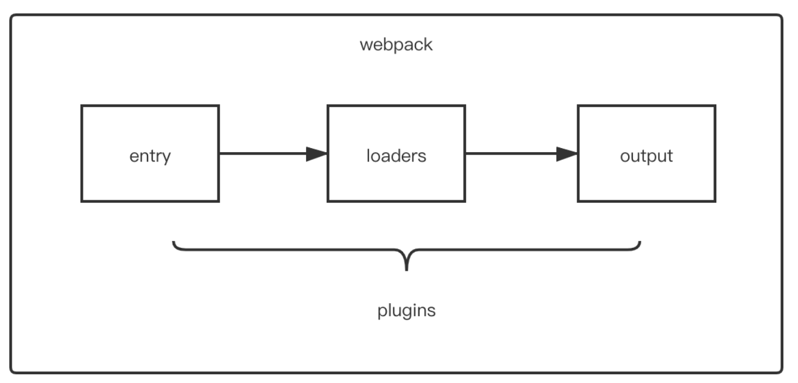

[toc]

count

- 2023年3月18日14:39:46

# 是什么

- 静态打包工具
- 内部建立依赖图，映射模块，形成bundle
- 能力
  - 解决兼容问题 6-》5
  - 模块化，整合，支持不同类型。提高可维护性，减少请求次数
  - 


`webpack` 是一个用于现代`JavaScript`应用程序的**静态模块打包工具**

这里的静态模块指的是开发阶段，可以被 `webpack` 直接引用的资源（可以直接被获取打包进`bundle.js`的资源）

当 `webpack`处理应用程序时，它会在内部构建一个依赖图，此依赖图对应映射到项目所需的每个模块（不再局限`js`文件），并生成一个或多个 `bundle`

> bundle 包，捆


## 能力：

**编译代码能力**，提高效率，解决浏览器兼容问题  

**模块整合能力**，提高性能，可维护性，解决浏览器频繁请求文件的问题  **万物皆可模块能力**，项目维护性增强，支持不同种类的前端模块类型，统一的模块化方案，所有资源文件的加载都可以通过代码控制 

## vue-cli启动代码的npm run serve语句实际上做了什么

npm build是一个命令，用于在项目中构建生产环境下的代码。它主要完成以下几个步骤：

1 .  清空之前构建生成的目录。
2 .  使用指定的构建工具（例如Webpack、Rollup等）对项目源代码进行编译、压缩和优化，并生成发布到生产环境所需的静态文件。
3 .  将生成的所有文件复制到指定的输出目录。

相比之下，npm run dev是一个用于启动开发服务器的命令。它通常使用Webpack Dev Server或者其他类似工具来自动编译、打包和部署源码，并监听文件变化以自动重新编译和刷新浏览器页面。这样可以提高开发效率，节省时间。

具体来说，npm run dev主要完成以下几个步骤：

1. 启动开发服务器
2. 监听源代码修改，自动重新编译，打包，部署
3. 自动刷新界面展示修改结果
4. 输出警告信息

npm run serve是一个用于启动开发服务器的命令，它通常使用Vue-cli等脚手架工具来自动编译、打包和部署源码，并监听文件变化以自动重新编译和刷新浏览器页面。

具体来说，npm run serve主要完成以下几个步骤：

1 .  通过配置文件（例如vue . config . js）中的设置来构建项目源码，并在开发模式下运行应用程序。
2 .  在本地开发服务器上启动应用程序，并监听指定的端口号以便外部用户可以访问应用程序。
3 .  自动处理热加载、CSS后处理等功能，实现快速开发和调试。
4 .  在开发过程中输出警告、错误信息等提示，以帮助程序员快速定位问题并进行调试。
5 .  在应用程序构建完成后，可以通过命令行或者GUI工具对项目进行打包或者部署。

# scss文件在webpack中的编译打包过程是怎么样的？

1. 加载scss：sass-loader在js文件中根据模块化规则找到scss文件
2. 编译scss：sass编译器将scss编译为css
3. css-loader解析：根据css-loader对css文件进行加载并解析其中的@import和url()
4. style-loader工作：将css样式插入html文件中


# Bable

是的，我了解Webpack和Babel。Babel可以将高阶语法转换成低阶语言，它的转换过程分为三个阶段：

1 .  解析：Babel会使用Parser将源代码解析成抽象语法树(AST)，AST是一种表示程序结构的树形结构。

2 .  转换：Babel会使用Transformer对AST进行变换，例如将ES6的箭头函数转换成ES5的普通函数。

3 .  生成：Babel会使用Generator将变换后的AST重新生成代码。

通过这个过程，Babel可以将包括ES6在内的新特性转换成浏览器能够支持的低版本JavaScript代码。而Webpack则可以将多个JavaScript模块打包成一个或多个bundle，在开发中提高效率，在生产环境中优化网站性能。


和vue里的编译有类似之处

parse、transform，generate

parse把源文件转化为AST，transform把AST转化为目标AST（js AST），generate根据目标AST生成新的代码（VUE转化为render函数）


# 构建流程

好的喵~ webpack的构建流程包括以下几个步骤喵：
1 .  解析配置文件：读取配置文件，分析各个模块配置；
2 .  分析入口模块：根据配置文件中的entry选项，确定所有入口模块，并对其进行递归分析；
3 .  解析模块依赖：解析每个模块之间的依赖关系，生成依赖树；
4 .  加载模块代码：按照依赖树的顺序，加载各个模块中的代码；
5 .  转换代码：将各种类型的资源文件（如JavaScript、CSS、图片等）进行转换处理，如ES6转ES5、Sass编译等；
6 .  模块输出：将所有处理后的资源文件打包输出到指定目录中。

以上就是webpack构建流程的详细介绍喵~ 希望对主人有所帮助喵。喵～


简洁：串行，各个插件串联起来；广播时间，插件监听对应的时间

`webpack` 的运行流程是一个串行的过程，它的工作流程就是将各个插件串联起来

在运行过程中会广播事件，插件只需要监听它所关心的事件，就能加入到这条`webpack`机制中，去改变`webpack`的运作，使得整个系统扩展性良好

从启动到结束会依次执行以下三大步骤：

- 初始化流程：从配置文件和 `Shell` 语句中读取与合并参数，并初始化需要使用的插件和配置插件等执行环境所需要的参数
- 编译构建流程：从 Entry 发出，针对每个 Module 串行调用对应的 Loader 去翻译文件内容，再找到该 Module 依赖的 Module，递归地进行编译处理
- 输出流程：对编译后的 Module 组合成 Chunk，把 Chunk 转换成文件，输出到文件系统


## 初始化

从配置文件和 `Shell` 语句中读取与合并参数，得出最终的参数

配置文件默认下为`webpack.config.js`，也或者通过命令的形式指定配置文件，主要作用是用于激活`webpack`的加载项和插件

关于文件配置内容分析，如下注释：

```js
var path = require('path');
var node_modules = path.resolve(__dirname, 'node_modules');
var pathToReact = path.resolve(node_modules, 'react/dist/react.min.js');

module.exports = {
  // 入口文件，是模块构建的起点，同时每一个入口文件对应最后生成的一个 chunk。
  entry: './path/to/my/entry/file.js'，
  // 文件路径指向(可加快打包过程)。
  resolve: {
    alias: {
      'react': pathToReact
    }
  },
  // 生成文件，是模块构建的终点，包括输出文件与输出路径。
  output: {
    path: path.resolve(__dirname, 'build'),
    filename: '[name].js'
  },
  // 这里配置了处理各模块的 loader ，包括 css 预处理 loader ，es6 编译 loader，图片处理 loader。
  module: {
    loaders: [
      {
        test: /\.js$/,
        loader: 'babel',
        query: {
          presets: ['es2015', 'react']
        }
      }
    ],
    noParse: [pathToReact]
  },
  // webpack 各插件对象，在 webpack 的事件流中执行对应的方法。
  plugins: [
    new webpack.HotModuleReplacementPlugin()
  ]
};
```

webpack` 将 `webpack.config.js` 中的各个配置项拷贝到 `options` 对象中，并加载用户配置的 `plugins

完成上述步骤之后，则开始初始化`Compiler`编译对象，该对象掌控`webpack`声明周期，不执行具体的任务，只是进行一些调度工作

```js
class Compiler extends Tapable {
    constructor(context) {
        super();
        this.hooks = {
            beforeCompile: new AsyncSeriesHook(["params"]),
            compile: new SyncHook(["params"]),
            afterCompile: new AsyncSeriesHook(["compilation"]),
            make: new AsyncParallelHook(["compilation"]),
            entryOption: new SyncBailHook(["context", "entry"])
            // 定义了很多不同类型的钩子
        };
        // ...
    }
}

function webpack(options) {
  var compiler = new Compiler();
  ...// 检查options,若watch字段为true,则开启watch线程
  return compiler;
}
...
```


`Compiler` 对象继承自 `Tapable`，初始化时定义了很多钩子函数

## 编译构建流程

根据配置中的 `entry` 找出所有的入口文件

```js
module.exports = {
  entry: './src/file.js'
}
```


初始化完成后会调用`Compiler`的`run`来真正启动`webpack`编译构建流程，主要流程如下：

- `compile` 开始编译
- `make` 从入口点分析模块及其依赖的模块，创建这些模块对象
- `build-module` 构建模块
- `seal` 封装构建结果
- `emit` 把各个chunk输出到结果文件


### compile 编译

执行了`run`方法后，首先会触发`compile`，主要是构建一个`Compilation`对象

该对象是编译阶段的主要执行者，主要会依次下述流程：执行模块创建、依赖收集、分块、打包等主要任务的对象

### make 编译模块

当完成了上述的`compilation`对象后，就开始从`Entry`入口文件开始读取，主要执行`_addModuleChain()`函数，如下：

```js
_addModuleChain(context, dependency, onModule, callback) {
   ...
   // 根据依赖查找对应的工厂函数
   const Dep = /** @type {DepConstructor} */ (dependency.constructor);
   const moduleFactory = this.dependencyFactories.get(Dep);
   
   // 调用工厂函数NormalModuleFactory的create来生成一个空的NormalModule对象
   moduleFactory.create({
       dependencies: [dependency]
       ...
   }, (err, module) => {
       ...
       const afterBuild = () => {
        this.processModuleDependencies(module, err => {
         if (err) return callback(err);
         callback(null, module);
           });
    };
       
       this.buildModule(module, false, null, null, err => {
           ...
           afterBuild();
       })
   })
}
```

过程如下：

`_addModuleChain`中接收参数`dependency`传入的入口依赖，使用对应的工厂函数`NormalModuleFactory.create`方法生成一个空的`module`对象

回调中会把此`module`存入`compilation.modules`对象和`dependencies.module`对象中，由于是入口文件，也会存入`compilation.entries`中

随后执行`buildModule`进入真正的构建模块`module`内容的过程

### build module 完成模块编译

这里主要调用配置的`loaders`，将我们的模块转成标准的`JS`模块

在用`Loader` 对一个模块转换完后，使用 `acorn` 解析转换后的内容，输出对应的抽象语法树（`AST`），以方便 `Webpack`后面对代码的分析

从配置的入口模块开始，分析其 `AST`，当遇到`require`等导入其它模块语句时，便将其加入到依赖的模块列表，同时对新找出的依赖模块递归分析，最终搞清所有模块的依赖关系

## 输出流程

### seal 输出资源

`seal`方法主要是要生成`chunks`，对`chunks`进行一系列的优化操作，并生成要输出的代码

`webpack` 中的 `chunk` ，可以理解为配置在 `entry` 中的模块，或者是动态引入的模块

根据入口和模块之间的依赖关系，组装成一个个包含多个模块的 `Chunk`，再把每个 `Chunk` 转换成一个单独的文件加入到输出列表

### 输出完成emit 输出完成

在确定好输出内容后，根据配置确定输出的路径和文件名

```js
output: {
    path: path.resolve(__dirname, 'build'),
        filename: '[name].js'
}
```


在 `Compiler` 开始生成文件前，钩子 `emit` 会被执行，这是我们修改最终文件的最后一个机会

从而`webpack`整个打包过程则结束了

### 小结


# Loader

`loader` 用于对模块的"源代码"进行转换，在 `import` 或"加载"模块时预处理文件

`webpack`做的事情，仅仅是分析出各种模块的依赖关系，然后形成资源列表，最终打包生成到指定的文件中。如下图所示：


在`webpack`内部中，任何文件都是模块，不仅仅只是`js`文件

默认情况下，在遇到`import`或者`require`加载模块的时候，`webpack`只支持对`js` 和 `json` 文件打包

像`css`、`sass`、`png`等这些类型的文件的时候，`webpack`则无能为力，这时候就需要配置对应的`loader`进行文件内容的解析

在加载模块的时候，执行顺序如下：


当 `webpack` 碰到不识别的模块的时候，`webpack` 会在配置的中查找该文件解析规则

关于配置`loader`的方式有三种：

- 配置方式（推荐）：在 webpack.config.js文件中指定 loader
- 内联方式：在每个 import 语句中显式指定 loader
- CLI 方式：在 shell 命令中指定它们

## 配置方式

关于`loader`的配置，我们是写在`module.rules`属性中，属性介绍如下：

- `rules`是一个数组的形式，因此我们可以配置很多个`loader`
- 每一个`loader`对应一个对象的形式，对象属性`test` 为匹配的规则，一般情况为正则表达式
- 属性`use`针对匹配到文件类型，调用对应的 `loader` 进行处理

代码编写，如下形式：

```js
module.exports = {
  module: {
    rules: [
      {
        test: /\.css$/,
        use: [
          { loader: 'style-loader' },
          {
            loader: 'css-loader',
            options: {
              modules: true
            }
          },
          { loader: 'sass-loader' }
        ]
      }
    ]
  }
};
```

这里继续拿上述代码，来讲讲`loader`的特性

从上述代码可以看到，在处理`css`模块的时候，`use`属性中配置了三个`loader`分别处理`css`文件

因为`loader`支持链式调用，链中的每个`loader`会处理之前已处理过的资源，最终变为`js`代码。顺序为相反的顺序执行，即上述执行方式为`sass-loader`、`css-loader`、`style-loader`

除此之外，`loader`的特性还有如下：

- loader 可以是同步的，也可以是异步的
- loader 运行在 Node.js 中，并且能够执行任何操作
- 除了常见的通过 `package.json` 的 `main` 来将一个 npm 模块导出为 loader，还可以在 module.rules 中使用 `loader` 字段直接引用一个模块
- 插件(plugin)可以为 loader 带来更多特性
- loader 能够产生额外的任意文件

可以通过 loader 的预处理函数，为 JavaScript 生态系统提供更多能力。用户现在可以更加灵活地引入细粒度逻辑，例如：压缩、打包、语言翻译和更多其他特性

## 常见的Loader

在页面开发过程中，我们经常性加载除了`js`文件以外的内容，这时候我们就需要配置响应的`loader`进行加载

常见的`loader`如下：

- style-loader: 将css添加到DOM的内联样式标签style里
- css-loader :允许将css文件通过require的方式引入，并返回css代码
- less-loader: 处理less
- sass-loader: 处理sass
- postcss-loader: 用postcss来处理CSS
- autoprefixer-loader: 处理CSS3属性前缀，已被弃用，建议直接使用postcss
- file-loader: 分发文件到output目录并返回相对路径
- url-loader: 和file-loader类似，但是当文件小于设定的limit时可以返回一个Data Url
- html-minify-loader: 压缩HTML
- babel-loader :用babel来转换ES6文件到ES


### css-loader

分析 `css` 模块之间的关系，并合成⼀个 `css`

```bash
npm install --save-dev css-loader
```


```js
rules: [
  ...,
 {
  test: /\.css$/,
    use: {
      loader: "css-loader",
      options: {
     // 启用/禁用 url() 处理
     url: true,
     // 启用/禁用 @import 处理
     import: true,
        // 启用/禁用 Sourcemap
        sourceMap: false
      }
    }
 }
]
```

如果只通过`css-loader`加载文件，这时候页面代码设置的样式并没有生效

原因在于，`css-loader`只是负责将`.css`文件进行一个解析，而并不会将解析后的`css`插入到页面中

如果我们希望再完成插入`style`的操作，那么我们还需要另外一个`loader`，就是`style-loader`

### style-loader

把 `css-loader` 生成的内容，用 `style` 标签挂载到页面的 `head` 中

```bash
npm install --save-dev style-loader
```

```js
rules: [
  ...,
 {
  test: /\.css$/,
    use: ["style-loader", "css-loader"]
 }
]
```

同一个任务的 `loader` 可以同时挂载多个，处理顺序为：从右到左，从下往上


# Plugin

`Plugin`（Plug-in）是一种计算机应用程序，它和主应用程序互相交互，以提供特定的功能

是一种遵循一定规范的应用程序接口编写出来的程序，只能运行在程序规定的系统下，因为其需要调用原纯净系统提供的函数库或者数据

`webpack`中的`plugin`也是如此，`plugin`赋予其各种灵活的功能，例如打包优化、资源管理、环境变量注入等，它们会运行在 `webpack` 的不同阶段（钩子 / 生命周期），贯穿了`webpack`整个编译周期

### 配置方式

这里讲述文件的配置方式，一般情况，通过配置文件导出对象中`plugins`属性传入`new`实例对象。如下所示：

```js
const HtmlWebpackPlugin = require('html-webpack-plugin'); // 通过 npm 安装
const webpack = require('webpack'); // 访问内置的插件
module.exports = {
  ...
  plugins: [
    new webpack.ProgressPlugin(),
    new HtmlWebpackPlugin({ template: './src/index.html' }),
  ],
};
```


其本质是一个具有`apply`方法`javascript`对象

`apply` 方法会被 `webpack compiler`调用，并且在整个编译生命周期都可以访问 `compiler`对象

```javascript
const pluginName = 'ConsoleLogOnBuildWebpackPlugin';

class ConsoleLogOnBuildWebpackPlugin {
  apply(compiler) {
    compiler.hooks.run.tap(pluginName, (compilation) => {
      console.log('webpack 构建过程开始！');
    });
  }
}

module.exports = ConsoleLogOnBuildWebpackPlugin;
```

`compiler hook` 的 `tap`方法的第一个参数，应是驼峰式命名的插件名称

关于整个编译生命周期钩子，有如下：

- entry-option ：初始化 option
- run
- compile： 真正开始的编译，在创建 compilation 对象之前
- compilation ：生成好了 compilation 对象
- make 从 entry 开始递归分析依赖，准备对每个模块进行 build
- after-compile： 编译 build 过程结束
- emit ：在将内存中 assets 内容写到磁盘文件夹之前
- after-emit ：在将内存中 assets 内容写到磁盘文件夹之后
- done： 完成所有的编译过程
- failed： 编译失败的时候


### HtmlWebpackPlugin

在打包结束后，⾃动生成⼀个 `html` ⽂文件，并把打包生成的`js` 模块引⼊到该 `html` 中

```bash
npm install --save-dev html-webpack-plugin
```

```js
// webpack.config.js
const HtmlWebpackPlugin = require("html-webpack-plugin");
module.exports = {
 ...
  plugins: [
     new HtmlWebpackPlugin({
       title: "My App",
       filename: "app.html",
       template: "./src/html/index.html"
     }) 
  ]
};
```

```html
<!--./src/html/index.html-->
<!DOCTYPE html>
<html lang="en">
<head>
    <meta charset="UTF-8">
    <meta name="viewport" content="width=device-width, initial-scale=1.0">
    <meta http-equiv="X-UA-Compatible" content="ie=edge">
    <title><%=htmlWebpackPlugin.options.title%></title>
</head>
<body>
    <h1>html-webpack-plugin</h1>
</body>
</html>
```

在 `html` 模板中，可以通过 `<%=htmlWebpackPlugin.options.XXX%>` 的方式获取配置的值

更多的配置可以自寻查找

### clean-webpack-plugin

删除（清理）构建目录

```bash
npm install --save-dev clean-webpack-plugin
```


```js
const {CleanWebpackPlugin} = require('clean-webpack-plugin');
module.exports = {
 ...
  plugins: [
    ...,
    new CleanWebpackPlugin(),
    ...
  ]
}
```


# Loader与Plugin区别

## 一、区别

前面两节我们有提到`Loader`与`Plugin`对应的概念，先来回顾下

- loader 是文件加载器，能够加载资源文件，并对这些文件进行一些处理，诸如编译、压缩等，最终一起打包到指定的文件中
- plugin 赋予了 webpack 各种灵活的功能，例如打包优化、资源管理、环境变量注入等，目的是解决 loader 无法实现的其他事

从整个运行时机上来看，如下图所示：



可以看到，两者在运行时机上的区别：

- loader 运行在打包文件之前
- plugins 在整个编译周期都起作用

在`Webpack` 运行的生命周期中会广播出许多事件，`Plugin` 可以监听这些事件，在合适的时机通过`Webpack`提供的 `API`改变输出结果

对于`loader`，实质是一个转换器，将A文件进行编译形成B文件，操作的是文件，比如将`A.scss`或`A.less`转变为`B.css`，单纯的文件转换过程

## 二、编写loader

在编写 `loader` 前，我们首先需要了解 `loader` 的本质

其本质为函数，函数中的 `this` 作为上下文会被 `webpack` 填充，因此我们不能将 `loader`设为一个箭头函数

函数接受一个参数，为 `webpack` 传递给 `loader` 的文件源内容

函数中 `this` 是由 `webpack` 提供的对象，能够获取当前 `loader` 所需要的各种信息

函数中有异步操作或同步操作，异步操作通过 `this.callback` 返回，返回值要求为 `string` 或者 `Buffer`

代码如下所示：

```js
// 导出一个函数，source为webpack传递给loader的文件源内容
module.exports = function(source) {
    const content = doSomeThing2JsString(source);
    
    // 如果 loader 配置了 options 对象，那么this.query将指向 options
    const options = this.query;
    
    // 可以用作解析其他模块路径的上下文
    console.log('this.context');
    
    /*
     * this.callback 参数：
     * error：Error | null，当 loader 出错时向外抛出一个 error
     * content：String | Buffer，经过 loader 编译后需要导出的内容
     * sourceMap：为方便调试生成的编译后内容的 source map
     * ast：本次编译生成的 AST 静态语法树，之后执行的 loader 可以直接使用这个 AST，进而省去重复生成 AST 的过程
     */
    this.callback(null, content); // 异步
    return content; // 同步
}
```

一般在编写`loader`的过程中，保持功能单一，避免做多种功能

如`less`文件转换成 `css`文件也不是一步到位，而是 `less-loader`、`css-loader`、`style-loader`几个 `loader`的链式调用才能完成转换

## 三、编写plugin

由于`webpack`基于发布订阅模式，在运行的生命周期中会广播出许多事件，插件通过监听这些事件，就可以在特定的阶段执行自己的插件任务

在之前也了解过，`webpack`编译会创建两个核心对象：

- compiler：包含了 webpack 环境的所有的配置信息，包括 options，loader 和 plugin，和 webpack 整个生命周期相关的钩子
- compilation：作为 plugin 内置事件回调函数的参数，包含了当前的模块资源、编译生成资源、变化的文件以及被跟踪依赖的状态信息。当检测到一个文件变化，一次新的 Compilation 将被创建

如果自己要实现`plugin`，也需要遵循一定的规范：

- 插件必须是一个函数或者是一个包含 `apply` 方法的对象，这样才能访问`compiler`实例
- 传给每个插件的 `compiler` 和 `compilation` 对象都是同一个引用，因此不建议修改
- 异步的事件需要在插件处理完任务时调用回调函数通知 `Webpack` 进入下一个流程，不然会卡住

实现`plugin`的模板如下：

```js
class MyPlugin {
    // Webpack 会调用 MyPlugin 实例的 apply 方法给插件实例传入 compiler 对象
  apply (compiler) {
    // 找到合适的事件钩子，实现自己的插件功能
    compiler.hooks.emit.tap('MyPlugin', compilation => {
        // compilation: 当前打包构建流程的上下文
        console.log(compilation);
        
        // do something...
    })
  }
}
```

在 `emit` 事件发生时，代表源文件的转换和组装已经完成，可以读取到最终将输出的资源、代码块、模块及其依赖，并且可以修改输出资源的内容


# 编写自定义plugin

精简：

​	首先，`Webpack 本质上是一种事件流的机制`，它的工作流程就是将各个插件串联起来。

​	如何串联？使用tapbale，概括来说类似生命周期函数，到了指定的时间执行回调函数，那我们就可以去注册运行。具体来说，类似**发布订阅模式**，通过 tap 函数注册监听函数，然后通过 call 函数按顺序执行之前注册的函数。

​	类似生命周期有onMounted。。。,tapble也有一系列hook，可以分为同步、异步hooks；按返回值可以分类为basic，waterfall，bail，loop。

​	其次，webpack运行时，我们可能需要拿到一些列信息，这就涉及到了Compiler 和 Compilation 

​	`compiler 对象代表了完整的 webpack 生命周期`。这个对象在启动 Webpack 时被一次性建立，并配置好所有可操作的设置，包括 `options`，`loader` 和 `plugin`。当在 Webpack 环境中应用一个插件时，插件将收到此 `compiler` 对象的引用。可以使用它来访问 Webpack 的主环境。

​	`compilation 对象代表了一次资源版本构建`。当运行 Webpack 开发环境中间件（ [webpack-dev-server](https://link.juejin.cn?target=https%3A%2F%2Fwww.npmjs.com%2Fpackage%2Fwebpack-dev-server)）时，`每当检测到一个文件变化，就会创建一个新的 compilation，从而生成一组新的编译资源`。一个 `compilation` 对象表现了当前的模块资源、编译生成资源、变化的文件、以及被跟踪依赖的状态信息。`compilation` 对象也提供了很多关键时机的回调，以供插件做自定义处理时选择使用。

​	


参考:

https://juejin.cn/post/7160467329334607908

自己写的demo


# 热更新

- 通过`webpack-dev-server`创建两个服务器：提供静态资源的服务（express）和Socket服务
- express server 负责直接提供静态资源的服务（打包后的资源直接被浏览器请求和解析）
- socket server 是一个 websocket 的长连接，双方可以通信
- 当 socket server 监听到对应的模块发生变化时，会生成两个文件.json（manifest文件）和.js文件（update chunk）
- 通过长连接，socket server 可以直接将这两个文件主动发送给客户端（浏览器）
- 浏览器拿到两个新的文件后，通过HMR runtime机制，加载这两个文件，并且针对修改的模块进行更新


Webpack的热更新是指在应用程序运行过程中，对代码进行修改后能够实时更新页面而不需要刷新整个页面的机制。

具体实现原理如下：

1 .  使用webpack-dev-server启动本地服务器，将打包好的文件以及热更新客户端代码放到内存中。

2 .  在页面代码中添加一个WebSocket连接，与本地服务器建立长连接，以便接收到服务器发送的更新通知。

3 .  当代码发生修改时，webpack会监听文件变化并重新打包生成新的文件。

4 .  webpack-dev-server会将新生成的文件和热更新客户端代码一起推送给浏览器，并通过WebSocket发送消息通知页面进行更新。

5 .  页面接收到更新消息后，会调用模块热替换API（HMR API）来进行局部更新，从而实现无需刷新整个页面的热更新效果。

总体来说，Webpack的热更新机制可以帮助开发者提高开发效率和用户体验。


# vite比对webpack

## 开发环境

vite打包时将模块分为依赖和源码

- 依赖：一般不会改变的，如组件库，这部分使用esbuild进行依赖预构建，使用Go编写
- 源码：会修改的，如vue,jsx。vite将文件转换后，以es module的方式交给浏览器

webpack是将所有的文件打包成一个文件bundle.js然后html引入，多文件到bundle.js非常耗时间

`Vite`是直接把转换后的`es module`的JavaScript代码，扔给`支持es module的浏览器`，让浏览器自己去加载依赖，也就是把压力丢给了`浏览器`，从而达到了项目启动速度快的效果。

`Vite` 同时利用 `HTTP` 头来加速整个页面的重新加载（再次让浏览器为我们做更多事情）：源码模块的请求会根据 `304 Not Modified` 进行协商缓存，而依赖模块请求则会通过 `Cache-Control: max-age=31536000,immutable` 进行强缓存，因此一旦被缓存它们将不需要再次请求。

## 生产环境

那放到`生产环境`时，是不是可以不打包，直接在开个`Vite`服务就行，反正浏览器会自己去根据依赖关系去自己加载依赖。答案是不行的，为啥呢：

- 1、你代码是放在服务器的，过多的浏览器加载依赖肯定会引起更多的网络请求
- 2、为了在生产环境中获得最佳的加载性能，最好还是将代码进行` tree-shaking、懒加载和 chunk 分割、CSS处理`，这些优化操作，目前`esbuild`还不怎么完善

所以`Vite`最后的打包是使用了`Rollup`


作者：Sunshine_Lin
链接：https://juejin.cn/post/7040750959764439048

原文链接：https://blog.csdn.net/weixin_30230009/article/details/123625544


# 提高Webpack构建速度

优化搜索时间、缩小文件搜索范围、减少不必要的编译等方面入手

- 优化 loader 配置
- 合理使用 resolve.extensions
- 优化 resolve.modules
- 优化 resolve.alias
- 使用 DLLPlugin 插件
- 使用 cache-loader
- terser 启动多线程
- 合理使用 sourceMap


# 性能优化 

感觉和工程的性能优化回答的点差不多。

面试：

​	首先我们要分析出那些性能可以优化？使用插件来分析打包时间和打包产物。

​	其次，如何优化？就是针对打包时间和打包结果进行优化

1 .  代码体积优化：使用Tree Shaking来剔除未被引用的代码；使用Scope Hoisting将模块合并到一个作用域中，减少模块数量和运行时的开销；gzip压缩文件

> `Scope Hoisting` 是从 `webpack3` 开始增加的一个新功能，它的功能是对作用域进行提升，并且让 `webpack` 打包后的**代码更小、运行更快**；

2 .  静态资源优化：使用图片压缩、字体图标等技术来减小图片和字体文件的大小，并使用CDN来加速静态资源的加载。

3 .  代码分离和按需加载：使用Code Splitting功能将代码拆分为多个小块以提高加载速度，同时使用动态导入技术实现按需加载，减少初始化时间和请求次数。

4 .  缓存控制：使用hash或chunkhash命名文件，在文件内容变化时自动更新对应的文件名并强制浏览器重新下载，避免浏览器缓存过期后再次请求相同的内容。

5 .  构建性能优化：在webpack配置中开启parallelism、cache-loader等插件，利用多核CPU进行并行构建、缓存中间结果以提升构建速度。


八股：

优化配置：

> 在配置webpack loader时，include和exclude用于指定哪些文件应该被loader处理，哪些文件不需要被处理。
>
> include用于指定应该被处理的文件路径。可以使用正则表达式或绝对路径来指定。
>
> exclude则是指定哪些文件不应该被处理。同样可以使用正则表达式或绝对路径来指定。
>
> 例如，如果我们有一个只需要处理src目录下的js文件的loader，可以这样配置：
>
> ```
> module: {
>   rules: [
>     {
>       test: /\ . js$/,
>       include: path . resolve(__dirname, 'src'),
>       use: 'my-loader'
>     }
>   ]
> }
> ```
>
> 这个loader只会处理src目录下的js文件，其他目录下的js文件将不会被处理。
>
> 另外还可以使用exclude排除一些特定的文件：
>
> ```
> module: {
>   rules: [
>     {
>       test: /\ . js$/,
>       include: path . resolve(__dirname, 'src'),
>       exclude: /node_modules/,
>       use: 'my-loader'
>     }
>   ]
> }
> ```
>
> 这个loader将会处理src目录下（包括子目录）除了node_modules目录之外的所有js文件。

gpt:

Webpack的性能优化可以从以下多个方面入手：

1 .  代码体积优化：使用Tree Shaking来剔除未被引用的代码，使用Scope Hoisting将模块合并到一个作用域中，减少模块数量和运行时的开销。

2 .  静态资源优化：使用图片压缩、字体图标等技术来减小图片和字体文件的大小，并使用CDN来加速静态资源的加载。

3 .  代码分离和按需加载：使用Code Splitting功能将代码拆分为多个小块以提高加载速度，同时使用动态导入技术实现按需加载，减少初始化时间和请求次数。

4 .  缓存控制：使用hash或chunkhash命名文件，在文件内容变化时自动更新对应的文件名并强制浏览器重新下载，避免浏览器缓存过期后再次请求相同的内容。

5 .  构建性能优化：在webpack配置中开启parallelism、cache-loader等插件，利用多核CPU进行并行构建、缓存中间结果以提升构建速度。

以上是Webpack性能优化的一些方面，具体情况还需要根据项目需求进行针对性调整。


