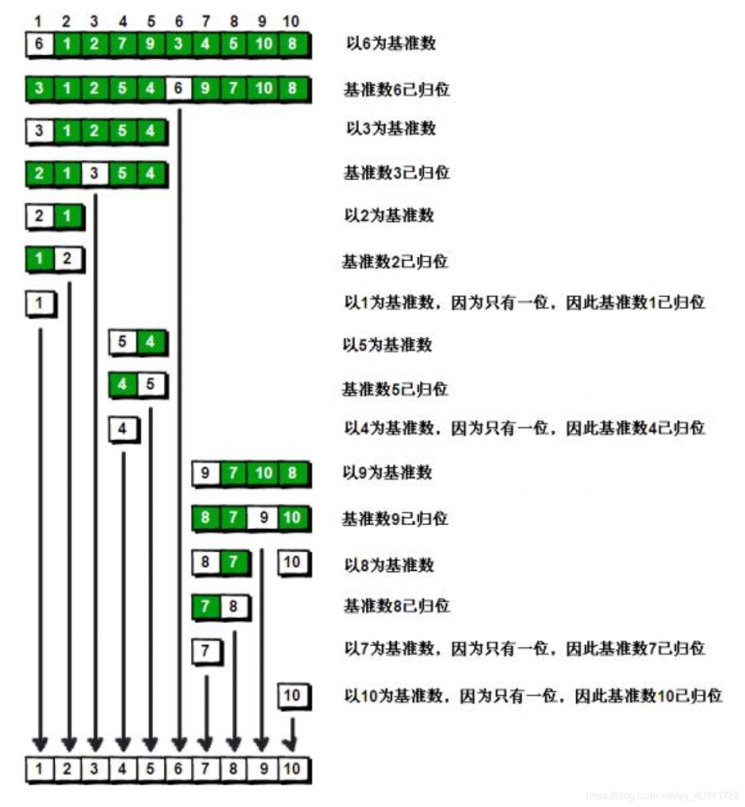

# 算法

[toc]

# 复杂度与程序调试

全局变量记得清零与初始化

全局变量在方法开始时要初始化，力扣的运行是先初始化一个类，然后针对不同的测试用例反复调用类里面的方法，所以类里面的类变量在不同测试用例调换时力扣是不会重新初始化类的，所以上次运行测试用例的类变量不初始化就是变成脏数据

大的变量记得申请为全局变量,比如说一个大的二维数组，否则栈溢出。

# c++与stl

- 队列模拟栈，考虑成一个环，每来一个元素就调换位置

- priority_queue

  - 如何自定义比较方式

  - 1.

  - 2.

# dfs

# bfs

- 常见的最短路问题，定义方向向量来简化，然后bfs即可

- 带状态的bfs
  - lc1293，区别之处在于多了障碍物的限制，因此搜索的时候需要多加上一个变量来记录状态，当前剩余消除k个障碍物

# 贪心

# 二分

- 注意，到现在了你还没仔细的读一遍，你这阅读质量可想而知。。。

- 正确设置L和R指针。其中L指向第一个元素的前一个位置，R指向最后一个元素的下一个位置。我们让L始终指向分界线以左的部分，让R始终指向分界线以右的部分。在保证这个前提的基础上，让L和R逐渐靠近，当L和R指向相邻两个数时，L和R之间就是分界线。比如区间 [0,n]，那么l=-1,r=n+1

- 正确理解分界线的含义。如分界线：当小于某个边长时，无法包含所有矩形；大于等于某个边长时，可以包含所有矩形。因此，分界线在“不能包含所有矩形”和“能包含所有矩形”之间，答案就是分界线右侧的第一个数

- 我超，人麻了，困难题真的有点难，保持敬畏和谦虚之心

# 数学基础

- 取模

- 位运算

  - 一般用于节省时间或简化状态的改变

  - 二进制位来统计状态

    - 比如说统计某个字符串各个字母是否出现，可以用低26位来记录（最多32位）

  - 异或性质

    - 真值表，和0异或得到本身，和自身异或得到0

    - 满足交换律，结合律
  
  - \>>,<<

    - 注意如果要移位，别拉下等于，a>>=1;

  - 获得某个数第i位，(a>>i)&1
    - 对某个数第i位赋值，a|=(1<<i)
  
  - 与
  
    > 正整数 y 是 2 的整数次幂，当且仅当 y & (y−1)=0
  
  - 例题
  
    - 统计1-n 二进制表达中，1的个数
  
      - 暴力，遍历每一个，然后逐个求
      - 动态规划，根据最高有效位，从前面转移过来，注意实现
  
    - 巧妙，找出只出现一次的数字，其余数字出现两次，使用异或，交换律与结合律
  
    - 找出只出现一次的数字，其余数字出现三次，
  
      - 哈希统计次数
  
      - 思路一：统计每一个二进制位，1的数量如果是3的倍数，说明这一位出现了三次，忽略，次数为1说明这一位的数字只出现了一次，时间复杂度：O(nlogC)
  
      - 思路二：
        - 思路一改进，在方法二中，我们是依次处理每一个二进制位的，那么时间复杂度中就引入了 O(log⁡C)这一项。既然我们在对两个整数进行普通的二元运算时，都是将它们看成整体进行处理的，那么我们是否能以普通的二元运算为基础，同时处理所有的二进制位？
  
    - 找出两个只出现一次的数字，其余出现2次
  
      - 还是利用异或，想办法进行分组，每组选出一个来，组内就用只出现一次的方法求
  
      - 如何进行分组呢？利用
  
      - > x&-x
        >
        > “当一个数与其取负后的值相与， 如果这个数是偶数， 则结果是能整除这个偶数的最大的2的幂(即： m = n & -n , 则 n % m = 0, 且 m = 2 ^ k)， 如果这个数是奇数， 则结果必为1”
        >
        > 用途： 该位运算技巧可以直接获取 n二进制表示的最低位的 1。

# 快速幂

# 前缀和&差分

- 前缀和

  

> # 例题，一堆-1,1，求最长的连续和为0的子数组
>
> 在有前缀和的情况下，考虑到第i个元素，怎么满足条件？
>
> 如果sum[i]==0说明从0到i这个子数组可以；如果前面出现过和自己一样大小的数sum[j]，说明i到j之间的和也是0，同样符合题意
>
> 哈希表来记录

> # 和为k的最长连续子数组
>
> 考虑 0... i ... j ... n，
>
> 已有前缀和的情况下，如何让i到j之间和为k呢？
>
> sum[j]-sum[i-1]==k即可
>
> 即对于当前的第j项来说，只要前面有 sum[j]-k即可，这样就能凑出区间和为k
>
> 使用哈希表来维护前面

# 双指针

滑动窗口，套路是，枚举右端点，不断把右端点加入，同时循环查看窗口内的情况，如果不符合要求，就得把左指针向右移动来缩小窗口

- 两数之和等于特定值

  - 暴力双循环
  - 排序之后,双指针扫描一遍,nlogn
  - 哈希表呢?可能存在的问题是自己*2=目标值,但是只有一个自己,多存一个

> # 不含重复字符的最长子字符串
>
> 不断利用套路即可

## 两头开始的双指针

> 去掉一个字母任然是回文字符串
>
> 1.暴力枚举去掉每一个字母，然后检查，复杂度n*n
>
> 2.贪心+双指针，两边向中间收缩，相同l++,r--；不相同，说明肯定得去掉一个，都检查，都不是说明不是回文串，否则就是

## 快慢指针


## 中心拓展

> 找到所有的回文子字符串
>
> 1.枚举左右端点，然后检查，n3
>
> 2.枚举中心，由中心向两侧扩展，n2
>
> ```c++
> class Solution {
> public:
>     int countSubstrings(string s) {
>         int num = 0;
>         int n = s.size(); 
>         for(int i=0;i<n;i++)//遍历回文中心点
>         {
>             for(int j=0;j<=1;j++)//j=0,中心是一个点，j=1,中心是两个点
>             {
>                 int l = i;
>                 int r = i+j;
>                 while(l>=0 && r<n && s[l--]==s[r++])num++;
>             }
>         }
>         return num;
>     }
> };
> ```
>
> 

# 单调栈&单调队列

## 单调栈

### 作用 

线性的时间复杂度，通常维护全局单调性

单调递增栈 可以找到数组中往左/往右第一个比当前元素 **小** 的元素 

单调递减栈 可以找到数组中往左/往右第一个比当前元素 **大** 的元素 

可以求得以当前元素为最值的最大区间

- 通常是在元素弹出时进行处理。

- 通常存储下标。

### 形象化理解

如果是单调递减栈，可以找到更大的元素。当前元素如果大于栈内元素，那么会把前面的元素压扁，想象一排人在排队，来了个高个，前面的人如果比他小，那就乖乖走了，只留下比他更高的。


### 单调递增栈伪代码


找到每个元素右边第一个小的

### 例题

lc316,去除重复字母,相对顺序不能变,返回最小字典序的字符串

> 柱状图最大的矩形
>
> 从左向右维护一个单调递增栈，访问到每个元素时，栈里保持单调递增，栈顶是左边最大的元素
>
> 如果有一个元素k被弹出了，说明：

> 每日温度
>
> 一个数组，找到每个元素右边第一个比它大的元素
>
> ```cpp
> class Solution {
>   public:
>     vector<int> dailyTemperatures(vector<int> &t) {
>         int len = t.size();
>         stack<int> st;
>         vector<int> res(len);
>         for (int i = 0; i < len; i++) {
>             while (!st.empty() && t[st.top()] < t[i]) {
>                 res[st.top()] = i - st.top();
>                 st.pop();
>             }
>             st.push(i);
>         }
>         res[len - 1] = 0;
>         return res;
>     }
> };
> ```
>
> 

## 单调队列

### 作用

维护局部单调性

• 单调队列的维护过程与单调栈相似，区别在于

单调栈只维护一端(栈顶), 而单调队列可以维护两端(队首和队尾)

单调栈通常维护 全局 的单调性, 而单调队列通常维护 局部 的单调性

由于单调队列 可以队首出队 以及 前面的元素一定比后面的元素先入队 的 性质，使得它可以维护局部的单调性

考虑区间[L,R]，依次将区间内的数加入单调递增队列，则队首是区间最小 值。若区间要变成[L+1,R+1]，将R+1加入队列。判断第L个元素是不是队 首。如果不是队首，说明队首元素在L后面，是区间[L+1,R+1]最小值。如 果是队首，将队首出队，新队首是区间[L+1,R+1]最小值。

### 伪代码


# 动态规划

定义

状态转移方程

举例验证

初始化

递推顺序


## 一维

## 二维

> # 找出最大的全为1的矩形
>
> 定义：dp[i] [j]以 i j为右下角的最大的正方形边长
>
> 状态转移方程： *dp**[**i**]**[**j**]* *=* *min*(*min*(*dp**[**i* *-* 1*]**[**j]*, *dp**[**i**]**[j* *-* 1*]*), *dp**[**i* *-* 1*]**[**j* *-* 1*]*) *+* 1;右下角元素取决于它上边，左边，左上边，三个里面最小的拿出来一块凑
>
> 初始化：matrix[i ] [j ]==0 => dp[i] [j]=0; 第0行，第0列为1的，初始化为1
>
> 递推顺序：逐个来即可

## 字符串

> # 编辑距离
>
> 给你两个单词 `word1` 和 `word2`， *请返回将 `word1` 转换成 `word2` 所使用的最少操作数* 。
>
> 你可以对一个单词进行如下三种操作：
>
> - 插入一个字符
> - 删除一个字符
> - 替换一个字符
>
> 
>
> 题意化简：一个插入等价于另一个删除，次数一样；替换操作次数都一样；
>
> 因此只有三种操作，A插入，B插入，A修改
>
> 定义：dp[i] [j] word1前i个字符，和word2前j个字符之间的相同需要的次数
>
> 状态转移方程：如果AB 此时的子串最后一位不同，那么有三种方式转移过来，
>
> - A插入,那B的最后一个不用比了，dp[i] [j-1]
> - B插入,那A的最后一个不用比了，dp[i-1] [j]
> - A修改，这时候AB最后一位都不需要比了，dp[i-1] [j-1]
>
> 取min，然后加一，选最少的一步，然后修改最后一位
>
> 如果相同，两个最后一位不需要比了，直接dp[i-1] [j-1]
>
> 初始化：一个长度为0时，另一个的操作次数就是它的长度
>
> 递推顺序：

## 背包

> 携程t4
>
> 题意：序列，价格ai，价值bi；如果半价买了i，则i+1必须原件买
>
> 普通背包加上一维状态
>
> 自己错的地方：
>
> - 某一件东西可以不买，状态转移方程没写好
> - 栈溢出，大变量应该放在全局
>
> ```c++
> #include <bits/stdc++.h>
> using namespace std;
> const int maxn = 1005;
> // #define maxn 1005
> 
> int main() {
>     ios_base::sync_with_stdio(0);
>     int n, x;
>     cin >> n >> x;
>     vector<int> a(n), b(n);
>     for (int i = 0; i < n; i++) {
>         cin >> a[i];
>     }
>     for (int i = 0; i < n; i++) {
>         cin >> b[i];
>     }
> 
>     int dp[maxn][maxn][2]; // 考虑到第i件物品,背包剩余价格为j时的最大喜爱度,!应该放在全局!
>     memset(dp, 0, sizeof dp);
>     // 0代表这件物品原价买,1代表半价买
>     for (int i = 0; i < n; i++) { // 考虑每一件物品
>         int cost = a[i], value = b[i];
>         for (int j = 0; j <= x; j++) { // 考虑价值
>             if (j < cost) {//!不对
>                 dp[i][j][0] = 0, dp[i][j][1] = 0;//这个可以不买，不能为0，从前面继承来
>             } else {
>                 // // 半价买当前这件,上一件只能原价
>                 // dp[i][j][1] = max(dp[i - 1][j - cost / 2][0] + value, dp[i][j][1]);
>                 // // 原价买当前这件,上一件都行
>                 // dp[i][j][0] = max({dp[i - 1][j - cost][0] + value, dp[i - 1][j - cost][1] + value, dp[i][j][1]});
>              
>             }
>         }
>     }
>     cout << max(dp[n - 1][x][0], dp[n - 1][x][1]);
>     return 0;
> }
> 
> 
> //循环体内转移方程应该是
>  	dp[i][j][0] = max({dp[i][j][0], dp[i - 1][j][0], dp[i - 1][j][1]});
>             dp[i][j][1] = max({dp[i][j][1], dp[i - 1][j][0], dp[i - 1][j][1]});
>             if (j >= a[i])
>                 dp[i][j][0] = max({dp[i][j][0], dp[i - 1][j - a[i]][0] + b[i], dp[i - 1][j - a[i]][1] + b[i]});
>             if (j >= a[i])
>                 dp[i][j][1] = max({dp[i][j][1], dp[i - 1][j - a[i] / 2][0] + b[i]});
>     
> ```
>
> 
>
> 

# 树状数组

# 复杂模拟题

# 图

- 存储

- 遍历

- 并查集

- 最小生成树

  - kruskal
    - 森林，然后合并

  - prim

- 最短路径

  - 单源

    - Dijkstra

      - LC1162

        - 题意
          - 给定一个数组，0海洋，1陆地。找一个距离，使得对于一个海洋区域，满足它到陆地的最小距离是最大的。

        - 解法

          - 直接多源bfs超时，太多重复了；

          - 增加一个超级源点，然后求最短路，这里距离是1，变成了单源bfs

          - 

    - Bellman-Ford

  - 多源

- 差分约束

- 拓扑排序

- 强连通分量

# 链表

- 快慢指针

  - 

  - 环形链表

    - 怎么判断有没有？lc141
      - 一个一次走两步，一个一次走一步，如果相遇，说明肯定有环

    - 怎么找到入环的位置？lc142

      - 上一步相遇的地方在环内，不等于环的入口

      - 图图解析

    - 代码,只需要考虑快的指针到没到头即可,慢的肯定在快的后面

    - 变形，数组下的这种思想，lc287
      - 链表长啥样？对数组nums建图，每个位置i连一条i->nums[i]的边

- 增加头指针

- 

# 树

# 数组

- 考虑哈希表可以优化时间复杂度
- 90度顺时针翻转数组，法一引入辅助数组，法二先上下轴翻转，在沿对角线翻转


# 堆实现

## 前置：

一颗二叉树，序号从0开始，某个节点下标i，父节点下标：，左右子节点下标：

使用数组来存储树，下标从0开始。

## 操作

### 添加

向数组末尾添加一个元素，然后不断循环上浮，直到这个元素到根节点位置。

上浮的意思就是这个节点不断向父节点比较，如果新加入的需要和父节点交换，那就交换。

### 删除

将当前根节点元素与最后一个节点交换位置，然后对交换之后的节点进行下沉操作。

下沉操作就是与左右两个孩子比较，不合适就换。


### 堆化

新建一棵树，如果插入就太慢了，nlogn。方法就是原地把这个数组转化为二叉树。

从最后一个非叶子节点开始逐个对非叶子节点进行下沉操作

> 如何找到最后一个非叶子节点呢？这也是二叉堆常问的一个问题。相信大家还记得前面我们说过parent(i) = (child(i)-1)/2。这个公式是不分左右节点的哦，自己可以用代码验证一下，在前面的parent()方法中也有注释解释了。那么最后一个非叶子节点其实就是 （(arr.size())/2 - 1）即可。

小根堆，根节点小于左右节点

关键是两个操作上浮和下沉，上浮是比较当前节点与父节点，小于就交换，同时继续向上比较

下浮同理

优化-建堆，当成一颗完全二叉树，从最后一个非叶子节点开始直到根，逐渐完成上浮动作

```js
class priority_queue {
	constructor() {
		this.arr = [];
	}
	getParent(k) {
		return (k - 1) >> 1;
	}
	getLeft(k) {
		return 2 * k + 1;
	}
	getRight(k) {
		return 2 * k + 2;
	}

	top() {
		return this.arr[0];
	}
	insert(val) {
		this.arr.push(val);
		this.up(this.arr.length - 1);
	}
	up(idx) {
		while (idx > 0 && this.arr[this.getParent(idx)] > this.arr[idx]) {
			[this.arr[this.getParent(idx)], this.arr[idx]] = [this.arr[idx], this.arr[this.getParent(idx)]];
			idx = this.getParent(idx);
		}
	}
	pop() {
		[this.arr[0], this.arr[this.arr.length - 1]] = [this.arr[this.arr.length - 1], this.arr[0]];
		this.arr.pop();
		this.down(0);
	}
	down(idx) {
		const len = this.arr.length;
		while (idx <= this.getParent(len)) {
			const l = this.getLeft(idx),
				r = this.getRight(idx);
			if (l < len && this.arr[l] < this.arr[idx]) {
				[this.arr[l], this.arr[idx]] = [this.arr[idx], this.arr[l]];
				idx = l;
			} else if (r < len && this.arr[r] < this.arr[idx]) {
				[this.arr[r], this.arr[idx]] = [this.arr[idx], this.arr[r]];
				idx = r;
			} else {
				break;
			}
		}
	}

	heapify(arr) {
		this.arr = arr;
		let len = this.arr.length;
		for (let i = this.getParent(len); i >= 0; i--) {
			this.down(i);
		}
	}
}
// let pq = new priority_queue();
// pq.insert(5);
// pq.insert(1);
// pq.insert(10);
// console.log(pq.top());
// pq.pop();
// console.log(pq.top());
// pq.insert(0);
// console.log(pq.top());

let q2 = new priority_queue();
q2.heapify([5, 1, 4, 2, 3]);
console.log(q2.top());
q2.pop();
console.log(q2.top());
q2.pop();
console.log(q2.top());
```


# 递归

- 不要跳进递归（你的脑袋能压⼏个栈呀？），⽽是要根据刚才的函数定义，来弄清楚这段代码会产⽣什么结果：

- 用迭代和递归来反转链表,lc206

# 字符串处理

- 模拟运算
  - 除法，lc166。关键是不断对余数补零（乘10），在重新计算余数和除数的新余数，如果产生了之前出现过的余数，说明产生了循环小数

# 排序算法

https://leetcode.cn/problems/sort-an-array/solutions/178305/pai-xu-shu-zu-by-leetcode-solution/

## 归并排序

思路

归并排序利用了分治的思想来对序列进行排序。对一个长为 n 的待排序的序列，我们将其分解成两个长度为 n/2 的子序列。每次先递归调用函数使两个子序列有序，然后我们再线性合并两个有序的子序列使整个序列有序。

算法

定义 mergeSort(nums, l, r) 函数表示对 nums 数组里 [l,r][l,r][l,r] 的部分进行排序，整个函数流程如下：

1. 递归调用函数 mergeSort(nums, l, mid) 对 nums 数组里 [l,mid][l,\textit{mid}][l,mid] 部分进行排序。

2. 递归调用函数 mergeSort(nums, mid + 1, r) 对 nums 数组里 [mid+1,r][\textit{mid}+1,r][mid+1,r] 部分进行排序。

3. 此时 nums 数组里 [l,mid][l,\textit{mid}][l,mid] 和 [mid+1,r][\textit{mid}+1,r][mid+1,r] 两个区间已经有序，我们对两个有序区间线性归并即可使 nums 数组里 [l,r][l,r][l,r] 的部分有序。

   线性归并的过程并不难理解，由于两个区间均有序，所以我们维护两个指针 iii 和 jjj 表示当前考虑到 [l,mid][l,\textit{mid}][l,mid] 里的第 iii 个位置和 [mid+1,r][\textit{mid}+1,r][mid+1,r] 的第 j 个位置。

   如果 nums[i] <= nums[j] ，那么我们就将 nums[i]\textit{nums}[i]nums[i] 放入临时数组 tmp 中并让 i += 1 ，即指针往后移。否则我们就将 nums[j]\textit{nums}[j]nums[j] 放入临时数组 tmp 中并让 j += 1 。如果有一个指针已经移到了区间的末尾，那么就把另一个区间里的数按顺序加入 tmp 数组中即可。

   这样能保证我们每次都是让两个区间中较小的数加入临时数组里，那么整个归并过程结束后 [l,r][l,r][l,r] 即为有序的。

函数递归调用的入口为 mergeSort(nums, 0, nums.length - 1)，递归结束当且仅当 l >= r

```js
let tmp = []; //全局变量，保存临时的归并排序结果,下标始终从0开始
//递归,定义是把数组nums[l,r]两侧闭区间,排好序
var mergeSort = function (nums, l, r) {
	if (l >= r) {
		return;
	}
	let mid = Math.floor((l + r) / 2);
	mergeSort(nums, l, mid);
	mergeSort(nums, mid + 1, r);
	let i = l,
		j = mid + 1; //两个部分有序的子序列的起点
	let index = 0; //两个子序列合并好的新序列的下标
	while (i <= mid && j <= r) {
		//两个均不为空,开始合并
		if (nums[i] <= nums[j]) {
			tmp[index++] = nums[i++];
		} else {
			tmp[index++] = nums[j++];
		}
	}
	//其中一个空了,剩下的全放进去就行
	while (i <= mid) {
		tmp[index++] = nums[i++];
	}
	while (j <= r) {
		tmp[index++] = nums[j++];
	}
	//把保存好的临时结果赋给nums完成修改
	for (let k = l; k <= r; k++) {
		nums[k] = tmp[k - l];
	}
};
var sortArray = function (nums) {
	tmp.length = nums.length;
	mergeSort(nums, 0, nums.length - 1);
	return nums;
};
let arr = [3, 1, 5, 2, 4];
sortArray(arr);
console.log(arr);

```

> 51.逆序对。
>
> 在数组中的两个数字，如果前面一个数字大于后面的数字，则这两个数字组成一个逆序对。输入一个数组，求出这个数组中的逆序对的总数。
>
> 关键是归并的过程中，不断进行统计。
>
> 

## 快速排序

​	快速排序的每一轮处理其实就是将这一轮的基准数归位，直到所有的数都归位为止，排序就结束了。

​	每一次找到基准数应该放的位置。从左右两个端点向中间找：右端点向左挪，大于基准数的本来就应该放到右边，不用动，除非遇到了一个小的，这个小的不应该出现在右边；左端点向右挪，小于基准数的本来就应该放到左边，不用动，除非找到一个大的，这个大的应该放到右边；两个端点都找到了不合适的元素后，交换这俩元素。处理完这一轮之后，递归处理左右两边



​	快速排序之所以比较快，是因为与冒泡排序相比，每次的交换时跳跃式的，每次排序的时候设置一个基准点，将小于等于基准点的数全部放到基准点的左边，将大于等于基准点的数全部放到基准点的右边。这样在每次交换的时候就不会像冒泡排序一样每次只能在相邻的数之间进行交换，交换的距离就大的多了。因此总的比较和交换次数就少了，速度自然就提高了。当然在最坏的情况下，仍可能是相邻的两个数进行了交换。因此快速排序的最差时间复杂度和冒泡排序是一样的都是O ( n 2 ) O(n^2)它的平均时间复杂度为O ( n log ⁡ 2 n )


```c++
void Quick_Sort(int *arr, int begin, int end){
    if(begin > end)
        return;
    int tmp = arr[begin];
    int i = begin;//左侧的都小
    int j = end;//右侧的都大
    while(i != j){
        while(arr[j] >= tmp && j > i)
            j--;
        while(arr[i] <= tmp && j > i)
            i++;
        if(j > i){//什么时候退出上面两个循环？j遇到个小的，i遇到个大的，这时候应该交换这俩的位置
            int t = arr[i];
            arr[i] = arr[j];
            arr[j] = t;
        }
    }
    arr[begin] = arr[i];
    arr[i] = tmp;
    Quick_Sort(arr, begin, i-1);
    Quick_Sort(arr, i+1, end);
}

```

https://blog.csdn.net/qq_40941722/article/details/94396010


## 计数排序

计数排序的核心在于将输入的数据值转化为键存储在额外开辟的数组空间中。作为一种线性时间复杂度的排序，计数排序要求输入的数据必须是有确定范围的整数。

1. 计数排序的特征

当输入的元素是 n 个 0 到 k 之间的整数时，它的运行时间是 Θ(n + k)。计数排序不是比较排序，排序的速度快于任何比较排序算法。

由于用来计数的数组C的长度取决于待排序数组中数据的范围（等于待排序数组的最大值与最小值的差加上1），这使得计数排序对于数据范围很大的数组，需要大量时间和内存。例如：计数排序是用来排序0到100之间的数字的最好的算法，但是它不适合按字母顺序排序人名。但是，计数排序可以用在基数排序中的算法来排序数据范围很大的数组。

通俗地理解，例如有 10 个年龄不同的人，统计出有 8 个人的年龄比 A 小，那 A 的年龄就排在第 9 位,用这个方法可以得到其他每个人的位置,也就排好了序。当然，年龄有重复时需要特殊处理（保证稳定性），这就是为什么最后要反向填充目标数组，以及将每个数字的统计减去 1 的原因。

 算法的步骤如下：

- （1）找出待排序的数组中最大和最小的元素
- （2）统计数组中每个值为i的元素出现的次数，存入数组C的第i项
- （3）对所有的计数累加（从C中的第一个元素开始，每一项和前一项相加）
- （4）反向填充目标数组：将每个元素i放在新数组的第C(i)项，每放一个元素就将C(i)减去1


```js
function countingSort(arr, maxValue) {
    var bucket = new Array(maxValue+1),
        sortedIndex = 0;
        arrLen = arr.length,
        bucketLen = maxValue + 1;

    for (var i = 0; i < arrLen; i++) {
        if (!bucket[arr[i]]) {
            bucket[arr[i]] = 0;
        }
        bucket[arr[i]]++;
    }

    for (var j = 0; j < bucketLen; j++) {
        while(bucket[j] > 0) {
            arr[sortedIndex++] = j;
            bucket[j]--;
        }
    }
    return arr;
}
```

