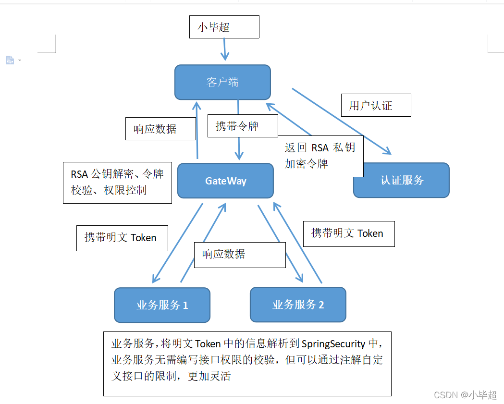
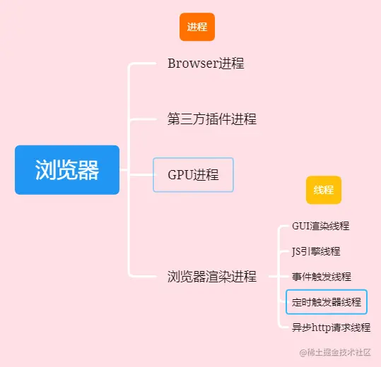

[toc]

# 跨域

## 定义

跨域不是问题，是一种安全机制。浏览器有一种策略名为*同源策略，同源策略规定了部分请求不能被浏览器所接受。*

**值得一提的是：同源策略导致的跨域是浏览器单方面拒绝响应数据，服务器端是处理完毕并做出了响应的。**

服务端到服务端不会

## 同源策略

一个url由三部分组成:**协议，域名（ip地址），端口**。

**只有当协议，域名，端口都一致的时候，才被称为同源。**

## 解决方案

1. jsonp，代表：jquery的$.ajax。（仅限JQuery项目使用）就是HTML标签中，很多带src属性的标签都可以跨域请求内容，比如我们熟悉的img图片标签。同理，script标签也可以，可以利用script标签来执行跨域的javascript代码。通过这些代码，我们就能实现前端跨域请求数据。
2. script标签解决跨域（远古web使用的方案，已不建议使用）
3. 前端：webpack代理。proxy 
4. 运维：nginx代理。
   - 前端和运维商量好协议路径代理规则，比如/api 代表域名
   - 前端配置webpack -dev -server 代理
   - 服务器利用ngnix 配置相同转发代理
5. 后端：设置响应头Http 协议CORS头。


## 跨域了浏览器会有什么操作吗

浏览器在跨域时会执行一些安全限制操作，如禁止跨域脚本访问本地资源、不允许跨域向服务器发送请求等。为了解决跨域问题，可以使用一些技术手段，如JSONP、CORS、代理服务器等。使用这些技术可以允许跨域访问，并确保安全性和稳定性。


## 如何解决跨域问题

跨域问题指的是在Web应用程序中，由于浏览器的同源策略限制，一个网站不能访问另一个域名下的资源或向另一个域名发送请求。这会导致一些功能无法实现，例如用户登录状态不能共享，购物车数据不能跨域保存等。

要解决跨域问题，可以采用以下几种方法：

1 .  JSONP：通过动态创建script标签来加载跨域脚本文件，并将返回值作为参数传递给回调函数。JSONP需要服务器端支持，并且存在安全性问题。

2 .  CORS：CORS是一种跨域资源共享的机制，通过在服务器端设置Access-Control-Allow-Origin头部信息来允许指定来源的请求访问，从而实现跨域访问。

3 .  代理：通过在自己的服务器上建立代理服务器，将客户端请求转发到目标网站，并将响应内容返回到客户端。代理需要消耗更多的服务器资源。

以上方法需要注意安全性和兼容性问题，并选择适合自己项目需求的方案。同时，要注意保护用户隐私和保密信息安全。

## Cookie跨域问题

Cookie跨域问题，指的是当一个网站在向另一个域名发送请求时，由于浏览器的同源策略，不能访问对方网站的Cookie信息。这就会导致一些无法预料的问题，例如用户登录状态不能共享，购物车数据不能跨域保存等。


# 存储

## cookie

`Cookie`，类型为「小型文本文件」，指某些网站为了辨别用户身份而储存在用户本地终端上的数据。是为了解决 `HTTP`无状态导致的问题

常用的属性如下：

- Expires 用于设置 Cookie 的过期时间

```js
Expires=Wed, 21 Oct 2015 07:28:00 GMT
```

- Max-Age 用于设置在 Cookie 失效之前需要经过的秒数（优先级比`Expires`高）

```js
Max-Age=604800
```

## localStorage

### 特征

- 持久化的本地存储-时间
- 大小：5M（跟浏览器厂商有关系）
- `localStorage`本质上是对字符串的读取，如果存储内容多的话会消耗内存空间，会导致页面变卡
- 受同源策略的限制


### sessionStorage

`sessionStorage`和 `localStorage`使用方法基本一致，唯一不同的是生命周期，一旦页面（会话）关闭，`sessionStorage` 将会删除数据

## 比对

### 选择使用cookie存储token而不是localStorage的原因主要有以下几点：

1 .  安全性：cookie可以设置HttpOnly和Secure属性，可以防止跨站脚本攻击和窃取cookie的安全问题。而localStorage没有这些属性，容易受到网络攻击。

2 .  跨域支持：cookie可以实现跨域通信，而localStorage只能在同一个域名下共享数据。

3 .  存储容量：cookie的存储容量一般为4KB左右，而localStorage的存储容量一般为5-10MB左右。如果存储的数据较小，使用cookie更加合适。

4 .  生命周期：cookie可以设置过期时间，也可以在浏览器关闭后自动删除。而localStorage没有这个功能。

综上所述，选择使用cookie还是localStorage要根据项目需求和安全性考虑。如果需要跨域支持和更大的存储容量，并且能够确保安全性，那么可以选择使用localStorage。反之，则应该选择使用cookie来存储token等敏感信息。


### 本地存储（localStorage）存在一些安全问题，主要包括以下几个方面：

1 .  XSS攻击：如果恶意用户能够注入脚本到网站中，就可能获取和篡改localStorage中的数据。

2 .  CSRF攻击：攻击者可以通过构造特定的请求来伪造用户身份，并在用户不知情的情况下将恶意数据写入localStorage中。

3 .  信息泄漏：如果localStorage中存储了敏感数据，如密码、身份证号等，那么一旦该存储被盗取或窃取，这些数据就容易被利用作恶。

为了确保localStorage的安全性，开发者可以采取多种措施，如对数据进行加密、限制访问范围、使用HTTPS等。此外，在使用localStorage时也应遵循最小化原则，只存储必要的信息，并且定期清理过期或不必要的数据。

### cookie和session在跨域请求里有什么问题

在跨域请求中，由于浏览器的同源策略限制，通常情况下cookie和session在不同域名之间无法共享。但是可以通过特定的设置来解决这个问题，比如设置Access-Control-Allow-Origin头部允许跨域请求、使用JSONP等方式。


# jwt

​	JWT（JSON Web Token）是一种用于身份验证和授权的开放标准。它由三部分组成：header、payload和signature。其中，header通常指定使用的算法，payload包含要传输的信息，而signature则用于防止内容被篡改。Header header典型的由两部分组成：token的类型（“JWT”）和算法名称（比如：HMAC SHA256或者RSA等等）。

​	通过使用JWT，可以在不需要保存服务器端会话的情况下对用户进行身份验证和授权。客户端在登录后，将用户信息以payload的形式加密后生成一个token，并将其在请求头中发送到服务器。服务器可以通过解密token并验证signature来确定用户身份和权限，在需要进行身份验证和授权的请求中使用该token。

​	JWT具有轻量级、跨平台、可扩展性等优点，适用于大多数语言和环境。然而，在使用时也需要注意安全性问题，例如防止伪造token、保证token有效期等。


# 登录问题

## 历史

​	单系统登录解决方案的核心是cookie，cookie携带会话id在浏览器与服务器之间维护会话状态。但cookie是有限制的，这个限制就是cookie的域（通常对应网站的域名），浏览器发送http请求时会自动携带与该域匹配的cookie，而不是所有cookie

​	既然这样，为什么不将web应用群中所有子系统的域名统一在一个顶级域名下，例如“*.baidu.com”，然后将它们的cookie域设置为“baidu.com”，这种做法理论上是可以的，甚至早期很多多系统登录就采用这种同域名共享cookie的方式。

​	然而，可行并不代表好，共享cookie的方式存在众多局限。首先，应用群域名得统一；其次，应用群各系统使用的技术（至少是web服务器）要相同，不然cookie的key值（tomcat为JSESSIONID）不同，无法维持会话，共享cookie的方式是无法实现跨语言技术平台登录的，比如java、php、.net系统之间；第三，cookie本身不安全。


## 单点登录SSO(Single Sign On)

​	相比于单系统登录，sso需要一个独立的认证中心，只有认证中心能接受用户的用户名密码等安全信息，其他系统不提供登录入口，只接受认证中心的间接授权。间接授权通过令牌实现，sso认证中心验证用户的用户名密码没问题，创建授权令牌，在接下来的跳转过程中，授权令牌作为参数发送给各个子系统，子系统拿到令牌，即得到了授权，可以借此创建局部会话，局部会话登录方式与单系统的登录方式相同。

java 解决方案有shiro，Spring Security，Oauth2

当下比较流行的一套解决方案就是 Spring Security + Oauth2.0 + JWT 方式。

> Spring Security是一个基于Spring框架的安全框架，主要用于保护Web应用程序。它提供了诸如身份验证、授权、密码管理等常见的安全功能。
>
> Oauth2 . 0是一个授权协议，用于为客户端应用程序提供对受保护资源的访问权限。它支持多种授权类型，例如授权码模式、密码模式和客户端模式等。
>
> Spring Security与Oauth2 . 0之间的不同在于其重点不同。Spring Security主要关注Web应用程序的安全性，而Oauth2 . 0则关注如何为客户端应用程序提供对受保护资源的访问权限。此外，Oauth2 . 0涉及到多个角色和交互过程，需要进行更复杂的配置和管理。

在前后端分离的项目中，可以使用token来处理登录问题。一般而言，流程如下：

1 .  用户输入用户名和密码进行登录；
2 .  后端服务器网关（spring gateway）接收到登录请求，发送到认证服务器Oauth2，验证用户身份，并返回一个jwt给前端；
3 .  前端将该token存储在本地（例如LocalStorage或Cookie）；
4 .  在后续的请求中，前端将该token放到请求头部，发送给后端进行验证；
5 .  后端网关，进行解密校验，并控制权限，如果有对应的权限，则发给对应服务器进行处理，则返回相应的数据给前端。



这样就可以保证用户身份的安全性，并避免了每次请求都需要重新登录的麻烦。同时也可以设置token过期时间，提高安全性。具体实现方式可能会因项目框架、技术栈等因素而有所不同。


# 浏览器进程和线程

作者：辉夜真是太可爱啦
链接：https://juejin.cn/post/7053974933931556900



## 多线程的浏览器内核

### 1. GUI渲染线程

负责渲染浏览器界面（解析 HTML ，CSS，构建 `DOM树` `CSSOM树` 和 `Render树` ，布局和绘制等）。

GUI 更新会被保存在一个队列中等到 JS 引擎空闲时立即被执行，当界面需要重绘或由于某种操作引发的重排时，该线程就会执行。

**GUI 渲染线程与 JS 引擎线程是互斥的**，这也是造成 `JS堵塞` 的原因所在。

由于 JavaScript 是可操纵 DOM 的，如果在修改这些元素属性同时渲染界面（即 JS 引擎线程和 GUI 渲染线程同时运行），那么渲染线程前后获得的元素数据就可能不一致了。

因此为了防止渲染出现不可预期的结果，浏览器设置 GUI 渲染线程与 JavaScript 引擎为互斥的关系，当 JavaScript 引擎执行时 GUI 线程会被挂起，GUI 更新会被保存在一个队列中等到引擎线程空闲时立即被执行。

### JS引擎线程

#### 3. 事件触发线程

首先这属于浏览器而不是JS引擎，主要用来控制事件循环（可以理解，JS引擎自己都忙不过来，需要浏览器另开线程协助）

当JS引擎执行代码块如setTimeOut时（也可来自浏览器内核的其他线程,如鼠标点击、AJAX异步请求等），会将对应任务添加到事件线程中。

当对应的事件符合触发条件被触发时，该线程会把是事件添加到待处理队列（宏任务）的队尾，等待JS引擎的处理。

同样地，由于 JS 是**单线程**的，所以需要等到 JS 引擎空闲了之后，才会对待处理队列进行处理。

#### 4. 定时触发器线程

传说中的 `setInterval` 与 `setTimeout` 所在线程。

因为JavaScript引擎是单线程的, 如果处于阻塞线程状态就会影响记计时的准确。

因此通过单独线程来计时并触发定时，计时完毕后，添加到事件队列（宏任务）中，等待JS引擎空闲后执行。

不禁感叹，懂得 JS 的**单线程** 原来那么有用。

需要值得注意的是，W3C 在 HTML 标准中规定，规定要求 `setTimeout` 中低于4ms的时间间隔算为4ms。

#### 5. 异步http请求线程

`XMLHttpRequest` 在连接后是通过浏览器新开的一个线程请求。

当检测到状态更新时，如果没有设置回调函数，异步线程就产生状态变更事件，将这个回调再放入事件队列（微任务）中，等待 JS 引擎执行。


# 浏览器渲染过程

具体的浏览器解析渲染机制如下所示：


- 解析HTML，生成DOM树，解析CSS，生成CSSOM树
- 将DOM树和CSSOM树结合，生成渲染树(Render Tree)
- Layout(回流):根据生成的渲染树，进行回流(Layout)，得到节点的几何信息（位置，大小）
- Painting(重绘):根据渲染树以及回流得到的几何信息，得到节点的绝对像素
- Display:将像素发送给GPU，展示在页面上

# 页面渲染时，资源加载的顺序一般是按照以下顺序：

1 .  HTML文件：首先加载HTML文件，浏览器从上到下解析HTML代码，并生成DOM树。

2 .  外部CSS文件：接着加载外部CSS文件，浏览器根据CSS代码生成样式规则并形成CSSOM树。

3 .  JavaScript文件：然后加载JavaScript文件，浏览器执行JavaScript代码并将其添加到DOM和CSSOM树中。

4 .  图片和其他媒体资源：最后加载图片和其他媒体资源，这些资源的加载不会影响DOM和CSSOM树的构建过程，但可能会影响页面的布局和渲染。

需要注意的是，以上顺序只是一般情况下的加载顺序，并不是绝对的。在实际开发中，我们还需要考虑缓存、异步加载等因素。


# web worker概念及使用场景

Web Worker是HTML5中新增的一项技术，它可以让JavaScript代码在后台线程中运行，从而避免阻塞主线程并提高应用程序的性能。

具体来说，Web Worker可以将一些耗时的计算、数据处理等任务放入独立的线程中运行，这样就能保证主线程不会被阻塞，并且能够更好地响应用户操作。同时，在Web Worker中还可以使用一些浏览器API和DOM API（如XMLHttpRequest、WebSocket等），从而实现更加灵活和强大的功能。

需要注意的是，由于Web Worker是在独立的线程中运行，所以它无法直接访问页面的DOM元素，也不能与主线程共享变量或者函数对象。因此，在使用Web Worker时需要注意数据传输和操作方法等问题，并尽可能避免出现安全漏洞或者程序错误。


Web Worker的使用场景包括但不限于以下几个方面：

1 .  大规模数据处理：当需要处理大量数据时，Web Worker可以在后台线程中并行处理数据，提高网页性能。

2 .  长时间运行的任务：当需要运行长时间的任务时，Web Worker可以在后台线程中运行，不会阻塞主线程。

3 .  实时通信：当需要实现实时通信功能时，如聊天室、多人协作编辑等应用，Web Worker可以用于与服务器进行实时通信。

4 .  图像处理：当需要对图像进行复杂处理时，Web Worker可以在后台线程中处理图像，提高网页性能。

案例包括：

1 .  Google Maps：Google Maps使用Web Worker来加速地图绘制和交互体验。

2 .  CodePen：CodePen使用Web Worker来编译和预览用户的代码。

3 .  WebGL应用程序：许多基于WebGL的应用程序使用Web Worker来并行计算和渲染图形。


## @Lucy web worker的弊端、web worker里上传文件任务完成后如何操作dom

Web Worker的弊端主要是：

1 .  无法直接访问DOM：因为Web Worker在独立的线程中运行，无法直接访问页面的DOM元素，所以无法通过Web Worker操作DOM。

2 .  线程之间通信受限：Web Worker之间的通信必须经过序列化和反序列化，而且只能传递少量数据类型，如字符串、数字、布尔值等，不能传递复杂数据类型或者函数对象。

对于第二个问题，在Web Worker里上传文件任务完成后如果需要操作DOM，可以通过postMessage方法向主线程发送消息，并在主线程中处理DOM操作。具体步骤如下：

1 .  在Web Worker中上传文件并处理完毕后，使用postMessage方法向主线程发送消息，并将需要操作DOM的数据作为参数传递过去。

2 .  在主线程中监听message事件，并接收来自Web Worker的消息。

3 .  在message事件处理函数中获取到需要操作的DOM元素，并修改其属性或内容等。

需要注意的是，在这个过程中一定要确保数据的安全性和正确性，防止出现潜在的安全漏洞或者程序错误。

# Web Worker与wasm

Web Worker是一种浏览器提供的API，它允许JavaScript代码在后台线程中运行，不影响主线程的性能。前端WASM（WebAssembly）是一种新型的低级二进制语言，可以在现代浏览器中运行，在某些情况下比JavaScript更高效。二者的区别在于Web Worker用于并行处理任务和提高网页性能，而WASM用于加速浏览器中高性能计算和游戏等应用程序的运行速度。


# 用window.open打开一个同域名的不同资源，是否能访问到其sessionStorage

至于window . open打开一个同域名的不同资源，是可以访问到其sessionStorage的。因为sessionStorage存储在浏览器端，同一域名下的不同资源共享相同的sessionStorage。但是需要注意的是，在使用window . open打开一个新页面时，默认情况下该页面位于新的浏览器进程中，所以如果要共享sessionStorage，需要保证两个页面处于同一浏览器进程中。

# 怎么让两个页面处于同一浏览器进程中

可以通过在window . open的参数中设置相同的name属性，来让两个页面处于同一浏览器进程中。具体来说，可以在window . open中添加如下参数：

```
window . open(url, name, specs, replace);
```

其中，name参数即为窗口名称，如果设置相同的名称，则新打开的页面会与之前的页面处于同一浏览器进程中。例如：

```
window . open('http://example . com', 'myWindow');
window . open('http://example . com/another-page', 'myWindow');
```

这样，在第二个页面中就可以访问到与第一个页面共享的sessionStorage了。需要注意的是，不同浏览器可能会有不同的实现方式，因此建议根据具体情况进行测试和调试。