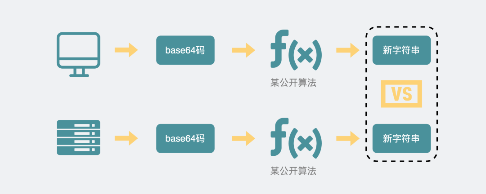

[toc]


cnt:

- 2023年3月19日08:38:28

# 概述

## 输入一个URL会发生什么？

1. 用户输入URL，会使用浏览器默认搜索引擎加上搜索内容合成url；如果是域名会加上协议（如https）合成完整的url。 

2. 然后按下回车。浏览器进程通过进程间通信把url传给网络进程。（网络进程接收到url才发起真正的网络请求）。 
3. 网络进程接收到url后，先查找有没有缓存。有缓存，直接返回缓存的资源。 没有缓存。（进入真正的网络请求）。 首先获取域名的IP，系统会首先自动从hosts文件中寻找域名对应的 IP 地址，一旦找到，和服务器建立TCP连接；如果没有找到，则系统会将网址提交 DNS 域名解析服务器进行 IP 地址的解析。 
4. 利用IP地址和服务器建立TCP连接（3次握手） 
5. 建立连接后，浏览器构建数据包（包含请求行，请求头，请求正文，并把该域名相关Cookie等数据附加到请求头），然后向服务器发送请求消息。 
6. 服务器接收到消息后根据请求信息构建响应数据（包括响应行，响应头，响应正文），然后发送回网络进程。
7. 网络进程接收到响应数据后进行解析。如果发现响应行的返回的状态码为301，302，说明服务器要我们去找别人要数据。找响应头中的Location字段要，Location的内容是需要重定向的地址url。获取到这个url一切重新来过。如果返回的状态码为200，说明服务器返回了数据。 
8. 数据传输完成，TCP四次挥手断开连接。如果，浏览器或者服务器在HTTP头部加上如下信息，TCP就一直保持连接。保持TCP连接可以省下下次需要建立连接的时间，提示资源加载速度Connection:Keep-Alive 。 
9. 网络进程将获取到的数据包进行解析，根据响应头中的Content-type来判断响应数据的类型，如果是字节流类型，就将该请求交给下载管理器，该导航流程结束，不再进行；如果是text/html类型，就通知浏览器进程获取到文档准备渲染。 浏览器进程获取到通知之后。新建一个渲染进程。 渲染进程对文档进行页面解析和子资源加载。解析html生成DOM树，解析css生成规则树。 两个树结合生成渲染树（render tree），浏览器会根据渲染树布局，计算css样式，即每个元素在页面中的位置好和大小等信息。最后浏览器绘制各个节点，将页面展现给用户。

# 浏览器&面试题相关

1. https如何保证传输安全？（百度二面，快手一面）
2. http请求方式、响应码、get和post区别（百度一面、云网络一面）
3. cookie、session的比较（云网络二面）
4. 浏览器导航过程、重定向过程、输入url到页面显示发生的过程（携程一面、云网络一面、小米一面）
5. cookie、LocalStorage、SessionStorage的比较（美团二面、网易一面、小米一面）
6. 浏览器缓存策略和资源更新问题（网易一面、二面、携程一面、二面）
7. 对重排和重绘的理解，怎么优化（携程一面）
8. 跨域问题，什么是同源策略，怎么跨域，预检请求（网易一面、百度一面、钉钉一面、美团一面）
9. websocket与http的区别（百度二面）

## TCP&UDP

UDP和TCP是两种不同的传输协议，它们有以下区别：

1 .  连接方式：TCP建立连接后进行数据传输，而UDP不需要建立连接即可发送数据。

2 .  可靠性：TCP保证数据传输的可靠性，通过确认机制、重传机制、流量控制等保证数据的完整性和正确性；而UDP没有这些机制，可能会因为网络原因导致数据丢失或乱序。

3 .  传输效率：UDP的传输效率比TCP高，因为它不需要建立连接和保证可靠性。

使用场景方面：
1 .  TCP适合要求数据准确无误的场景，如文件传输、HTTP请求等。
2 .  UDP适合对实时性要求较高且可以容忍一定程度的数据丢失或乱序的场景，如音视频通信、游戏等。

优劣方面：
1 .  TCP优点是可靠性强，缺点是效率低。
2 .  UDP优点是效率高，缺点是可靠性差。

让UDP可靠：
1 .  应用层协议设计：可以在应用层上设计一些确认机制、重传机制、流量控制等来提高UDP的可靠性。
2 .  FEC前向纠错技术：使用冗余编码技术增加冗余信息以提高数据包错误检测和修复能力。
3 .  延迟ACK策略：接收方延迟发送ACK报文以提高网络利用率和降低网络负载。

> QUIC
>
> QUIC（Quick UDP Internet Connection）是一种基于UDP协议的新型网络传输协议，由Google公司开发。QUIC旨在解决TCP连接的延迟和拥塞控制问题，并提高网络安全性。
>
> 优点：
> 1 .  快速连接：QUIC使用0-RTT快速连接方式，减少了建立连接时的延迟。
> 2 .  多路复用：QUIC支持多路复用技术，可以同时传输多个数据流。
> 3 .  数据包可靠性：QUIC内置了数据包可靠性机制，可以自行进行控制和重传。
> 4 .  安全性：QUIC内置了TLS加密机制，保障了通信的安全性。
>
> 缺点：
> 1 .  兼容性问题：由于QUIC是较新的协议，与使用TCP协议的设备兼容性差。
> 2 .  资源占用问题：由于内置了加密和重传机制，对服务器资源消耗较大。
> 3 .  网络管理问题：尚无成熟的监管规则和管理手段来管理QUIC流量。

## 请求的并发问题

请求的并发问题是指在网络通信中，同时发送多个请求时会出现的问题。这会导致服务器性能下降，响应时间变长，甚至会出现崩溃等情况。

为了解决请求的并发问题，可以采取以下措施：
1 .  合理设置服务器并发连接数限制，限制同时处理的请求数量。
2 .  使用CDN技术加速静态资源的下载和传输。
3 .  将大文件拆分成多个小文件，采用分片上传和下载技术实现并行处理。
4 .  对于长时间运行的任务，采用异步处理方式避免阻塞。
5 .  通过负载均衡技术将请求分散到多台服务器上进行处理，提高整体性能和可靠性。
6 .  对于移动端用户，可以使用离线缓存技术降低对服务器的请求压力。


nginx 


## XSS

 Cross Site Script，中译是跨站脚本攻击。

> 其原本缩写是 CSS，但为了和层叠样式表(Cascading Style Sheet)有所区分，因而在安全领域叫做 XSS。

XSS 攻击是指攻击者在网站上注入恶意的客户端代码，通过恶意脚本对客户端网页进行篡改，从而在用户浏览网页时，对用户浏览器进行控制或者获取用户隐私数据的一种攻击方式。

攻击者对客户端网页注入的恶意脚本一般包括 JavaScript，有时也会包含 HTML 和 Flash。有很多种方式进行 XSS 攻击，但它们的共同点为：将一些隐私数据像 cookie、session 发送给攻击者，将受害者重定向到一个由攻击者控制的网站，在受害者的机器上进行一些恶意操作。

XSS攻击可以分为3类：[存储型](#存储型)（持久型）、[反射型](#反射型)（非持久型）、[基于DOM](#基于DOM)。


作者：清风晴雨
链接：https://juejin.cn/post/6945277278347591688

## CSRF

CSRF英文全称是Cross-site request forgery，所以又称为“跨站请求伪造”，是指黑客引诱用户打开黑客的网站,在黑客的网站中，利用用户的登录状态发起的跨站请求。简单来讲，**CSRF攻击就是黑客利用了用户的登录状态，并通过第三方的站点来做一些坏事。**

方式

自动发起get请求，如图片src

自动post请求，隐藏表单，且自动提交

诱惑用户点击链接


## TODO


## 浏览器缓存（介绍了强缓存和协商缓存，提到了）

## 了解协商缓存吗，强缓存和协商缓存的区别，缓存存在本地什么地方 内存、硬盘...我说不清楚

强缓存是通过Expires和Cache-Control两种响应头来实现的。当浏览器发起请求时，如果在本地能够获取到强制缓存，则会直接使用，不会向服务器发送请求。

协商缓存则是通过Last-Modified和ETag两种响应头来实现的。当浏览器发起请求时，会向服务器发送一个If-Modified-Since或者If-None-Match字段的请求头，询问是否有新的资源可以获取。如果服务器返回304状态码，则表示本地已经有最新版本的资源。

缓存存在本地的位置包括内存中的缓存（Memory Cache）和硬盘中的缓存（Disk Cache）。内存中的缓存速度更快但容量较小，适合保存一些频繁使用且较小的资源；硬盘中的缓存容量较大但速度较慢，适合保存一些不常用且较大的资源。

## last-modified的缺点

1 .  时间精度问题：服务器上文件修改时间只能精确到秒，如果同一秒内多个文件被修改，就无法区分它们的修改顺序。

2 .  时钟不同步问题：如果服务器和客户端的时钟不同步，就会导致Last-Modified值不准确。

3 .  文件内容变化但是修改时间未变化：如果文件内容发生变化但是修改时间没有更新，那么浏览器可能会错误地认为本地缓存仍然有效。

4 .  时间戳粒度过大：对于一些频繁被访问的资源，在两次请求之间可能只发生了小幅度的修改，但是由于时间戳粒度太大，仍然会被判定为已经过期，从而导致缓存失效。


## Etag的缺点是什么有了解吗

Etag的缺点主要有以下几个：

1 .  资源变化未必会导致Etag值的变化。如果资源被修改了但是Etag值并没有更新，那么浏览器就无法获取到最新的内容，造成缓存不一致。

2 .  Etag值需要服务器计算和存储。这会增加服务器的负担，并且对于分布式服务器来说，Etag值的计算和比较也会带来额外的网络开销。

3 .  Etag值可能会因为负载均衡等原因而发生变化。如果一个资源部署在多台服务器上，并且每台服务器都生成自己的Etag值，那么客户端在请求时就可能得到不同的Etag值，从而导致缓存失效。

4 .  一些代理服务器可能会屏蔽或修改Etag头信息，从而导致缓存失效或者出现其他问题。


# HTTP


## HTTP 基本概念

### 是什么

超文本传输协议，也就是**H**yperText **T**ransfer **P**rotocol。

**HTTP 是一个在计算机世界里专门在「两点」之间「传输」文字、图片、音频、视频等「超文本」数据的「约定和规范」。**

### 状态码


- 1 表示消息
- 2 表示成功
- 3 表示重定向
- 4 表示请求错误
- 5 表示服务器错误


- 200（成功）：请求已成功，请求所希望的响应头或数据体将随此响应返回
- 301（永久移动）：请求的网页已永久移动到新位置。 服务器返回此响应（对 GET 或 HEAD 请求的响应）时，会自动将请求者转到新位置
- 304 **Not Modified** 说明无需再次传输请求的内容，也就是说可以使用缓存的内容
- 400（错误请求）： 服务器不理解请求的语法
- 401（未授权）： 请求要求身份验证。 对于需要登录的网页，服务器可能返回此响应。
- 403（禁止）： 服务器拒绝请求
- 404（未找到）： 服务器找不到请求的网页

### 常见字段

Host域名

服务器在返回数据时，会有 `Content-Length` 字段，表明本次回应的数据长度。

`Connection` 字段最常用于客户端要求服务器使用「HTTP 长连接」机制，以便其他请求复用。HTTP/1.1 版本的默认连接都是长连接，但为了兼容老版本的 HTTP，需要指定 `Connection` 首部字段的值为 `Keep-Alive`

`Content-Type` 字段用于服务器回应时，告诉客户端，本次数据是什么格式。客户端请求的时候，可以使用 

`Accept` 字段声明自己可以接受哪些数据格式。

`Content-Encoding` 字段说明数据的压缩方法。表示服务器返回的数据使用了什么压缩格式。客户端在请求时，用 `Accept-Encoding` 字段说明自己可以接受哪些压缩方法。


### Q:Content-Type

格式：Content-Type：type/subtype ;parameter

了解：

常见的Content-Type有数百个，下面例举了一些

- HTML文档标记：text/html;
- 普通ASCII文档标记：text/html;
- JPEG图片标记：image/jpeg;
- GIF图片标记：image/gif;
- js文档标记：application/javascript;
- xml文件标记：application/xml;

掌握：

- 如果是一个restful接口（json格式），一般将Content-Type设置为application/json; charset=UTF-8；

- 如果是文件上传，一般Content-Type设置为multipart/form-data

- 如果普通表单提交，一般Content-Type设置为application/x-www-form-urlencoded

- application/xml 和 text/xml

与application/json类似，这里用的是xml格式的数据，text/xml的话，将忽略xml数据里的编码格式


## Get 与 Post

### 区别

- 语义
- 安全
- 幂等

根据 RFC 规范，**GET 的语义是从服务器获取指定的资源**，这个资源可以是静态的文本、页面、图片视频等。GET 请求的参数位置一般是写在 URL 中，URL 规定只能支持 ASCII，所以 GET 请求的参数只允许 ASCII 字符 ，而且浏览器会对 URL 的长度有限制（HTTP协议本身对 URL长度并没有做任何规定）。


根据 RFC 规范，**POST 的语义是根据请求负荷（报文body）对指定的资源做出处理**，具体的处理方式视资源类型而不同。POST 请求携带数据的位置一般是写在报文 body 中，body 中的数据可以是任意格式的数据，只要客户端与服务端协商好即可，而且浏览器不会对 body 大小做限制。

### POST请求会返回几次？

两次，一次先发送header，返回100 continue，再发送body，返回200 OK。

### GET 和 POST 方法都是安全和幂等的吗？

- 在 HTTP 协议里，所谓的「安全」是指请求方法不会「破坏」服务器上的资源。
- 所谓的「幂等」，意思是多次执行相同的操作，结果都是「相同」的。

看实现

### get请求有什么限制（url长度）、url最大限制是多少个字符

HTTP协议中，GET和POST是两种常见的请求方式，它们的应用场景和限制有所不同。

GET请求主要用于获取资源，例如读取网页、图片等数据。它通常会将请求参数放在URL中，并且不会对服务器端的资源产生任何修改。因此，GET请求比较适合于一些简单的数据查询或者浏览操作。

对于GET请求，由于请求参数放在URL中，URL长度存在一定限制。常见的浏览器对URL长度限制为2048个字符左右，而具体实现还与浏览器、服务器等相关。如果参数过多或者超出了限制，则可能导致无法正常访问相应的页面或者资源。

需要注意的是，并非所有情况下都应该使用GET或者POST请求。例如涉及到敏感信息传输时，建议使用HTTPS协议进行加密；涉及到复杂数据处理时，则可能需要使用PUT、DELETE等其他类型的HTTP方法进行处理。

## HTTP 缓存技术

### 实现方式

对于一些具有重复性的 HTTP 请求，比如每次请求得到的数据都一样的，我们可以把这对「请求-响应」的数据都**缓存在本地**，那么下次就直接读取本地的数据，不必在通过网络获取服务器的响应了，这样的话 HTTP/1.1 的性能肯定肉眼可见的提升。

所以，避免发送 HTTP 请求的方法就是通过**缓存技术**，HTTP 设计者早在之前就考虑到了这点，因此 HTTP 协议的头部有不少是针对缓存的字段。

HTTP 缓存有两种实现方式，分别是**强制缓存和协商缓存**。

### 强制缓存

只要浏览器判断缓存没有过期，则直接使用浏览器的本地缓存，决定是否使用缓存的主动性在于浏览器这边。

强缓存是利用下面这两个 HTTP 响应头部（Response Header）字段实现的，它们都用来表示资源在客户端缓存的有效期：

- `Cache-Control`， 是一个相对时间；优先级高
- `Expires`，是一个绝对时间；

流程

- 浏览器第一次请求时，服务器同时在头部加上cache-control
- 再次访问时，先通过请求资源的时间和cache-control中设置的过期时间大小来计算有无过期，未过期用缓存，否则服务器。
- 服务器再次收到请求后，再次更新rep头部的cache-control

### 协商缓存

**协商缓存就是与服务端协商之后，通过协商结果来判断是否使用本地缓存**。

协商缓存可以基于两种头部来实现。

请求头部中的 `If-Modified-Since` 字段与响应头部中的 `Last-Modified` 字段实现，这两个字段的意思是：

- 响应头部中的 `Last-Modified`：资源的最后修改时间；
- 请求头部中的 `If-Modified-Since`：当资源过期了，发现响应头中具有 Last-Modified 声明，则再次发起请求的时候带上 Last-Modified 的时间，服务器收到请求后发现有 If-Modified-Since 则与被请求资源的最后修改时间进行对比（Last-Modified），如果最后修改时间较新（大），说明资源又被改过，则返回最新资源，HTTP 200 OK；如果最后修改时间较旧（小），说明资源无新修改，响应 HTTP 304 走缓存。

第二种：请求头部中的 `If-None-Match` 字段与响应头部中的 `ETag` 字段，这两个字段的意思是：

- 响应头部中 `Etag`：唯一标识响应资源；
- 请求头部中的 `If-None-Match`：当资源过期时，浏览器发现响应头里有 Etag，则再次向服务器发起请求时，会将请求头 If-None-Match 值设置为 Etag 的值。服务器收到请求后进行比对，如果资源没有变化返回 304，如果资源变化了返回 200。

第一种实现方式是基于时间实现的，第二种实现方式是基于一个唯一标识实现的，相对来说后者可以更加准确地判断文件内容是否被修改，避免由于时间篡改导致的不可靠问题。


## HTTP/1.1

优点

- 简单。格式就是 `header + body`，头部信息也是 `key-value`
- 灵活和易于扩展。各类请求方法、URI/URL、状态码、头字段等每个组成要求都允许**自定义和扩充**。
- 应用广泛和跨平台

缺点

- 无状态。身份信息需要验证。解决方案cookie
- 明文传输
- 不安全
  - 明文传输，窃听
  - 不验证通信方的身份，伪装。
  - 不验证报文完整性，篡改


性能

- 长连接，减少建立断开TCP的额外开销。长时间无交互断开
- 管道，客户端发起多个请求。但是服务器必须按序回应，没有解决响应的队头阻塞。

## HTTPS 与 HTTP

HTTPS通过SSL/TLS协议来保证传输安全。具体来说，它采用了如下几种方式：

1 .  数据加密：通信双方使用公钥和私钥进行数据加密，确保传输过程中的数据不被窃取或篡改。

2 .  身份认证：客户端可以通过验证服务器的数字证书来确保与合法的服务器通信。如果证书不合法，则会出现警告提示。

3 .  完整性校验：在传输过程中，使用消息摘要算法对数据进行计算并生成摘要值，接收方在接收到数据后同样进行计算，并比对计算结果以确保数据完整性。


在 TCP 和 HTTP 网络层之间加入了 SSL/TLS 安全协议，使得报文能够加密传输。HTTPS 默认端口号是 443。HTTPS 协议需要向 CA（证书权威机构）申请数字证书，来保证服务器的身份是可信的。

- **混合加密**的方式实现信息的**机密性**，解决了窃听的风险。
- **摘要算法**的方式来实现**完整性**，它能够为数据生成独一无二的「指纹」，指纹用于校验数据的完整性，解决了篡改的风险。
- 将服务器公钥放入到**数字证书**中，解决了冒充的风险。


SSL/TLS 协议基本流程：

- 客户端向服务器索要并验证服务器的公钥。
- 双方协商生产「会话秘钥」。
- 双方采用「会话秘钥」进行加密通信。

### 对称加密与非对称加密，在非对称加密的时候客户端如何解密服务端传过来的公钥

对称加密和非对称加密都是常用的加密方式。对称加密使用同一个秘钥进行加解密，而非对称加密则使用一对公钥和私钥分别进行加解密。

在非对称加密中，服务端会生成一对公钥和私钥，将公钥传输给客户端。客户端在发送数据给服务端时，使用服务端提供的公钥进行加密，在传输过程中即使被窃取也无法破解。当服务端接收到数据后，使用自己的私钥进行解密。因为只有服务端拥有私钥，所以这种方式能够确保数据的安全性。

客户端如何解密服务端传过来的公钥？实际上在非对称加密中，客户端只需要获取到服务端的公钥就可以了，并不需要解密。客户端拿到公钥后，直接使用该公钥对需要发送给服务端的数据进行加密即可。


## HTTP/2

### 头部压缩

 **HPACK** 算法，HPACK 算法主要包含三个组成部分：

- 静态字典；
- 动态字典；
- Huffman 编码（压缩算法）；

客户端和服务器两端都会建立和维护「**字典**」，用长度较小的索引号表示重复的字符串，再用 Huffman 编码压缩数据，**可达到 50%~90% 的高压缩率**。

### 二进制帧

### 并发传输

多个 Stream 复用一条 TCP 连接，达到并发的效果

### 服务器主动推送资源

服务器推送资源时，会先发送 PUSH_PROMISE 帧，告诉客户端接下来在哪个 Stream 发送资源，然后用偶数号 Stream 发送资源给客户端。

## HTTP3

HTTP/3 就将传输层从 TCP 替换成了 UDP，并在 UDP 协议上开发了 QUIC 协议，来保证数据的可靠传输。

QUIC 协议的特点：

- **无队头阻塞**，QUIC 连接上的多个 Stream 之间并没有依赖，都是独立的，也不会有底层协议限制，某个流发生丢包了，只会影响该流，其他流不受影响；
- **建立连接速度快**，因为 QUIC 内部包含 TLS 1.3，因此仅需 1 个 RTT 就可以「同时」完成建立连接与 TLS 密钥协商，甚至在第二次连接的时候，应用数据包可以和 QUIC 握手信息（连接信息 + TLS 信息）一起发送，达到 0-RTT 的效果。
- **连接迁移**，QUIC 协议没有用四元组的方式来“绑定”连接，而是通过「连接 ID 」来标记通信的两个端点，客户端和服务器可以各自选择一组 ID 来标记自己，因此即使移动设备的网络变化后，导致 IP 地址变化了，只要仍保有上下文信息（比如连接 ID、TLS 密钥等），就可以“无缝”地复用原连接，消除重连的成本


## webSocket

### 服务器主动发消息给客户端的场景，是怎么做到的？

#### 短轮询

缺点

- 消耗带宽
- 可能延迟

#### 长轮询

HTTP 请求**将超时设置的很大**，比如 30 秒，**在这 30 秒内只要服务器收到了扫码请求，就立马返回给客户端网页。如果超时，那就立马发起下一次请求。**

像这种发起一个请求，在较长时间内等待服务器响应的机制，就是所谓的**长训轮机制**。

#### 应用层协议websocket

TCP是全双工的，但是HTTP/1.1是半双工的。webSocket基于TCP的新协议

> **单工数据传输**只支持数据在一个方向上传输；在同一时间只有一方能接受或发送信息，不能实现双向通信，举例：电视，广播。
>
> **半双工数据传输**允许数据在两个方向上传输,但是,在某一时刻,只允许数据在一个方向上传输,它实际上是一种切换方向的单工通信；在同一时间只可以有一方接受或发送信息，可以实现双向通信。举例：对讲机。
>
> **全双工数据通信**允许数据同时在两个方向上传输,因此,全双工通信是两个单工通信方式的结合,它要求发送设备和接收设备都有独立的接收和发送能力；在同一时间可以同时接受和发送信息，实现双向通信，举例：电话通信。

### 如何建立？

简而言之：**经历了三次TCP握手之后，利用 HTTP 协议升级为 WebSocket 协议**。

浏览器在 **TCP 三次握手**建立连接之后，都**统一使用 HTTP 协议**先进行一次通信。

- 如果此时是**普通的 HTTP 请求**，那后续双方就还是老样子继续用普通 HTTP 协议进行交互，这点没啥疑问。
- 如果这时候是**想建立 WebSocket 连接**，就会在 HTTP 请求里带上一些**特殊的header 头**，如下：

```http
Connection: Upgrade
Upgrade: WebSocket
Sec-WebSocket-Key: T2a6wZlAwhgQNqruZ2YUyg==\r\n
```

这些 header 头的意思是，浏览器想**升级协议（Connection: Upgrade）**，并且**想升级成 WebSocket 协议（Upgrade: WebSocket）**。同时带上一段**随机生成的 base64 码（Sec-WebSocket-Key）**，发给服务器。

如果服务器正好支持升级成 WebSocket 协议。就会走 WebSocket 握手流程，同时根据客户端生成的 base64 码，用某个**公开的**算法变成另一段字符串，放在 HTTP 响应的 `Sec-WebSocket-Accept` 头里，同时带上`101状态码`，发回给浏览器。HTTP 的响应如下：

```http
HTTP/1.1 101 Switching Protocols\r\n
Sec-WebSocket-Accept: iBJKv/ALIW2DobfoA4dmr3JHBCY=\r\n
Upgrade: WebSocket\r\n
Connection: Upgrade\r\n
```

HTTP 状态码=200（正常响应）的情况，大家见得多了。101 确实不常见，它其实是指**协议切换**。


之后，浏览器也用同样的**公开算法**将`base64码`转成另一段字符串，如果这段字符串跟服务器传回来的**字符串一致**，那验证通过。



就这样经历了一来一回两次 HTTP 握手，WebSocket就建立完成了，后续双方就可以使用 webscoket 的数据格式进行通信了。

### 断线重连机制

WebSocket在连接中断后可以自动尝试重连，具体实现方式可以通过以下几种方式：

1 .  客户端定时检测：客户端可以定时检测连接状态，如果发现连接中断，则尝试重新连接服务器。

2 .  服务器推送：如果服务器支持推送功能，客户端可以在接收到服务器推送的消息时尝试重新建立连接。

3 .  断线重连机制：WebSocket协议本身就支持断线重连机制，在连接中断后会自动尝试重连。客户端和服务器之间可以进行一些配置来调整这个机制的行为。

# TCP

**面向连接的、可靠的、基于字节流**

TCP 四元组可以唯一的确定一个连接，四元组包括如下：

- 源地址
- 源端口
- 目的地址
- 目的端口


## 三次握手

三次握手能

- 防止历史连接的建立，能减少双方不必要的资源开销（如果客户端发送的 `SYN` 报文在网络中阻塞了，重复发送多次 `SYN` 报文，那么服务端在收到请求后就会建立多个冗余的无效链接，造成不必要的资源浪费。这时候，客户端第三次发个RST连接终止）
- 能帮助双方同步初始化序列号。序列号能够保证数据包不重复、不丢弃和按序传输。两边都要确认对方正确接受了序列号，这样一来一回，才能确保双方的初始序列号能被可靠的同步。


## 四次挥手

原因

- 关闭连接时，客户端向服务端发送 `FIN` 时，仅仅表示客户端不再发送数据了但是还能接收数据。
- 服务端收到客户端的 `FIN` 报文时，先回一个 `ACK` 应答报文，而服务端可能还有数据需要处理和发送，等服务端不再发送数据时，才发送 `FIN` 报文给客户端来表示同意现在关闭连接。


### 为什么需要time_wait状态

主动发起关闭连接的一方，才会有 `TIME-WAIT` 状态。

需要 TIME-WAIT 状态，主要是两个原因：

- 防止历史连接中的数据，被后面相同四元组的连接错误的接收；
- 保证「被动关闭连接」的一方，能被正确的关闭；TIME-WAIT 作用是等待足够的时间以确保最后的 ACK 能让被动关闭方接收，从而帮助其正常关闭。万一确认的包丢了，你得正确告诉人家关闭


### 为什么time_wait等待的时间是 2MSL

`MSL` 是 Maximum Segment Lifetime，**报文最大生存时间**，它是任何报文在网络上存在的最长时间，超过这个时间报文将被丢弃。因为 TCP 报文基于是 IP 协议的，而 IP 头中有一个 `TTL` 字段，是 IP 数据报可以经过的最大路由数，每经过一个处理他的路由器此值就减 1，当此值为 0 则数据报将被丢弃，同时发送 ICMP 报文通知源主机。

MSL 与 TTL 的区别： MSL 的单位是时间，而 TTL 是经过路由跳数。所以 **MSL 应该要大于等于 TTL 消耗为 0 的时间**，以确保报文已被自然消亡。

**TTL 的值一般是 64，Linux 将 MSL 设置为 30 秒，意味着 Linux 认为数据报文经过 64 个路由器的时间不会超过 30 秒，如果超过了，就认为报文已经消失在网络中了**。

TIME_WAIT 等待 2 倍的 MSL，比较合理的解释是： 网络中可能存在来自发送方的数据包，当这些发送方的数据包被接收方处理后又会向对方发送响应，所以**一来一回需要等待 2 倍的时间**。


### TIME_WAIT 过多有什么危害？

过多的 TIME-WAIT 状态主要的危害有两种：

- 第一是占用系统资源，比如文件描述符、内存资源、CPU 资源、线程资源等；
- 第二是占用端口资源，端口资源也是有限的，一般可以开启的端口为 `32768～61000`，也可以通过 `net.ipv4.ip_local_port_range`参数指定范围。

### SYN泛洪攻击

TCP 连接建立是需要三次握手，假设攻击者短时间伪造不同 IP 地址的 `SYN` 报文，服务端每接收到一个 `SYN` 报文，就进入`SYN_RCVD` 状态，但服务端发送出去的 `ACK + SYN` 报文，无法得到未知 IP 主机的 `ACK` 应答，久而久之就会**占满服务端的半连接队列**，使得服务端不能为正常用户服务。


- 调大 netdev_max_backlog；
- 增大 TCP 半连接队列；
- 开启 tcp_syncookies；
- 减少 SYN+ACK 重传次数
- 

## 流量控制与可靠传输机制

流量控制的基本方法是接收方控制发送方发送数据的速率，停等协议和滑动窗口协议

### 停等

​	每发一帧都要收到应答后才能发

### 滑动窗口协议

​	发送方维护一组连续的允许发送的帧的序号，称为发送窗口；接收方也维护一组，接收窗口。

​	接收方只有收到的数据帧落入窗口内才允许收下，否则丢弃；发送方每收到一个确认帧，发送窗口就向前滑动一个帧的位置，没有可发送（窗口内全是已发送但未收到确认的帧）发送方就会停止发送。


### 可靠传输机制

​	使用确认和超时重传机制。自动重传请求ARQ通过接收方请求发送方重传出错的数据帧来恢复出错的帧。有停等协议，后退N帧ARQ，选择重传ARQ，后两种是滑动窗口技术和请求重发技术的结合。


#### 多帧滑动窗口与后退N帧GBN

​	发送方连续发送；接收方检测出失序的信息帧后，要求发送方重发最后一个正确接收的信息帧之后所有未被确认的帧。

#### 多帧滑动窗口与选择重传协议

​	加大接收窗口，只重传出现差错的数据帧或超时的数据帧。

​	一般大小相等。


### TCP流量控制

​	消除发送方太快使接收方缓冲区溢出的可能性，是一个速度匹配服务。TCP提供基于滑动窗口协议的流量控制协议，接收方维护接收窗口rwnd代表允许连续接收的最大能力，发送方维护一个拥塞窗口cwnd。


​	重传机制的其中一个方式，就是在发送数据时，设定一个定时器，当超过指定的时间后，没有收到对方的 `ACK` 确认应答报文，就会重发该数据，也就是我们常说的**超时重传**。

- 数据包丢失
- 确认应答丢失

`RTT` 指的是**数据发送时刻到接收到确认的时刻的差值**，也就是包的往返时间。

`RTO` Retransmission Timeout 超时重传时间。


## 拥塞控制

​	拥塞控制是让网络能够接受现有的网络符合，是一个全局性的过程；流量控制往往指点对点通信量的控制。

​	拥塞控制的四种算法：慢开始算法，拥塞避免算法，快重传和快恢复。

​	慢开始算法，慢指的是cwnd=1，然后加倍加倍，直到慢开始门限ssthresh，然后改用拥塞避免算法。具体是每过一个RTT就把拥塞窗口增大1，使得线性增长。当出现拥塞时，慢开始门限设为原来的一半，拥塞窗口cwnd重新设为1。

​	改进：快重传在收到三个重复的ACK报文时，直接重传对方未收到的报文段，而不必等待重传计时器超时。当收到三个冗余ACK时，执行乘性减小算法，把慢开始门限ssthresh设置为发送方cwnd的一半，这是为了预防网络发生阻塞，不一样的地方是，它把cwnd设置为慢开始门限改变后的数值，然后开始拥塞避免算法，因此被称为快恢复。 跳过了拥塞窗口从1开始的慢开始过程，所以被称为快恢复


# TODOIP

## 功能

## 路由算法

## IPV4

## IPV6

## 路由协议

## IP组播
