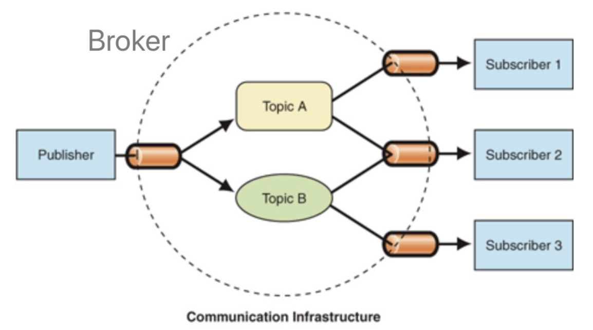

# 设计模式概述

https://juejin.cn/post/7205401322111500344#heading-12

作者：九思
链接：https://juejin.cn/post/6844904032826294286

[toc]

# 概述

​	解决软件危机，设计模式并不直接用来完成代码的编写，而是描述在各种不同情况下，要怎么解决问题的一种方案


# 单例模式

​	保证一个类仅有一个实例，并提供一个访问它的全局访问点。实现的方法为先判断实例存在与否，如果存在则直接返回，如果不存在就创建了再返回，这就确保了一个类只有一个实例对象

​	实现一，提供一个全局访问点

```js
 class LoginForm {
    constructor() {
        this.state = 'hide'
    }
    show() {
        this.state = 'show'
        console.log('登录框显示成功')
    }
    hide() {
        this.state = 'hide'
        console.log('登录框隐藏成功')
    }
 }
 LoginForm.getInstance = (function () {
     let instance
     return function () {
        if (!instance) {
            instance = new LoginForm()
        }
        return instance
     }
 })()

let obj1 = LoginForm.getInstance()
obj1.show()

let obj2 = LoginForm.getInstance()
obj2.hide()

console.log(obj1 === obj2)

```

​	实现二，封装axios，先封装一个请求的实例，然后暴露出去，各个地方都用这一个实例

```ts
utils/request.ts

// 定义一个类
class HttpRequest {
  instance: AxiosInstance;
  constructor(options: CreateAxiosOptions) {
    this.instance = axios.create(options)
  }

  setHeader() {...}
  get() {...}
  post() {...}
  put() {...}
  delete() {...}
}
// 生成一个实例
const request = new HttpRequest({})

// 全局仅用这么一个请求实例
export default request

//别的文件使用
import request '@/utils/request'
const fetchData = (url) => {
  return request.get(url)
}
```


# 策略模式

通俗点说就是：**根据不同的策略去做不同的事情**

比如我需要根据不同的年龄去做不同的处理

```ts
const doSomething = (age: number) => {
  if (age === 20) {
    // do something
  }
  if (age === 30) {
    // do something
  }
  if (age === 40) {
    // do something
  }
}
复制代码
```

但其实这样做有很多坏处：

- **可读性一般**（实际代码比这更复杂）
- **可维护性差**，如果以后多一种age判断，又要修改这个`doSomething`函数，规范的话是不建议去过多修改函数本身的
- **可拓展性差**，多一种age判断只能修改原函数体

所以我们可以这么做

```ts
// map存储，好拓展
const doMap: Record<number, Function> = {
  20: () => { // do something },
  30: () => { // do something },
  40: () => { // do something },
}

const doSomething = (age: number) => {
  doMap[age]?.()
}
```


# 观察者

观察者模式定义了对象间的一种一对多的依赖关系，当一个对象的状态发生改变时，所有依赖于它的对象都将得到通知，并自动更新。

​	被观察者将观察者加入数组，每当被观察者想发送消息时，就遍历一下自己的观察者发消息


```js
class Subject {
	constructor() {
		this.count = 0;
		this.observers = [];
	}
	setCount(count) {
		// 设置值之后通知更新
		this.count = count;
		this.notify();
	}
	notify() {
		this.observers.forEach((o) => {
			o.update();
		});
	}
}

class Observer {
	constructor(name, sub) {
		this.name = name;
		this.subject = sub;
		this.subject.observers.push(this);
	}
	update() {
		console.log(`${this.name} 观察到 ${this.subject.count}`);
	}
}

const sub = new Subject();
// 观察一号
const observer1 = new Observer('一号', sub);
// 观察二号
const observer2 = new Observer('二号', sub);

sub.setCount(1);
//一号 观察到 1
//二号 观察到 1

```


# 发布订阅

发布-订阅是一种消息范式，消息的发送者（称为发布者）不会将消息直接发送给特定的接收者（称为订阅者）。而是将发布的消息分为不同的类别，无需了解哪些订阅者（如果有的话）可能存在

同样的，订阅者可以表达对一个或多个类别的兴趣，只接收感兴趣的消息，无需了解哪些发布者存在

上述代码，发布者和订阅者需要通过发布订阅中心进行关联，发布者的发布动作和订阅者的订阅动作相互独立，无需关注对方，消息派发由发布订阅中心负责



## 实现

​	思路，主要维护一个map关系，事件名称及对应的回调函数数组，每当对某个事件发送一个消息，将这个数据传送给所有的回调函数

代码如下：

```js
// 创建一个发布订阅模式的对象
const pubsub = {
	// 存储所有订阅者的回调函数
	subscribers: {},
	// 发布消息
	publish(eventName, data) {
		// 获取该事件的所有订阅者
		const subscribers = this.subscribers[eventName];
		if (subscribers) {
			// 遍历所有订阅者并执行其回调函数
			subscribers.forEach((callback) => callback(data));
		}
	},
	// 订阅消息
	subscribe(eventName, callback) {
		// 如果该事件还没有任何订阅者，先创建一个空数组
		if (!this.subscribers[eventName]) {
			this.subscribers[eventName] = [];
		}
		// 把回调函数添加到该事件的订阅者列表中去
		this.subscribers[eventName].push(callback);
	},
};

// 示例代码：
// 定义一个处理消息的回调函数
function handleMessage(data) {
	console.log(`订阅者1回调函数收到了一条消息:${data}`);
}
function handleMessage2(data) {
	console.log(`订阅者2回调函数收到了一条消息:${data}`);
}
// 订阅 "message" 事件，并传入处理消息的回调函数
pubsub.subscribe('message', handleMessage);
pubsub.subscribe('message', handleMessage2);

// 发布一条 "message" 消息，并传入数据 "Hello, world!"
pubsub.publish('message', 'Hello, world!');
```


从表面上看：

- 观察者模式里，只有两个角色 —— **观察者** + **被观察者**
- 而发布订阅模式里，却不仅仅只有发布者和订阅者两个角色，还有一个经常被我们忽略的 —— {经纪人|Broker}

往更深层次讲：

- 观察者和被观察者，是`松耦合`的关系
- 发布者和订阅者，则完全不存在耦合

从使用层面上讲：

- 观察者模式，多用于**单个应用内部**
- 发布订阅模式，则更多的是一种{跨应用的模式|cross-application pattern} ，比如我们常用的消息中间件


# 代理模式

## 是什么

代理模式（Proxy Pattern）是为一个对象提供一个代用品或占位符，以便控制对它的访问

代理模式的关键是，当客户不方便直接访问一个对象或者不满足需要时，提供一个替身对象来控制这个对象的访问，客户实际上访问的是替身对象


在生活中，代理模式的场景是十分常见的，例如我们现在如果有租房、买房的需求，更多的是去找链家等房屋中介机构，而不是直接寻找想卖房或出租房的人谈。此时，链家起到的作用就是代理的作用

## 实现

基于es6的代理和反射，能够实现

```js
const handler = {
	get(target, key, receiver) {
		console.log('get');
		return Reflect.get(target, key, receiver);
	},
	set(target, key, value, receiver) {
		console.log('set');
		return Reflect.set(target, key, value, receiver);
	},
};

let obj = { a: 1 };
const objProxy = new Proxy(obj, handler);
console.log(objProxy.a);//get 1
objProxy.a = 2;//set

```


# 适配器模式

适配器模式通俗点说就是：**将一种格式适配成你所需要的格式**

比如有一个场景：**后端给你返回了三种数据格式，但是你需要把这三种格式转成你前端所需要的格式**

这个时候你需要定义几个**适配器类**

当你需要转换成你需要的数据时，调用这些类就行

```ts
// 格式1
const data1 = [{ age1: 20, name1: '林三心' }];
// 格式2
const data2 = [{ age2: 20, name2: '林三心' }];
// 格式3
const data3 = [{ age3: 20, name3: '林三心' }];
class Adapter1 {
	data;
	constructor(data) {
		this.data = data;
	}
	transform() {
		return this.data.map(({ age1, name1 }) => ({
			age: age1,
			name: name1,
		}));
	}
}
const adapter1 = new Adapter1(data1);
// 适配成功
const data = adapter1.transform();
console.log(data);

```


# 装饰器模式

装饰器模式通俗点说就是：**定义一个类，在不改这个类的前提下，给这个类拓展功能**

### 前端

场景：**普通人变成超人**

```ts
class Man {
  say() {
    console.log('我是普通人')
  }
}
class Man2SuperMan {
  man: Man
  constructor(man) {
    this.man = man
  }
  say() {
    this.man.say()
    console.log('我变成超人啦！')
  }
}

const man = new Man()
const superMan = new Man2SuperMan(man)
man.say()
// 我是普通人
superMan.man()
// 我是普通人
// 我变成超人啦！
复制代码
```

### 后端

其实装饰器在后端语言中应用很多，在 **Nodejs** 中同样也有很多应用

比如下面的，我们看起来是发送`POST api-duplicate`请求，然后会执行下面的`duplicate`函数

但是大家有没有想过实现原理是什么呢？

其实就是装饰器的作用，拓展了`duplicate`这个函数，使它具备了匹配`POST api-duplicate`后执行的能力

```ts
  @Post('api-duplicate') // 装饰器
  async duplicate() {
  }
复制代码
```

