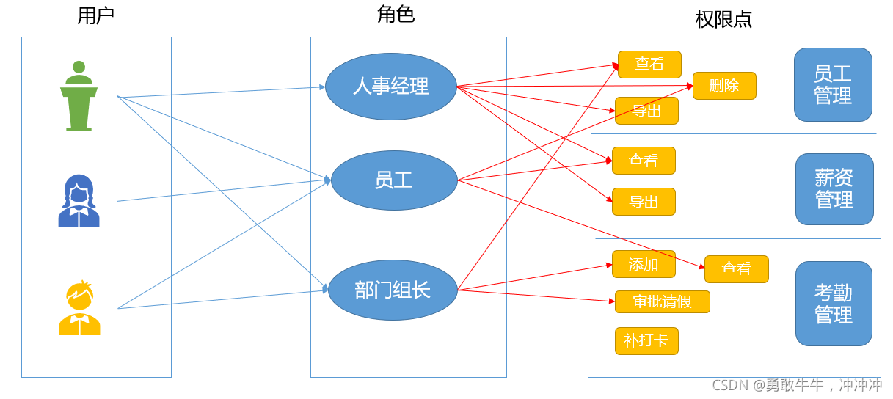
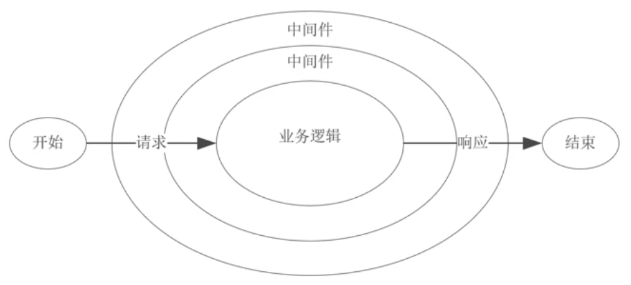

[toc]

# 图书管理项目

后端通常是微服务架构，包括认证中心，网关，服务

关于单点登录，见浏览器


## 权限

权限是对特定资源的访问许可，所谓权限控制，也就是确保用户只能访问到被分配的资源

- 接口权限
- 按钮权限
- 路由权限

接口权限

结合jwt

- 接口权限目前一般采用`jwt`的形式来验证，没有通过的话一般返回`401`，跳转到登录页面重新进行登录

- 登录完拿到`token`，将`token`存起来，通过`axios`请求拦截器进行拦截，每次请求的时候头部携带`token`


路由权限

- 初始化挂载全部路由，在路由上标注相应的权限信息，每次路由跳转前做校验
- 登录后，获取用户权限，筛选有权限访问的路由，全局路由守卫里调用addRoutes添加


按钮权限

- v-if
- 自定义指令


RBAC

为了达成不同账号(员工、总裁)登录系统后看到不同页面，执行不同功能，RBAC(Role-Based Access control)权限模型，就是根据角色的权限，分配可视页面。

三个关键点:
用户:使用系统的人
角色：使用系统的人是什么职位(员工、经理、总裁)
权限点：职位可以做的事情(左侧菜单栏中的功能模块——>增删改查)




## 首屏性能优化

见架构

## docker

根据镜像image产生不同容器container

Docker是一种虚拟化技术，可以帮助开发人员将应用程序及其依赖项打包到一个称为容器的可移植运行环境中。这些容器可以在任何地方运行，无需担心环境差异或依赖项冲突。


## 骨架屏

### 方案一、在模版中来实现骨架屏

> 思路：在 index.html 中的 div#app 中来实现骨架屏，程序渲染后就会替换掉 index.html 里面的 div#app 骨架屏内容；

### 方案二、使用一个Base64的图片来作为骨架屏

> 方案一插入图片

### 方案三、使用 .vue 文件来完成骨架屏

> 我们可能不希望在默认的模版(index.html)上来进行代码的coding；想在方案一的基础上，将骨架屏的代码抽离出来，使用一个 .vue 文件来 coding，易于维护。


# 论坛项目

## SEO优化

如何做

HTML标签有不同权重，优化重点，可选的措施


- 首页静态页面然后跳转

- 标题+内部连接

- Meta标签优化

- 文本标记和img

- 针对搜索引擎做优化（sitemap.xml/robots.txt/favicon.ico）一般搜索引擎来爬我们的网站会优先去网站根目录找这三个东西，sitemap.xml也就是站点地图；robots.txt里面包括一些设置，你允许爬虫爬哪些内容，不允许哪些被爬，还有就是允许哪些搜索引擎去爬等等；favicon.ico可能没那么重要，但是也是网站必不可少的一部分～


善于利用Next Head，Next.js 暴露了一个内置组件，用于将 HTML 标签添加到页面的 `head` 中。为了避免在 `head` 中出现重复的 HTML 标签，你可以设置 `key` 属性，该属性将确保添加的标签仅渲染一次。

next-seo 插件

## 中间件

中间件（Middleware）是介于应用系统和系统软件之间的一类软件，它使用系统软件所提供的基础服务（功能），衔接网络上应用系统的各个部分或不同的应用，能够达到资源共享、功能共享的目的

在`NodeJS`中，中间件主要是指封装`http`请求细节处理的方法

例如在`express`、`koa`等`web`框架中，中间件的本质为一个回调函数，参数包含请求对象、响应对象和执行下一个中间件的函数



在这些中间件函数中，我们可以执行业务逻辑代码，修改请求和响应对象、返回响应数据等操作


## 虚拟列表实现

为什么要用?

假设我们的长列表需要展示10000条记录，我们同时将10000条记录渲染到页面中，先来看看需要花费多长时间：

```xml
<button id="button">button</button><br>
<ul id="container"></ul>  
```

```js
document.getElementById('button').addEventListener('click',function(){
    // 记录任务开始时间
    let now = Date.now();
    // 插入一万条数据
    const total = 10000;
    // 获取容器
    let ul = document.getElementById('container');
    // 将数据插入容器中
    for (let i = 0; i < total; i++) {
        let li = document.createElement('li');
        li.innerText = ~~(Math.random() * total)
        ul.appendChild(li);
    }
    console.log('JS运行时间：',Date.now() - now);
    setTimeout(()=>{
      console.log('总运行时间：',Date.now() - now);
    },0)

    // print JS运行时间： 38
    // print 总运行时间： 957 
  })

```


当我们点击按钮，会同时向页面中加入一万条记录，通过控制台的输出，我们可以粗略的统计到，JS的运行时间为`38ms`,但渲染完成后的总时间为`957ms`。

简单说明一下，为何两次`console.log`的结果时间差异巨大，并且是如何简单来统计`JS运行时间`和`总渲染时间`：

- 在 JS 的`Event Loop`中，当JS引擎所管理的执行栈中的事件以及所有微任务事件全部执行完后，才会触发渲染线程对页面进行渲染
- 第一个`console.log`的触发时间是在页面进行渲染之前，此时得到的间隔时间为JS运行所需要的时间
- 第二个`console.log`是放到 setTimeout 中的，它的触发时间是在渲染完成，在下一次`Event Loop`中执行的

## 怎么用?

### 固定长度

失败的实现

```js
<template>
  <div class="information" style="{height: informationH+'vh'}">{{ infText }}</div>
  <div :style="styleObj" class="scroll-box" ref="containerRef">
    <div class="all-data">
      <AnswerCard v-for="item in datalist.slice(startIndex, endIndex + 1)" :ans=item class="mid"></AnswerCard>
    </div>
  </div>
</template>


<script setup lang="ts">
import { ref, reactive } from 'vue'
import answer from '@/components/answerType'
import { transform } from 'typescript';
import debounce from '~~/composables/debounce';
//数据部分
let tmp: answer = {
  aid: 2,
  title: '使用npm编写启动脚本',
  writer: 'gg',
  content: '找到package.json ,添加执行脚本 ,其中 两条命令之间 并行 使用&隔开,串行使用 &&隔开,如"ser":"cd server && node app.js",',
  tag: 'undefined',
  likes: 0,
  dislikes: 0,
  gmt_create: '2023-02-27 08:40:17',
  gmt_modified: '2023-02-27 08:40:17',
};
const datalist: answer[] = reactive([])
let i=0;
for ( i = 0; i < 10; i++) {
  tmp.title = i 
  datalist.push({...tmp})
}

//滚动事件

const clientHeight = ref(0); //浏览器高度
const scrollHeight = ref(0);//总高度
const scrollTop = ref(0);//当前页面顶部到最上方距离
const itemHeight = 200;//定高的子项
const startIndex = computed(() => {
  return Math.floor(scrollTop.value / itemHeight);
})
const endIndex = computed(() => {
  return startIndex.value + Math.floor(clientHeight.value / itemHeight);
})
const onScroll = () => {
  clientHeight.value = (document.documentElement.clientHeight);
  scrollHeight.value = (document.body.scrollHeight);
  scrollTop.value = (document.documentElement.scrollTop);
  console.log(clientHeight.value, scrollHeight.value, scrollTop.value, 'ans', scrollTop.value + clientHeight.value >= scrollHeight.value - 200);
  console.log('Index', startIndex.value, endIndex.value);

  let distance = 200; //距离视窗还用50的时候，开始触发；
  if (scrollTop.value + clientHeight.value >= scrollHeight.value - distance) {
    console.log('添加呀');
    
    tmp.title=i++
    datalist.push({...tmp})
  };
};

//下拉加载事件
const startPos = ref(0), moveDis = ref(0), infText = ref('')
const styleObj: any = reactive({
  position: "relative",
  transition: 'transform 0s',
  transform: ''
  // width: "200px"
})
const informationH = ref(0)
function touchstartEvent(e: TouchEvent) {
  startPos.value = e.touches[0].pageY
  styleObj.position = 'relative'
}
function touchmoveEvent(e: TouchEvent) {
  moveDis.value = e.touches[0].pageY - startPos.value;
  if (moveDis.value > 0 && moveDis.value < 60) {
    infText.value = '下拉刷新'
    styleObj.transform = 'translateY(' + moveDis.value + 'px)';
    informationH.value = 5;
  }
}
function touchendEvent(e: TouchEvent) {
  styleObj.transition = 'transform 0.5s ease 1s';
  styleObj.transform = 'translateY(0px)';
  infText.value = '更新中...';
  let tmpt = [...datalist]
  datalist.length = 0;
  //异步操作 重新请求数据,下面是更新后的结果
  setTimeout(() => {
    datalist.push(...tmpt)
    infText.value = ''
    console.log(tmp, datalist);
    informationH.value = 0
  }, 1000)

}


//页面加载
onMounted(() => {
  clientHeight.value = (document.documentElement.clientHeight);
  scrollHeight.value = (document.body.scrollHeight);
  scrollTop.value = (document.documentElement.scrollTop);

  window.addEventListener("scroll", onScroll);
  window.addEventListener("touchstart", touchstartEvent);
  window.addEventListener('touchmove', touchmoveEvent, false)
  window.addEventListener('touchend', touchendEvent)
});
//页面卸载
onUnmounted(() => {
  window.removeEventListener("scroll", onScroll);
  window.removeEventListener("touchstart", touchstartEvent);
  window.removeEventListener('touchmove', touchmoveEvent, false)
  window.removeEventListener('touchend', touchendEvent)
});
</script>

<style scoped>
.mid {
  width: 70vw;
  margin: auto;
  margin-bottom: 5vh;
}

.information {
  /* height: 5vh; */
  text-align: center;
  color: white;
  background-color: pink;
  border-radius: 0 0 50% 50%;
  transition: all 0.3s ease 1s;
}
</style>
```


虚拟列表的实现，实际上就是在首屏加载的时候，只加载`可视区域`内需要的列表项，当滚动发生时，动态通过计算获得`可视区域`内的列表项，并将`非可视区域`内存在的列表项删除。

- 计算当前`可视区域`起始数据索引(`startIndex`)
- 计算当前`可视区域`结束数据索引(`endIndex`)
- 计算当前`可视区域的`数据，并渲染到页面中
- 计算`startIndex`对应的数据在整个列表中的偏移位置`startOffset`并设置到列表上


### 动态高度

对组件属性进行扩展。预先计算，不能实现由内容撑开

以预估高度先行渲染，然后获取真实高度并缓存。

先设置一个默认高度，然后定义`positions`，用于列表项渲染后存储`每一项的高度以及位置`信息

滚动后获取列表`开始索引`的方法修改为通过`缓存`获取，可以通过二分查找